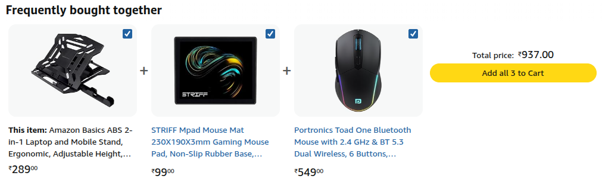
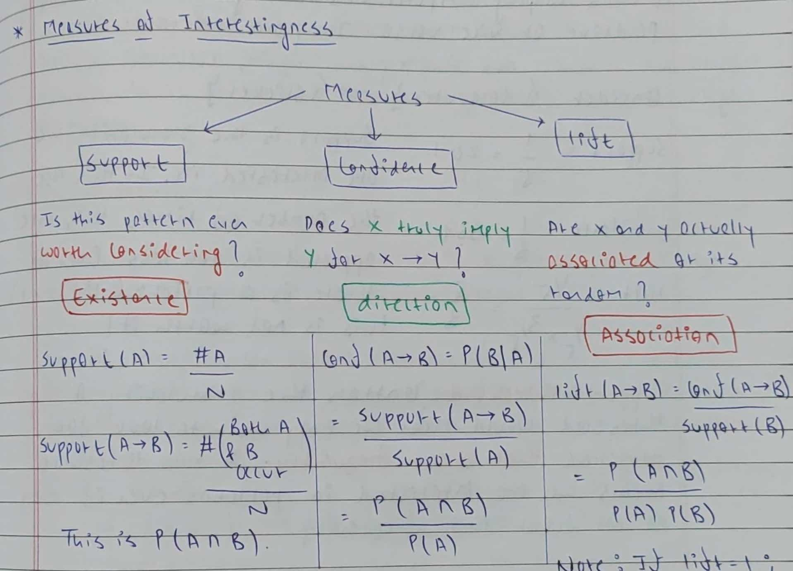
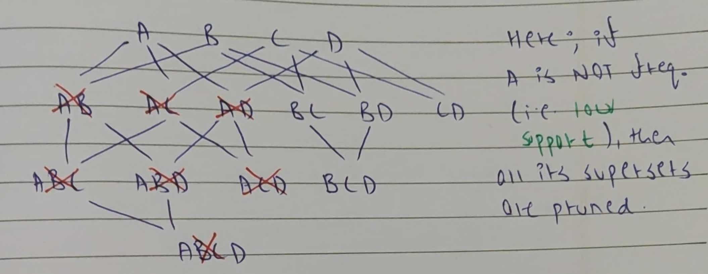
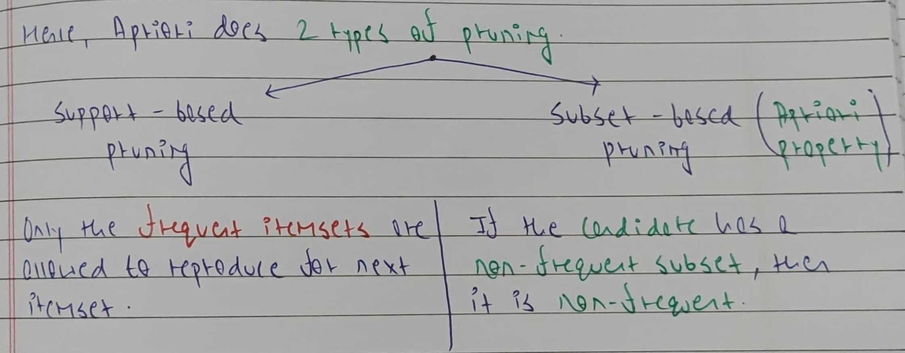

# Apriori Algorithm

<p align="center">
  
  <br>
  <small><i>Amazon recommendation when searching for a laptop stand</i></small>
</p>

## Introduction

Association Rule Mining is identifying patterns between items in transactional data. For example, in a computer store, we might find that customers who buy a laptop stand often also buy a mouse pad. We can use this pattern to make business decisions, like placing laptop stands and mouse pads near each other in the store. Apriori Algorithm is a smart way to discover these associations.

## Naive Algorithm

Imagine we have three items, {computer, mouse, antivirus}, in our store. There are several possible patterns that could exist.

```
{computer} → {mouse}
{computer} → {antivirus}
{mouse} → {antivirus}
{mouse} → {computer}
{antivirus} → {computer}
{antivirus} → {mouse}
{computer, mouse} → {antivirus}
{computer, antivirus} → {mouse}
{mouse, antivirus} → {computer}
{computer} → {mouse, antivirus}
{mouse} → {computer, antivirus}
{antivirus} → {computer, mouse}
```

Out of all these, we want to find the patterns that are meaningful. The naive approach to association rule mining is to loop over every possible pattern and decide whether the pattern is interesting or not. This requires metrics that can help us determine whether a rule is interesting. These metrics are known as measures of rule interestingness.

### Measures of Rule Interestingness 

The three popular metrics used to evaluate association rules are `support`, `confidence`, and `lift`.
Each metric captures a different aspect of “interestingness”. Using all three together helps us find rules that are truly meaningful.

<p align="center">
  
</p>

Consider the following transactions:

```
T1 → Computer, Antivirus, Pendrive
T2 → Computer, Antivirus, Mouse, Pendrive
T3 → Mouse, Pendrive
T4 → Computer, Antivirus, Mouse, Pendrive, Sticker
T5 → Antivirus, Mouse, Pendrive
```

In this store, for every purchase the consumer made, we gave them a pendrive for free.

#### Measure 1: Support

Support tells us whether a rule is worth considering at all. The idea is that if an item appears very rarely in the data, we do not have enough evidence to make decisions about it. Any rule involving such items is trivial. For example, our data has only `1` out of `5` transactions that contain a sticker. Hence, it is not worth exploring rules involving stickers. 

The formula for support is simply the probability of finding the given item or set of items.

#### Measure 2: Lift

Lift measures how strongly two items are associated. This is different from support, which just measures how frequent the items are. In our data, we gave free pendrives to each customer, and hence each transaction has a pendrive. However, in reality, buying a pendrive does not mean we will buy a computer next.

The formula for lift is the probability of both items appearing in a transaction, divided by the product of the individual probabilities of each item. Note that when the items are independent of each other, the numerator becomes equal to the denominator, and lift equals 1. Thus, a lift of 1 means the items are independent.

* If `Lift = 1`, A and B are independent (no association).
* If `Lift > 1`, A and B are positively associated.
* If `Lift < 1`, A and B are negatively associated.

For the rule `Pendrive → Computer`, the support is `100%`, but the lift is `1`, meaning there is no real association between the items.

Note: If we ignore support, a rule like `Sticker → Computer` might have a lift of `5/3`. However, this can be misleading because the data is too sparse. That’s why it's important to check support first.

#### Measure 3: Confidence

While support and lift are useful measures, they don't capture directionality. For both metrics, `A → B` is the same as `B → A`, but in reality, this might not be the case. For example, if a person buys a computer, they are likely to buy antivirus software. However, a person buying an antivirus might already own a computer, so they are unlikely to buy another one. Instead, they might buy related items, like camera clips. Confidence is a measure of directionality.

In formula terms, confidence is conditional probability `P(B|A)`, i.e. probability of buying B given A is bought.

For our example, `{computer} → {mouse}` has higher confidence than `{mouse} → {computer}`.

**Note:** For applications like shelf placement or course selection, confidence doesn't matter a lot. The importance is on grouping rather than direction. So we can ignore confidence for such usecases.

## Issues with Naive Approach

<p align="center">
  
</p>

<p align="center">
  
</p>

## Apriori Algorithm

Apriori means using prior knowledge. The trick used in Apriori Algorithm is simple:

1) If an itemset is not frequent, then all of its supersets are also not frequent. For example, if `{A}` is not frequent, then `{A, B}`, `{A, C}`, `{A, B, C}`, etc. cannot be frequent. So we can prune them without checking their support.

2) Similarly, if an itemset contains any subset that is not frequent, then the itemset itself cannot be frequent. For example, the candidate `{A, B, C}` can not be frequent if we have the prior knowledge that `{A, C}` is not frequent.

The algorithm starts by building the `1-itemset`. Only items whose support is greater than or equal to the support threshold are kept. Items with low support are removed, and hence all their possible combinations get pruned. Using the frequent `1-itemset`, the algorithm builds `2-itemsets`, `3-itemsets` ... `k-itemsets`. 

While creating new itemsets, it joins the elements of the previous itemset and prunes if any new candidate has a subset of items that are not frequent. This process continues until no new frequent itemsets can be formed. Now, we generate rules for all the itemsets that had enough support, and only evaluate those rules for interestingness.

Consider the following example. Just by knowing that item `A` does not have enough support, we can prune many itemsets that contain `A`.

<p align="center">
  
</p>

This is the first type of pruning called `support based pruning`.

Now, consider the following 2-itemset,

```
BC -> Frequent
CD -> Not Frequent
BD -> Frequent
```

To generate candidates for the `3-itemset`, we can join `BC` and `BD` because both are frequent. This produces the candidate `BCD`. However, `BCD` contains the subset `CD`, which is not frequent. Therefore, `BCD` cannot be frequent, and we can prune it immediately without checking its support. This reduces our database scans. 

This is the second type of pruning called `subset based pruning`.

<p align="center">
  
</p>

## Results

We chose an interesting task for Association Rule Mining. Every semester, IIIT Hyderabad offers some courses, and the students register for these courses. Some courses are compulsory for certain segments of students. For example, M.Tech students in their first semester have a fixed set of courses that they must take. In contrast, some segments of students are allowed to choose electives.

The raw data that we use is exam seating arrangement data. The Monsoon 2025 exams were held over 7 days with morning and evening sessions. Thus, we have 14 PDFs, each corresponding to a specific session of the exam. One sample page from a sample PDF is as follows:

```
Seating Arrangement - Monsoon 2025 End Sem Examinations
Date : 01/12/2025 (3.00 pm to 6.00 pm)
Subject : PD2.421-Business Fundamentals
Room No : H - 101
S.No Roll No Name of the Student
 A1     1        NAME
 A2     2        NAME 
 A3     3        NAME
 A4     4        NAME
 A5     5        NAME 
```

The transactional data we use is derived from these raw PDFs using `scripts/student_courses_data_preprocessing.py`. 

First, we run the apriori algorithm over the entire dataset (~2000 students) with `support_threshold = 0.025` (i.e., `50` students is the minimum frequency for an itemset) and `confidence_threshold = 0.95`. Some of the rules discovered are as follows:

```
['MA4.101-Real Analysis'] -> ['Computer Programming']
['EC5.201-Signal Processing'] -> ['EC5.202-Systems Thinking']
['CS1.304-Data Structures & Algorithms for Problem Solving'] -> ['CS3.304-Advanced Operating Systems']
```

The rules that we obtain here are courses which are compulsory. The first two rules are compulsory for `B. Tech` students in their semester I, while the third course is compulsory for `M. Tech` students in their semester I. Thus, the algorithm gives high confidence and lift for these rules.

We also try another variant of data, where we remove all the compulsory courses and only analyze the patterns among electives. For electives, we set a lower threshold (`support_threshold = 0.01` and `confidence_threshold = 0.7`). The patterns discovered are:

```
['CE1.621-Retrofit of Existing Infrastructure'] -> ['CE1.610-Advanced Design of Steel Structures']
['CE1.610-Advanced Design of Steel Structures'] -> ['CE1.621-Retrofit of Existing Infrastructure']
['CS3.401-Distributed Systems', 'CG1.402-Introduction to Cognitive Science'] -> ['CS3.402-Advanced Computer Networks']
['CS3.401-Distributed Systems', 'CS8.501-Research in Information Security'] -> ['CS3.402-Advanced Computer Networks']
```

While the first two rules make sense intuitively because they belong to the same domain, it is interesting to observe rules such as `{Distributed Systems, Introduction to Cognitive Science} -> {Advanced Computer Networks}`. Somehow, students who prefer system courses also tend to take course on cognitive science!