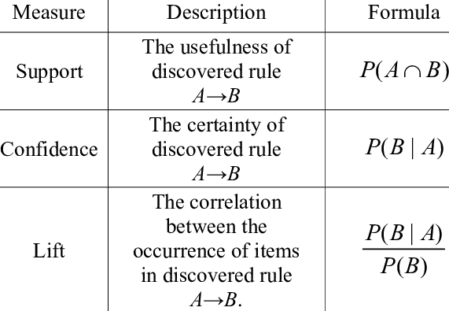
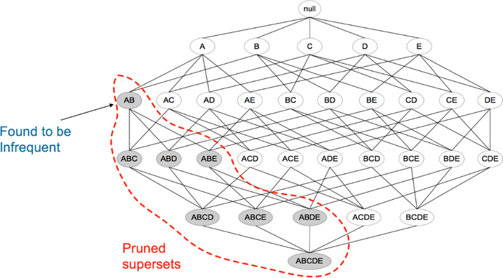

# Association Rule Mining

Association rule mining can be posed as unsupervised learning, where we extract a set of patterns from a database. The goal is to find frequently occurring patterns.

## Introduction

One difference between recommendation systems and association rule mining is what they focus on. Recommendation systems are personalized. They suggest things based on your individual preferences, like what you have liked or bought before. Association rule mining, however, looks at the whole dataset to find patterns that happen frequently, without focusing on individual users.

For example, in a store, you might place computers and antivirus softwares next to each other. Even if I don’t like antivirus softwares and don’t buy it when I buy computers, many other people do. So it makes sense to place them near each other in the store. This is a pattern that association rule mining helps to find.

It is important to note that "If people buy computer, they are likely to buy antivirus software" i.e. `Computer -> Antivirus` is not the same as "If people buy antivirus software, they are likely to buy computer" i.e. `Antivirus -> Computer`.

Given a set of 3 items A, B, and C, we can generate 12 rules out of it. Some of them are `A -> B`, `B, C -> A`, `C -> A, B`. What we want to know is which of these 12 rules are interesting for us. Hence we define certain measures of interestingness for rules. 

### Measures of Rule Interestingness 

Consider a rule `A -> B`.

* Support: Support is defined as the percentage of times A and B have appeared together in the dataset. Do note that support for `Computer -> Antivirus` is same as `Antivirus -> Computer`. 

* Confidence: Confidence indicates that percentage of people who bought A and then also bought B. Do note that confidence for `Computer -> Antivirus` is not the same as `Antivirus -> Computer`. 

Typically, association rules are considered interesting if they satisfy both a minimum support threshold and a minimum confidence threshold. However these rules alone can be misguiding.

Consider a scenario where a store provides Antivirus Software for free on any purchase. Each transaction on the database now contains Antivirus. Thus, if we were to check confidence of `Camera -> Antivirus`, it would be very high. However we know that this is not the case. Hence we define measures such as lift.

* Lift: Lift refers to the increase in the ratio of sale of B when A is sold. This eliminates the issue of `Camera -> Antivirus` because the number of times Antivirus has been sold is greater than number of time Camera & Antivirus has been sold. Thus there is a decrease in sale of B when A & B are considered together.

In general, association rule mining can be viewed as a two-step process:

* Find all frequent itemsets: These are the itemsets that will occur at least as frequently as a predetermined minimum support count, `min_sup`.

* Generate strong association rules from the frequent itemsets: These are the rules which satisfy minimum support and minimum confidence.

## Apriori Algorithm

A brute force way for association rule mining can be evaluating each and every combination of itemsets. For a database of size 3, this becomes 12 different combinations. Thus this does not scale well as items increase. For example, consider a CD Shop which keeps thousands of different CDs. 

Apriori algorithm uses a very simple concept for limited candidates generation. Consider 3 people A, B, and C. If I say A and B are not friends, then it also means that A, B, and C together are not friends. A and C might be friends and B and C might be friends. But the only fact that A and B are not friends is enough for me to conclude that A, B , and C are not friends as a group.

Similarly, if I realize that an itemset of {Computer, Bread} is not frequent, it is enough for me to conclude all the supersets of this set are not frequent. Hence, I can prune the evaluation of those subsets.

A very intuitive explanation of Apriori Algorithm can in these <a href="https://www.youtube.com/watch?v=eOOhn9CX2qU">slides</a>.