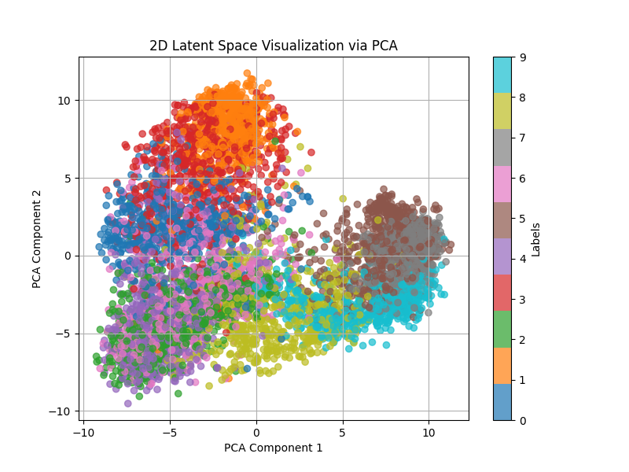
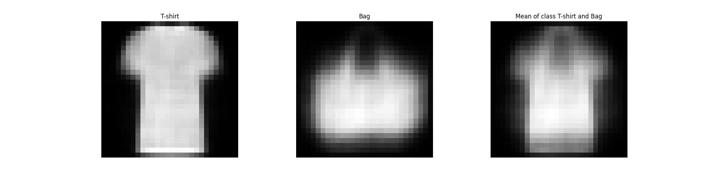
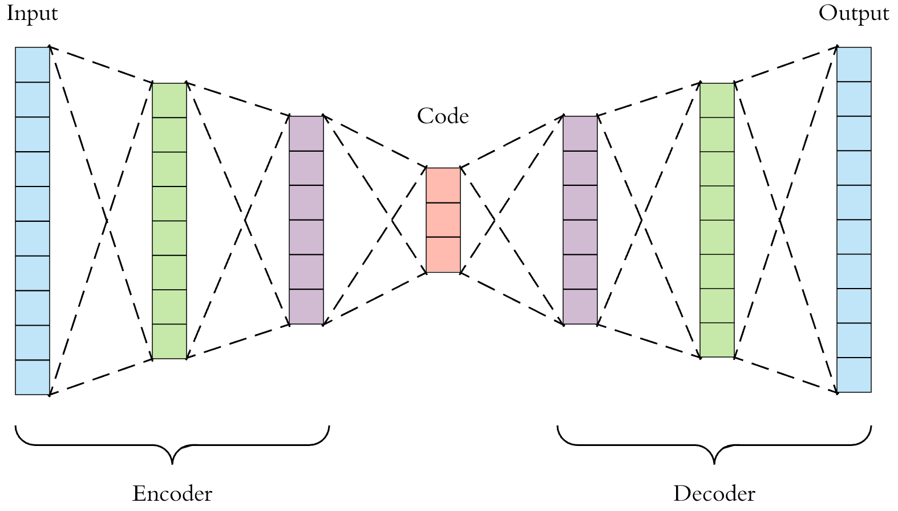
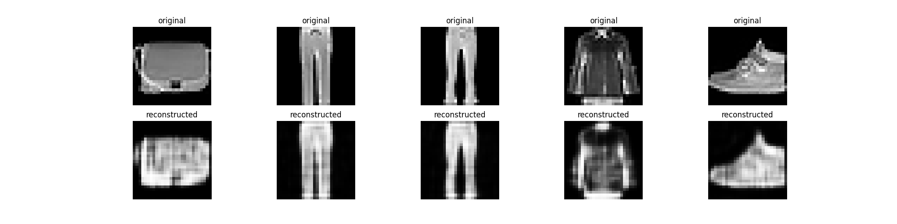
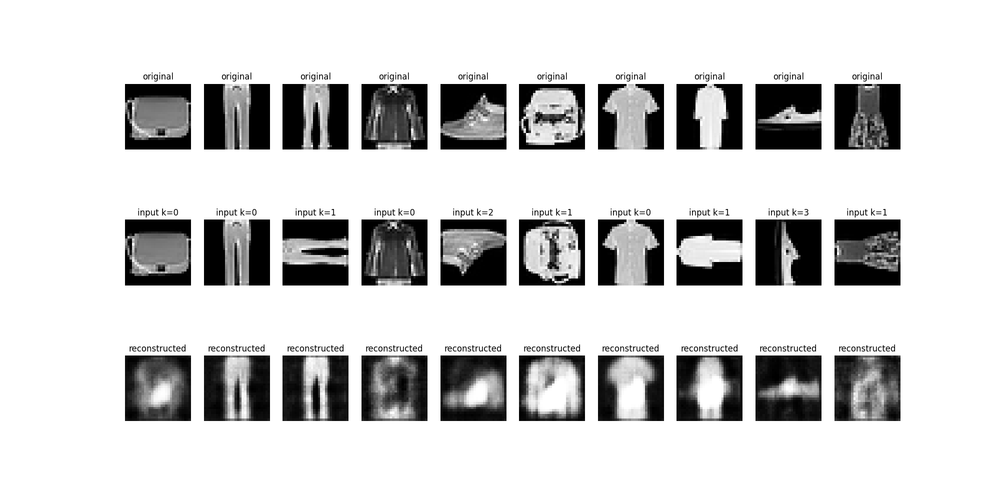
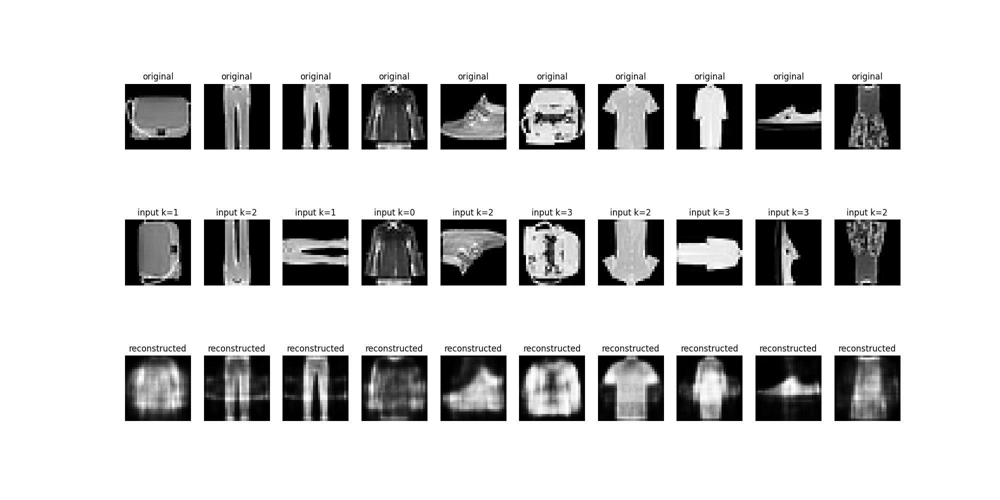
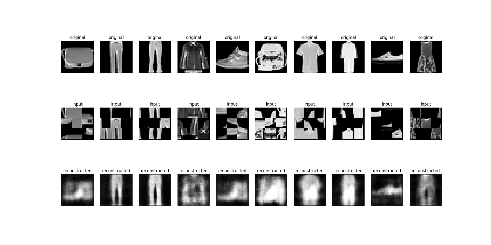
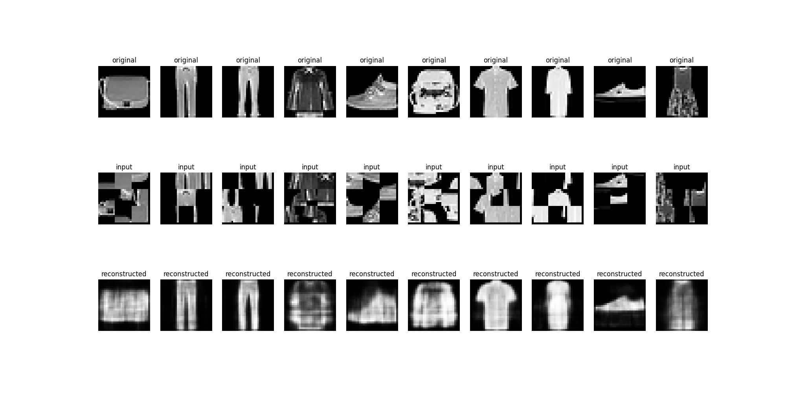

# Autoencoder Family

| Visualizing latent vectors (Abstraction) | Creating new samples (Generation) |
|:-----------:|:--------------------------:|
|  |  |

## Introduction

Apart from tasks like classification, regression, clustering, etc., we are also interested in abstraction and generation. Abstraction means learning representations for our data. For example, we can convert an image into a feature vector. This idea of learning low-dimensional feature representation is useful for many tasks, such as visualization or similarity. Generation means creating new data samples such that they belong to the original data distribution. Autoencoders are one family of models that can do these tasks. While there are several flavors of autoencoders, we will focus on vanilla autoencoders and variational autoencoders (VAEs).

## Vanilla Autoencoders

  
   
  <small><i>Image Source: https://medium.com/data-science/applied-deep-learning-part-3-autoencoders-1c083af4d798</i></small>

### Results

#### Abstraction 

  

  

#### Generations

While autoencoders are not designed for generation, they too can give good generations sometimes. We look at the latent space and choose classes that are close to each other and try to generate a few images. These are some examples where the generations were really amazing:

  
   
  <small><i>The generated output resembles both a t-shirt and a bag</i></small>

  

### Stress Test 01: Random Rotations

We wanted to explore how the autoencoder behaves when its input is distorted. For each image, we first apply a random rotation of 0°, 90°, 180°, or 270°. The rotated image is then fed into the autoencoder, whose task is to reconstruct the original, unrotated image. Success in this task might require the model to learn rotation-invariant features. While I expected the autoencoder to struggle with undoing the rotations, the results are amazing. Below, we show the reconstruction outputs after the 1st epoch and after the 20th epoch.

  
   
  <small><i>After 1st epoch</i></small>

  
   
  <small><i>After 20th epoch</i></small>

Here, K denotes the multiple of 90 degree that was used to rotate the image. The rotations are random, even across epochs, but still the autoencoder has managed to reconstruct the original image.

### Stress Test 01: Jigsaw Permutations

An even more challenging task is to apply jigsaw permutations to the input images before feeding them to the autoencoder. This is an extreme task, but still the autoencoder performs very well. If we notice a few examples carefully, such as 8th and 10th example, the outputs have some artifacts. But still, producing these outputs from jigsawed input is very challenging.

  
   
  <small><i>After 1st epoch</i></small>

  
   
  <small><i>After 20th epoch</i></small>

