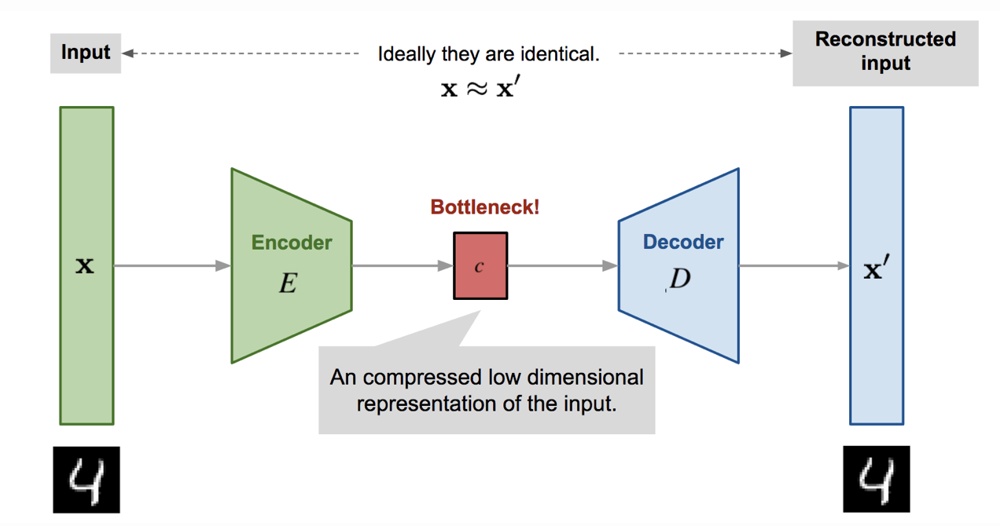

# Autoencoders

  
   
  <small><i>Image source: https://towardsdatascience.com/autoencoders-and-the-denoising-feature-from-theory-to-practice-db7f7ad8fc78/</i></small>

## Results

  

  

  

  

