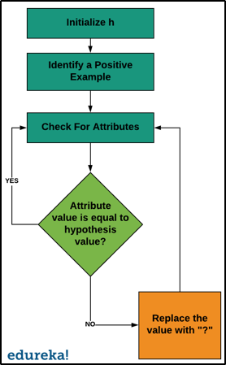

# Concept Learning

## Hypothesis Space

Formally, in the context of machine learning, the function ```f(x)``` represents a hypothesis ```h```  within a hypothesis space ```H```. For instance, if we select a decision tree as our function ```f(x)```, then the hypothesis space ```H``` would encompass the set of all possible decision trees. The objective is to find a hypothesis ```h``` that serves as the most accurate approximation of the true function ```f```.

## Introduction to Concept Learning


Imagine we want to learn to identify birds from a group of animals. We can start by looking at different birds and try to understand the features which make them different from other animals. We might look at a sparrow and derive that if the animal has wings, feathers, brown colour, a short tail etc. then it is a bird. However by looking at other birds, we might realize that colour has nothing to do with a bird, and we can come to generalized idea that if it has feathers or wings, it is a bird.

Here, bird becomes a Concept, which we want to learn. Concept Learning was the idea a boolean function defined over a set of all possible animal whicht returns true only if a given object is a member of a bird. The problem of inducing general functions from specific training examples is central to concept learning.

## FIND-S Algorithm

### Assumption

The FIND-S Algorithm works on a simple assumption: we can learn something by looking only at examples where it's true. For instance, if we want to find a thief, we ask people who have seen the thief what they look like (positive examples), but we don't bother asking those who haven't seen the thief (negative examples). By gathering details from people who have seen the thief, we try to build a general picture of what the thief might look like.

When questioning witnesses, the algorithm starts with specific details and tries to find common traits. For example, one person might say the thief wore a black jacket and cap, while another might say they wore a shirt and cap. From these details, we can guess that the thief was at least wearing a cap. This process helps us build a broader understanding of the concept.

However, while FIND-S is a basic way to learn from examples, it's not very practical for real-life problems. Other methods are better at handling different situations and are more effective overall. Because of this, FIND-S hasn't been studied and improved as much as other, more advanced techniques.

### Algorithm



### Results

Upon applying the FIND-S algorithm to the Titanic dataset, it yields a highly general hypothesis, suggesting limitations in its ability to understand the concept of survival in the Titanic data. However, if we consider only the first few instances, it gives us the following hypothesis: `['?', '?', '?', 'female', '?', '?', '?', '?', '?', '?']`. This finding suggests that gender emerges as a notable attribute among survivors, provided we consider only the first few instances.