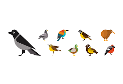

# Concept Learning



## Introduction to Hypothesis Space & Concept Learning

Formally, in the context of machine learning, the function ```f(x)``` represents a hypothesis ```h```  within a hypothesis space ```H```. For instance, if we select a decision tree as our function ```f(x)```, then the hypothesis space ```H``` would encompass the set of all possible decision trees. The objective is to find a hypothesis ```h``` that serves as the most accurate approximation of the true function ```f```.

Concept learning describes the process by which experience allows us to partition objects in the world into classes for the purpose of generalization. In simple words, Concept learning is learning how to group similar things together. Each concept can be thought of as a boolean-valued function defined over some larger set.

The problem of inducing general functions from specific training examples is central
to learning. For example, we see different species of birds such as sparrows, robins, and pigeons. Even though they look different, we notice they all have something in common. So, we create a concept in our mind called "birds" to group them together. Gradually, by looking at positive and negative examples, we move from a specific example of sparrow is a bird to general concept, that maybe if it has wings, it is a bird.

Thus, Concept learning is inferring a boolean-valued function from training examples of
its input and output.

Consider the concept of a bird, where we want to infer whether an animal is a bird based on certain features. Let's define our features as follows:

* hasEyes: whether the animal has eyes (Boolean)
* hasWings: whether the animal has wings (Boolean)
* canFly: whether the animal can fly (Boolean)

The most specific hypothesis can be ```(None, None, None)``` which implies no animal is a bird. This implies that none of the animal can be a bird. (?, ?, ?) represents the most general definition of a bird, where any animal could potentially be classified as a bird regardless of its features. This implies that any combination of features could classify an animal as a bird. This hypothesis essentially suggests that none of the specified features are necessary for an animal to be considered a bird.

These hypotheses illustrate the extreme ends of the spectrum of possible classifications for the concept of a bird. The true nature of the concept might lie somewhere in between these two extremes, for example, (?, True, True) can be a possible hypothesis for the concept of bird.

## FIND-S & Candidate Elimination Algorithm

FIND-S Algorithm and Candidate Elimination both take different approaches in order to find the best hypothesis for a concept. Find-S starts very specific and gets broader, while Candidate Elimination starts broad and specific and refines both sides. Imagine a detective trying to identify a specific type of criminal.

According to FIND-S Algorithm,

* we start with a very precise description (For example, "tall, blonde woman wearing a red jacket").
* As we interview witnesses, we adjust wer description to include everyone who matches the criminals they saw, even if that makes the description less specific. (For example, we might conclude that the criminal was atleast a tall woman by talking to all witnesses).
* we ignore people who didn't see the criminal at all.

Thus, we try to get a general view of the criminal by considering all the positive witnesses. This is first approach to understand who the criminal can be.

Accoridng to Candidate Elimination,

* we start with two descriptions: one very specific, one very general (e.g., "A tall blonde woman between 5'5" and 6', with gold wristwatch" and "anyone wearing red").
* As we interview witnesses, we refine both descriptions:
    * If someone saw the criminal and they don't match the specific description, we make that description less specific.
    * If someone didn't see the criminal but they match the general description, we make that description more specific. (That is we consider the negative examples as well)
* we keep adjusting both descriptions until we find one that fits all the witnesses who saw the criminal and excludes everyone who didn't.