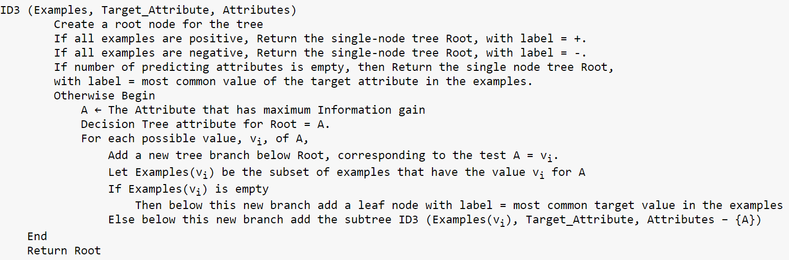
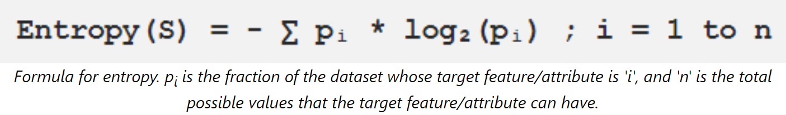

# Decision Trees

## Introduction

In machine learning, we often judge models based on two things: how well they predict outcomes and how easy it is to understand why they made those predictions.

For tasks where achieving peak performance is the primary goals, complex models like neural networks and random forests are commonly employed. However, there are scenarios where interpretability becomes more important rather than just achieving peak accuracy. For instance, in healthcare, when making decisions about patient treatment plans, it's crucial to understand the reasoning behind a model's recommendations rather than blindly following its predictions. Thus for purposes like this, we choose models which give good predictions, but at the same time tell us why they made this prediction.

That's where decision trees come in. They're straightforward models that are good at predicting outcomes and also easy to understand. We call them "white box" models because it's clear how they make decisions. They are a type of supervised learning algorithm, which can be used for both classification and regression problems. 

Decision tree is just a series of decisions presented in a tree-like structure. This is very similar to the ```if-else``` statements we use in traditional programming.

Decision trees, unlike neural networks, can perform well even with smaller datasets like the iris dataset, which contains just 150 instances. This is because decision trees don't require massive amounts of data to learn effectively.

To illustrate, think about how a child learns to distinguish between cats and dogs. They don't need to see thousands of images; instead, they make observations and ask simple questions like "Does it have whiskers?" or "Is it furry?" This step-by-step process resembles how decision trees work – they make a series of straightforward decisions based on features to classify or predict outcomes.


A decision tree consists of two types of nodes, one is the internal node which represents the decision condition, and other is the leaf node which represents the decision outcome.

Each internal node is characterized by two parameters, split index and split value. Split index determine the feature to be used for the decision, and split value is the value of the feature to be used for partitioning the data. Consider ```X6 > 91``` as an example. The split index is 6, and the split value is 91.

A decision tree essentially divides the feature space into axis parallel rectangles. 


Every classification function can be represented by a sufficiently complex decision tree. However, as the complexity increases, so does the risk of overfitting.

Additionally, there is no unique decision tree for a given set of labels. Multiple decision trees can be formed based on different features and splitting criteria.

## Building a Decision Tree

### Choosing the best split index

Smaller trees are preferred because they are easier to store and understand. However, finding the smallest tree is very difficult. Instead, a common method is to use a simple greedy heuristic approach to choose the best attribute at each step of tree construction.

A good split in a decision tree occurs when it increases our certainty about the classification of data points. This means that after the split, the resulting partitions should ideally have distinct class labels. To measure the effectiveness of a split in a decision tree, we typically use metrics such as Entropy or Gini Impurity. We can use either of these metrics for a given subset of data, and they tell us how "impure" or uncertain the subset is in terms of class labels.

#### ID3 Algorithm



Either Gini Impurity or Entropy can be used to measure the uncertainty in a given subset S, and Gini Index or Information Gain can be used to choose the best split index.

#### Gini Impurity & Gini Index

#### Entropy & Information Gain



Entropy has an interpretation that if the logarithms are base 2, entropy represents the number of bits required to needed to tell us the class of any item we pick from S.

Imagine a box of items (S) where you only care about their class (P+ or P-). Entropy is like a measure of how well the labels in the box tell you the class of any item you pick (X). If all the items are the same class (P+ or P-), it's obvious, so entropy is 0 (no bits needed to tell). But if the box has a mix of both classes (equal chance of either), it's a guessing game, so entropy is 1 (you need 1 bit of information, like a label, to know for sure). The more mixed the labels, the higher the entropy and the more information you need to sort them.

Essentially, entropy tells us how uncertain we are about the class of any item we pick from the set.


Information Gain is the difference between the entropy of the parent node and the weighted average of the entropy of the children nodes. It just represents the reduction in uncertainty after the split.