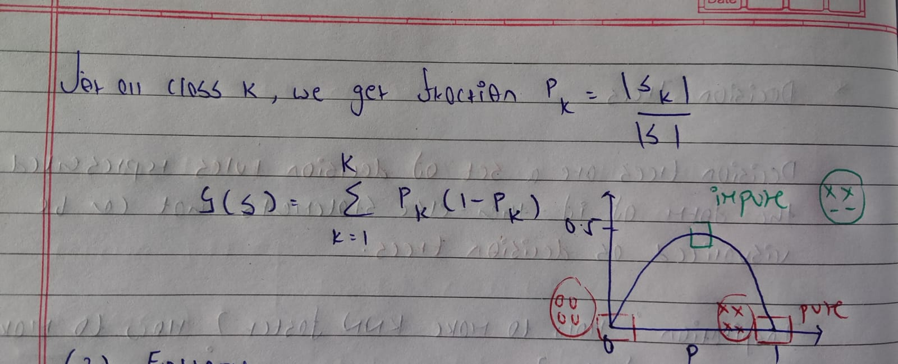
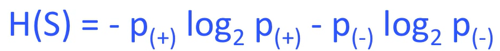
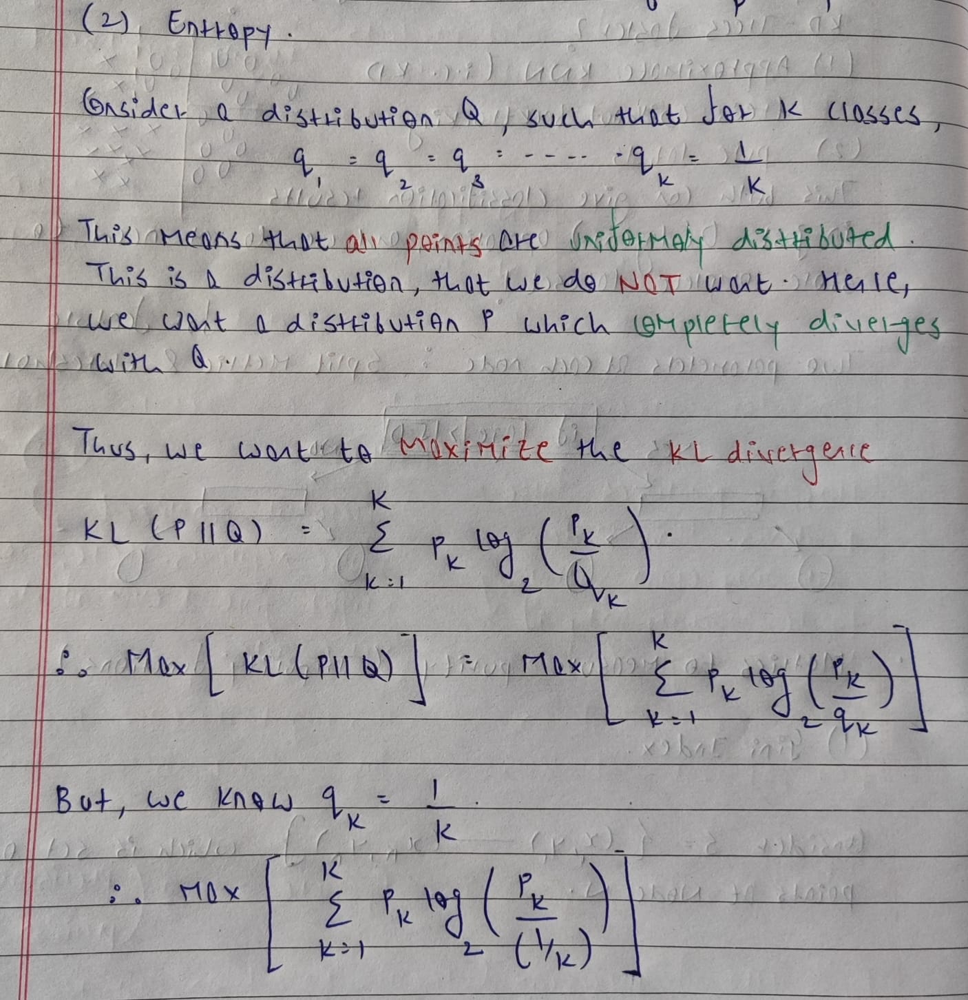
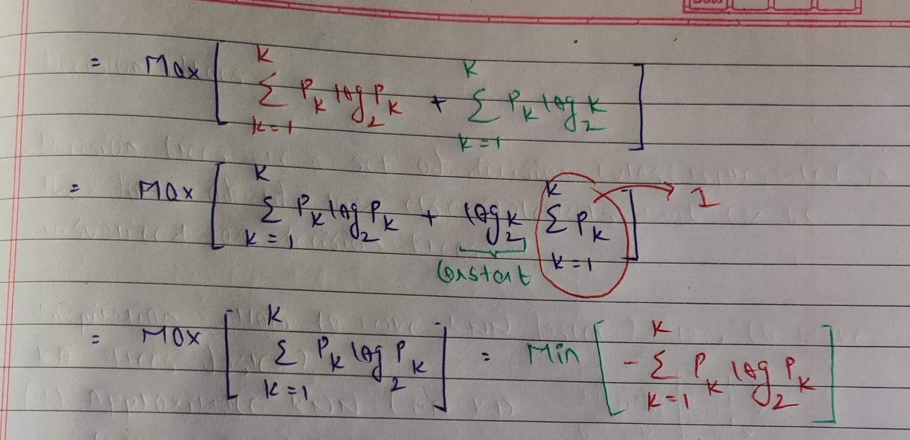
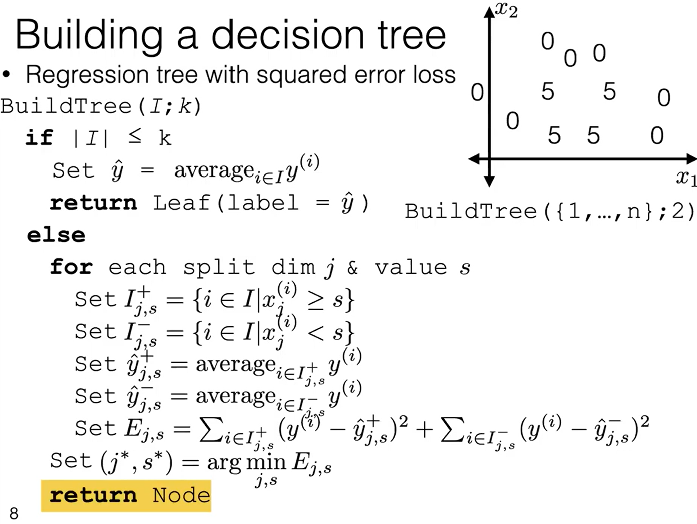
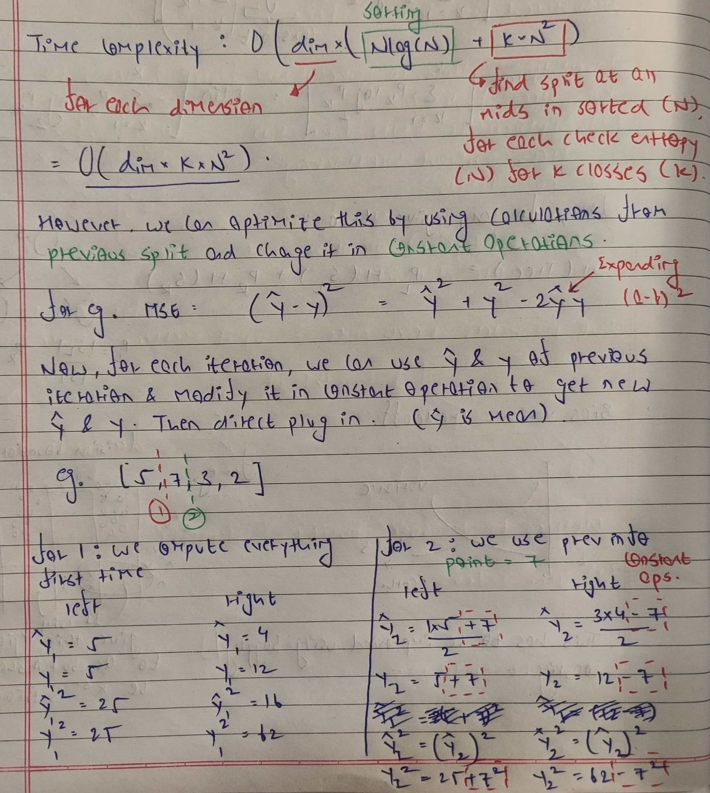
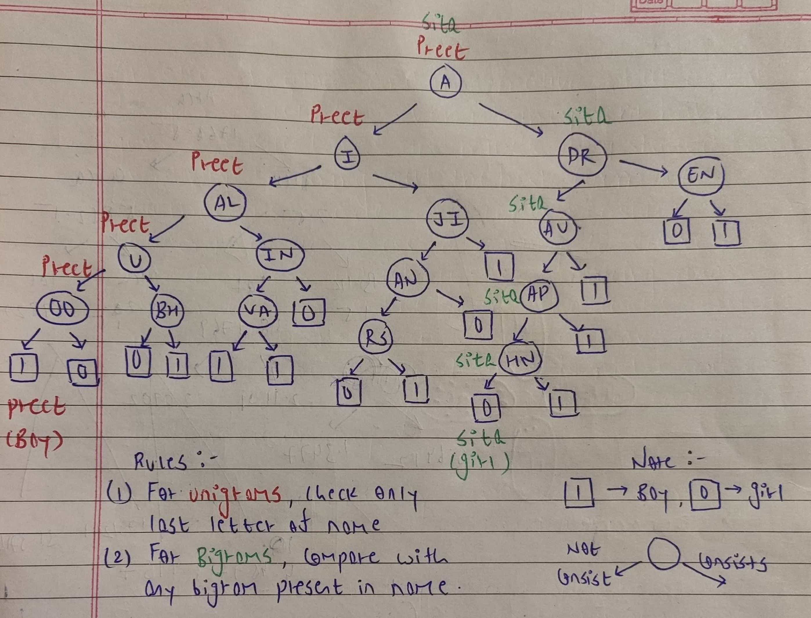
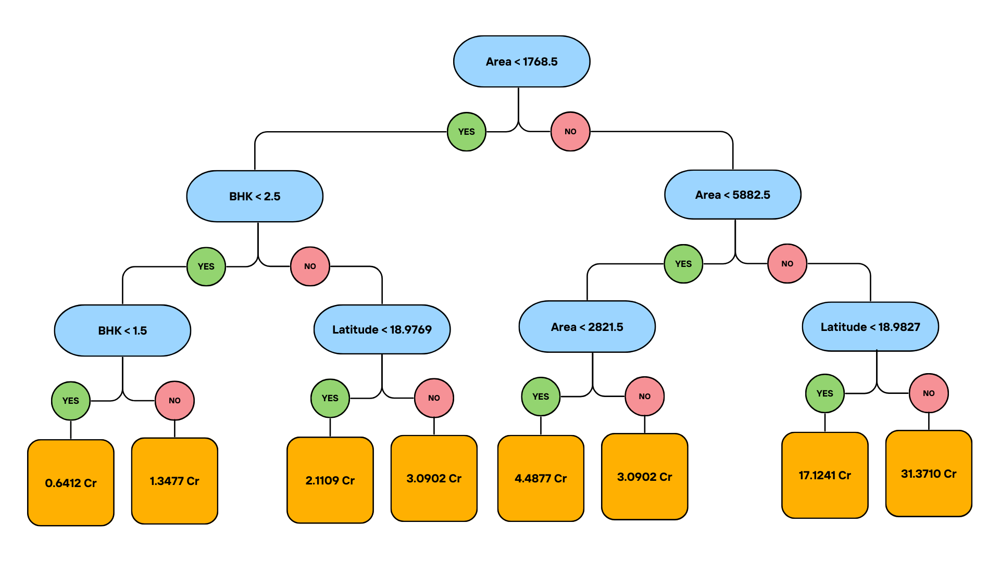

# Decision Trees

## Introduction

Decision Trees are a supervised learning algorithm used for both classification and regression tasks. They represent decisions using a series of if-then-else rules, which can be visualized as a tree-like structure.

## Intuition

Let's say we use K-Nearest Neighbors for binary classification. KNN can be slow, but we can speed it up using KD Trees.

A KD Tree is a binary tree that helps speed up nearest neighbor searches by partitioning data along its axes. When searching for the nearest neighbor, the algorithm recursively checks nodes, comparing distances to find the closest points. At each step, we compare the current best distance with the distance to the opposite branch. If the search radius (current best distance) intersects the splitting plane, we continue searching that branch, because we want to find the exact nearest neighbor.

However, we can make it faster by not searching for the exact nearest neighbor, but rather approximately nearest neighbor. This can be done by not performing recursion. While this idea makes inference faster, it loses upon the accuracy slightly. We can make it even faster by introducing the concept of purity. A "pure" node is a node where all points belong to the same class. If we encounter such a node during a decision, we can immediately make a prediction without further checks. This greatly speeds up the process and reduces the amount of data stored, as we only need the structure of the tree.

Thus, Decision Trees are essentially KD Trees, but the only difference being splitting criteria. In KD Trees, we split data to get two equal halves. However, in Decision trees, we split data to get pure nodes.

Bias and Variance are a function of depth of tree. As the depth of tree increases, bias decreases and variance increases.

## Algorithm

Decision Trees are a non-parametric algorithm. This means they don't have fixed parameters (like weights W and bias b in a perceptron). Instead, each non-leaf node in the tree is defined by two things:

1) Split dimension: The feature (or attribute) of the data used to make a decision at this node.
2) Split value: The value that the feature is compared against to determine which branch to follow.

One way to find these parameters is to try every split dimension and every split value, and then evaluate it using a impurity function.

### Impurity Functions

### Gini Index

Consider S as the dataset available at node N. We can compute the Gini Index of this node using the below formula.

### Entropy

Entropy for a subset `S`, where proportion of positive and negative examples are given by `p(+)` and `p(-)` respectively is given by,

One way to look at entropy is that it represents the total number of bits required in order to express the class of a random instance of subset `S`. In other words, if we were to pick a random sample from `S`, what is the total number of bits required to express its class.

Consider a pure subset which consists only of positive elements. In this case, entropy = H(S) = 0. Thus, we dont require any bits to determine the class of the instance. We can be sure its a positive instance becuase the subset is positive.

Now, consider an impure subset such that there are 3 positives and 3 negatives. Here, we get `H(S) = 1`. This means that we require one full bit to determine the class of instance.

All this says is how uncertain the subset S is.

An explaination for this intuition can be found <a href="https://www.youtube.com/watch?v=tJmhT3oLXCU">here</a>

### Regression Trees

The only difference in regression trees is that we use a loss function like MSE instead of impurity functions with respect to mean of the points in that subset. 

### Training a decision tree

Training a decision tree is different from other ML models because it doesn't require optimization methods like gradient descent. It reduces the loss by decreasing impurity. Also the regularizer here is the depth of tree or number of nodes. Minimizing the purity is a NP hard problem, and hence we choose a greedy way to approach it.

### Better approach to find the best splits

Currently, we require `O(dim*(N*log(N) + K*(N^2)))` in order to calculate the best split for a given node. This is because, there are `dim` features in the dataset. Thus, we need to iterate over each dim. Now, for each dim we have `N` data points. Sorting them requires `N*log(N)`, and then we need to traverse the whole sorted row. While traversing, we need to calculate split at each `[i]` and `[i+1]` point. This takes overall of `O(N^2)` time complexity. For each split, we need to calculate entropy for `K` classes and hence even K appears in the complexity.

Thus, the time complexity can be given as `O(dim*K*(N^2))`, because `N^2` dominates `N*log(N)`. However, this quadratic complexity is dangerous, as it scales badly with large datasets. Hence we try to find a better spliting approach by storing the values from previous computation.

For instance, consider the data as `[5, 7, 3, 2]`. Now for a regression tree, we use Mean Squared Error (MSE). But, we can expand the formula of MSE and look at individual terms used in MSE.

Now our complexity becomes linear, which is `O(dim*K*N)`. This complexity makes decision trees cheap to compute, and hence we can afford to perform bagging and boosting over trees.

## Results

### Classification

The decision tree model trained on the gender dataset achieves an validation accuracy of `89.92`, and a test accuracy of `86.15%` on the test set. This is slightly less than the accuracy achieved by logistic regression and KNNs. We use a tree with depth `4` and min_instances as `5`. 

However, decision tree are interpretable in nature and thus they reveal an interesting pattern about names. If we visualize the tree for gender classification, we obtain a diagram as follows.

We also run two samples `Preet` and `Sita` and traverse through the tree. Note that while traversing the tree, we should only compare unigrams with last letter of name, and bigrams with full name. For instance, while name `Parul` consists of `A`, since it is not the last character, it will go to the left of tree. For bigrams, we can compare it with any bigram obtained from name. For instance, `Mahendra` consists of bigram `EN`.

### Regression

We trained a decision tree model with depth `10` and min_instances `50` to predict house prices in Mumbai. On the validation set, the model achieved an mean squared error (MSE) of `0.2283` and mean absolute error (MAE) of `0.2727` Crores. Similarly, on test set, it achieved an MSE of `0.3827` and MAE of `0.3368` Crores.

We can observe that decision trees outperform linear regression and KNN in Mumbai House Price Prediction. By printing the decision tree, we can also take note of important attributes, which are `Area`, `BHK`, and `Latitude`. A sample decision tree as generated by using MSE loss and depth of 2 can be visualized as given below.

