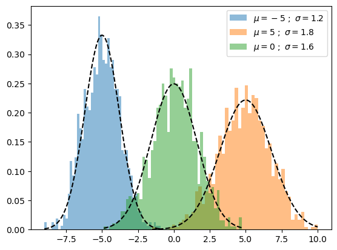
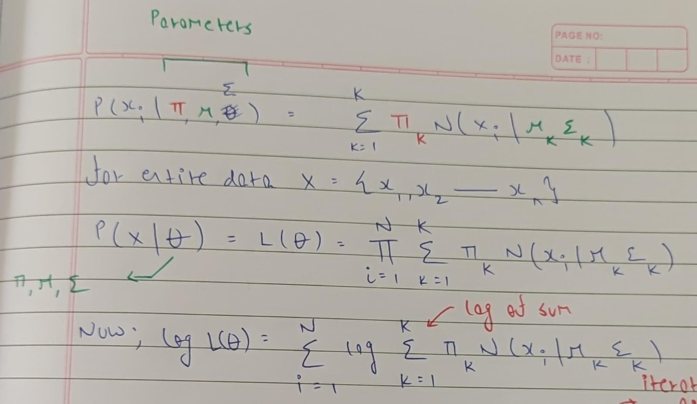
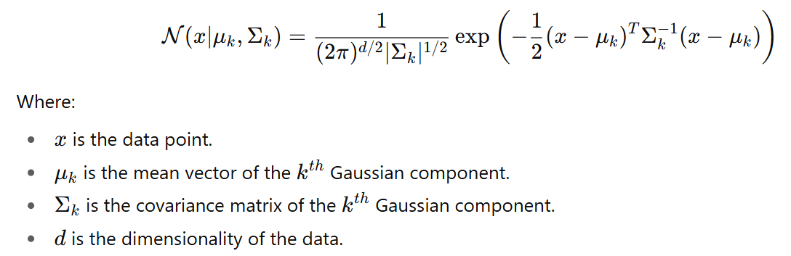

## Gaussian Mixture Models

  
   
  <small><i>Image source: https://stats.stackexchange.com/questions/517652/</i></small>

In a mixture model, each data point is assumed to come from one of the underlying distributions (clusters) with some probability, and the model estimates the parameters of these distributions as well as the probabilities of the data points belonging to each distribution. 

A Gaussian Mixture Model (GMM) is a specific type of mixture model where the underlying distributions are Gaussian distributions. The model estimates the parameters (means, variances, and mixing coefficients) of these Gaussian distributions, as well as the probabilities of each data point belonging to each distribution.

Similar to clustering, GMMs is an unsupervised learning technique where the primary goal is to discover groups or clusters within the data. The only difference between clustering and GMMs is that GMMs take a probabilistic approach (soft assignment). This means that data points can belong to multiple clusters with different probabilities.

## Assumptions

By definition, GMM assumes that each component (cluster) in the mixture is modeled by a multivariate Gaussian distribution with a mean vector <i>μk</i> and a covariance matrix <i>Σk</i>.

However, GMMs relax the assumption made by K means clustering that the the clusters should have similar sizes. The clusters in GMM can have different covariance and different shapes. 

## Algorithm

We start by understanding the maximum likelihood estimation method for GMMs,

  

The problematic part is the log of a sum, which makes optimization very difficult. This structure comes from marginalizing out the unobserved latent variable <i>zi</i>. The log of sum appears because we do not have access to the latent variable which is cluster assignment <i>zi</i>. 

Using gradient method is one option, but this has to be directly applied to above equation, and that is computationally expensive. Furthermore, at each step we need to take care of constraints (For example, the value of <i>πk</i> >= 0 and sum of all <i>πk</i> has to be 1). Whenever we have latent variables, EM algorithm turns out to be very useful. 

The main reason of using EM algorithm for GMMs is that we need to deal with a latent variable (hidden variable) <i>zi</i>. If we had access to <i>zi</i>, we could get a closed form solution for MLE. However, because we don't have <i>zi</i>, 

1) We need to first estimate <i>zi</i> by fixing our parameters <i>π</i>, <i>μ</i>, <i>Σ</i> (E step).

2) Then for that fixed <i>zi</i>, we find closed form solution for our parameters <i>π</i>, <i>μ</i>, <i>Σ</i> (M step). Fixing <i>zi</i> makes it possible to find closed form solution for that iteration.

### E step

### M step

### Why does this work?

Using EM doesn't guarantee global optimum, and hence we need to run it a few times and choose the result with highest likelihood.

## Extra Notes

1) GMMs is a mixture of several multivariate gaussians, where each gaussian is given by 

  

(a) If all Gaussians share the same covariance matrix <i>Σk</i> = <i>Σ</i>, this means that all the Gaussians have the same shape and size (i.e., they all have the same elliptical shape).

(b) If the covariance matrix is diagonal <i>Σk</i> = <i>𝜎2I</i>, then each Gaussian distribution will be spherical with a radius corresponding to the variance. Here since the value of <i>𝜎</i> is same for all, each cluster has same radius. This is the K Means setup.

(c) If we change the (b) to become <i>Σk</i> = <i>𝜎k2I</i>, then this would mean all gaussians are spherical but with different size.

2) If we cannot closed-form updates for the M step in EM algorithm, we could take a Newton or gradient step instead.

## Results
