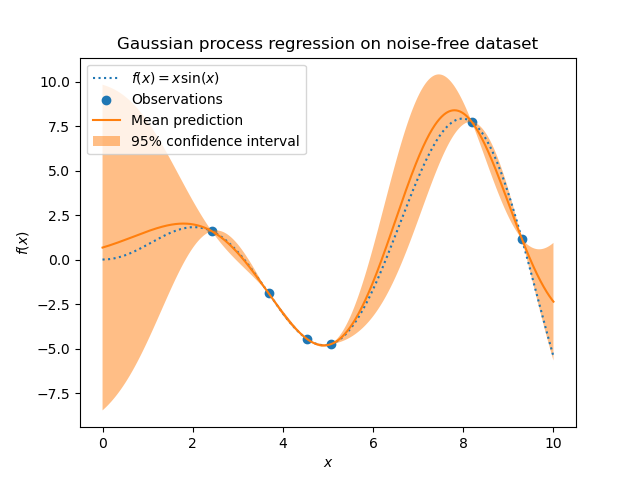
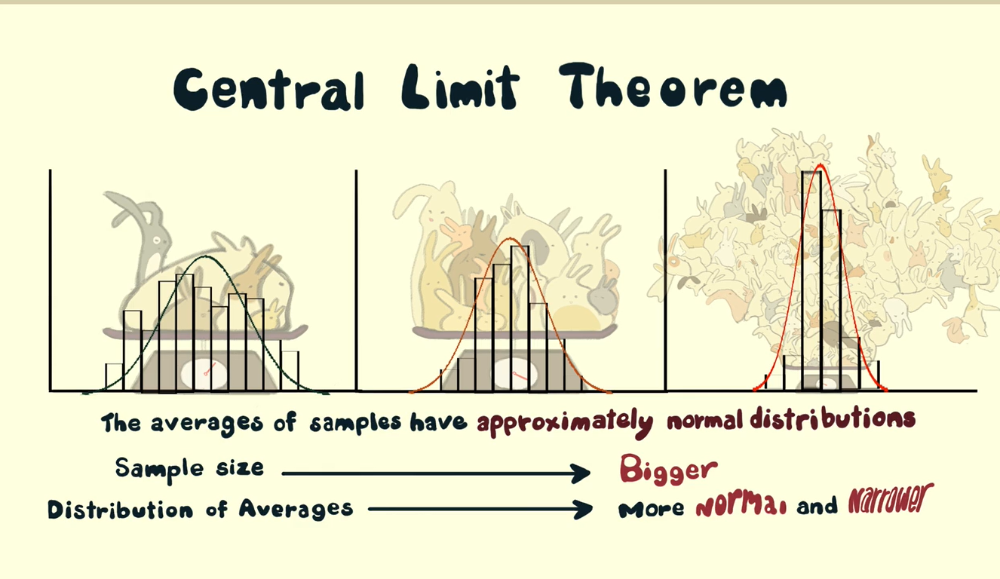
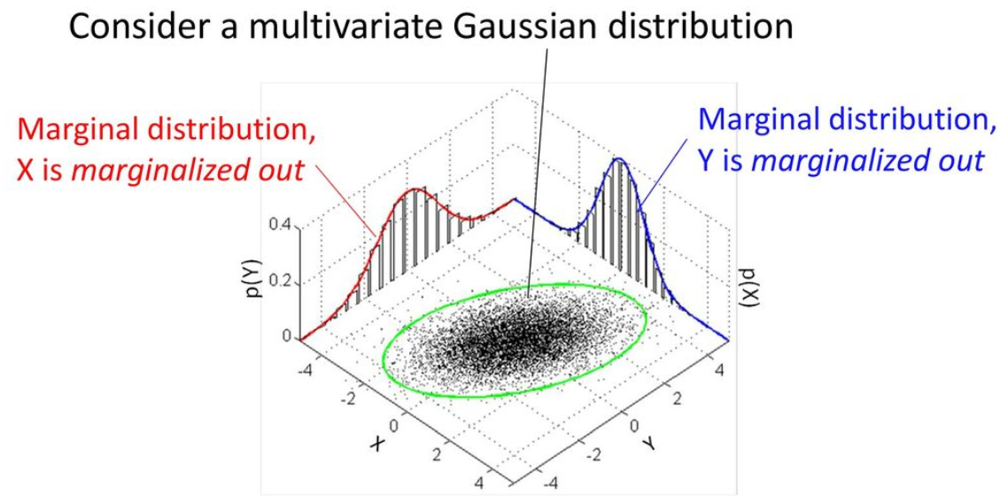
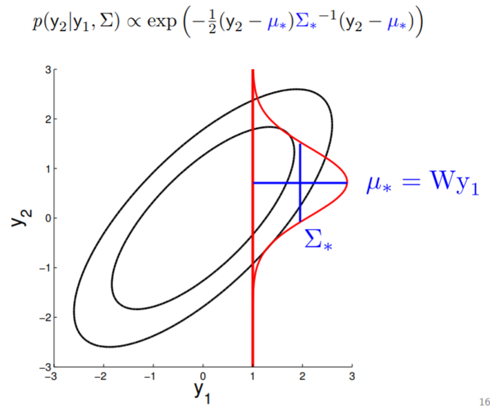

# Gaussian Process Regression

## Introduction

The whole idea behind Gaussian Process Regression is that it is a Probabilistic Model for Regression. This means that we make predictions with well defined uncertainties. Thus for example, we can say that we are 95% confident that the point should lie in this region.

## Background

### Gaussian Distribution

Gaussian Distributions are quite evident in the nature. This is because of two reasons:

1) Central Limit Theorem: The idea behind Central Limit Theorem is that when we add multiple copies of a random variable, for eg. rolling a die several times, then the distribution which describes this sum represents gaussian distribution. This distribution becomes more and more gaussian as we make the sum larger (i.e. consider more samples in each sum).

2) Once a gaussian, always a gaussian: Gaussian Distributions have some nice properties such as Adding two gaussian gives a gaussian, multiplying two gaussian gives a gaussian. It is because of some of these properties such as Conditioning and Marginalization that allow us to perform Gaussian Process Regression.

Some important properties of Gaussian Distribution are:

1) Marginalization: if `P(x, z)` is gaussian, then `P(x)` is gaussian.

2) Conditioning: if `P(x, z)` is gaussian, then `P(x | z)` is gaussian. Here, we are given the value of `z` and our job is to predict `x`

### MLE vs MAP

MLE tries to maximize the probability of distribution given the data, that is it tries to maximize `P(D|θ)`. MAP on the other hand places a prior probability over parameters `P(θ)` and tries to maximize the probability of parameters given the data, that is `P(θ|D)` which is nothing but `P(D|θ)P(θ)`.

In context of linear regression, we can say MLE tries to find a parameter `W` such that it would maximize the likelihood of data i.e. `P( D | W )`. MAP on the other hand would mean that given the data, we need to find parameters which would fit our data the best.

Gaussian Process Regression is a probabilistic model for regression. Here, the main goal is to make predictions with a well-defined uncertainty, which can be useful for tasks such as active learning and uncertainty-aware decision making. The Gaussian process (GP) is a nonparametric and probabilistic model also for nonlinear relationships. Here we will use it for the purpose of regression. The nonparametric nature means that the GP does not rely on any parametric model assumption—instead the GP is flexible with the capability to adapt the model complexity as more data arrives. This means that the training data is not summarized by a few parameters (as for linear regression) but is part of the model (as for k-NN). The probabilistic nature of the GP provides a structured way of representing and reasoning about the uncertainty that is present both in the model itself and the measured data.

Assume that we want to fit a model to some training data T = {xi,yi}3 i=1, as we show in Figure 1.1a. We could make use of linear regression, but even from just these three data points it looks like a simple linear regression model Y = β0 + β1X + ε might be inadequate. Using nonlinear transformations of the input X (polynomials, say) is a possibility, but it can be hard to know what transformations to consider in practice. Instead, we try a different approach in specifying a model. Instead of assuming that we have a linear function, let us just say there exists some (possibly non-linear) function f, which describes the data points as yi = f(xi) + εi, as illustrated by Figure 1.1b. For two different input values x and x, the unknown function f takes some output values f(x) and f(x), respectively. Let us now reason probabilistically about this unknown f, by assuming that f(x) and f(x) are

jointly Gaussian distributed: f(x ) f(x) ∼N(µ,K), (1.1) We illustrate this by Figure 1.2. Of course, there is nothing limiting us to making this assumption about only two input values x and x, but we may extend it to any arbitrary set of input values {x(1),x(2),...,x(n)}. This assumption implies that f is what we refer to as a Gaussian process: Definition 1 (Gaussian process (GP)). A Gaussian process is a (potentially infinite) collection of random variables such that any finite subset of it has a joint multivariate Gaussian distribution. In other words, f isunknowntous, andbyconsideringanarbitrary(butfinite) set of inputs {x(1),x(2),...,x(n)}, we reason about this ignorance by assuming that the function values, or outputs, {f(x(1)),f(x(2)),...,f(x(n))} are distributed according to a multivariate Gaussian distribution. Since we are free to choose the inputs {x(1),x(2),...,x(n)} arbitrarily, and the Gaussian assumption holds for any collection of inputs, this implicitly gives us a distribution for all possible inputs. In other words, we obtain a probabilistic model for the function f itself. Note that we now reason probabilistically about the function f in a way similar to how we probabilistically reasoned about the parameters β in the probabilistic linear regression.

So far, we have only talked about assuming some multivariate Gaussian distribution over f(x) and f(x), but not specified its mean µ or covariance matrix K. One choice would be µ = 0 and a covariance matrix K with only diagonal elements. That would be a white Gaussian process, implying that there is no correlation between f(x) and f(x), and such an assumption would be of very little help when reasoning about f in a regression setting. Instead, we need a way to construct a mean vector and a covariance matrix which adhere to the various properties that we might require from f, such as smoothness and trends. For instance, if we evaluate f at two points x and x which are very close in the input space, then we would expect that f(x) and f(x) are strongly correlated (if the function f is assumed to be continuous, which is often the case). At the same time, we need this construction to generalize in a natural way to an arbitrary selection (and number) of inputs for it to be applicable to the definition of the Gaussian process above.