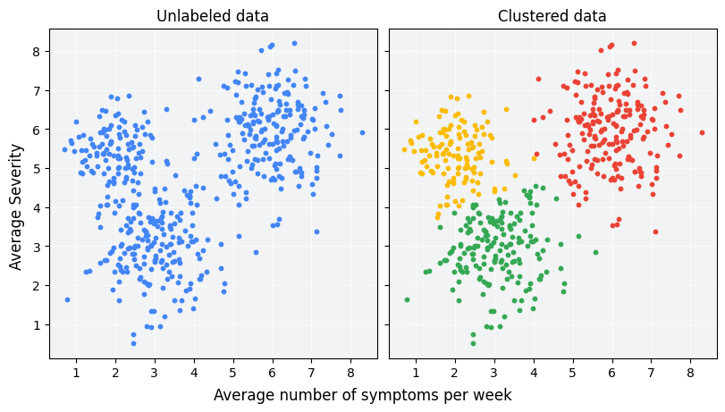
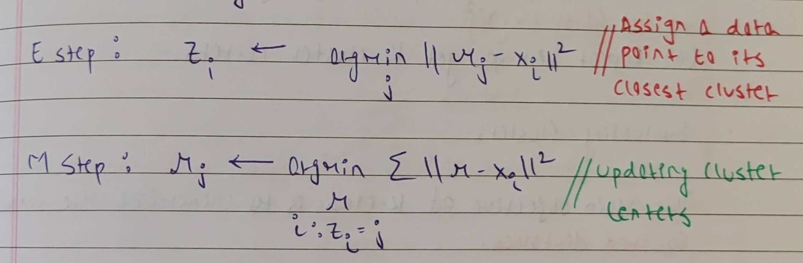

# K Means Clustering

<p align="center">
  
  <br>
  <small><i>Image source: https://developers.google.com/machine-learning/clustering/overview</i></small>
</p>

Clustering is an unsupervised learning technique where the primary goal is to discover groups or clusters within the data.

## Assumptions

K-Means Clustering makes three assumptions about the data:

1) The data should have well-separated clusters.

2) The clusters should be spherical in shape. This assumption arises if we use Euclidean distance in clustering. In general, the shape of the clusters can vary depending on the distance metric used. For example, with Manhattan distance, the clusters are expected to be diamond-shaped.

3) The clusters should be approximately the same size.

## Algorithm

The K-Means Clustering Algorithm is an iterative method consisting of two main steps. It begins by randomly selecting K initial centroids. The first step assigns each data point to the nearest centroid. In the second step, the centroids are updated to be the mean of the points assigned to them. These two steps are repeated until there are no further updates in the assignments or the centroids i.e. until the algorithm converges.

<p align="center">
  
</p>

This formulation allows us to interpret K-Means as a form of coordinate descent. In the first step, we fix the centroids and determine the optimal cluster assignments for the data points. In the second step, we fix the assignments and update the centroids accordingly. This alternating optimization of fixing one part of the problem while optimizing the other is the essence of coordinate descent.


## Choices

The algorithm involves selecting 3 crucial things:

1) The value of K
2) Initialization of K mean points
3) The distance Metric

### How to choose K?

The parameter `K` in clustering represents how many groups we want to divide our data into. As the value of `K` increases, the 


We can sometimes figure out K if we know our data well. For example, if we want to 


The elbow method involves trying different K values and plotting how compact the clusters are. We look for where adding more clusters doesn't make much difference, forming an "elbow" shape in the plot. That's usually a good K value.

### How to initialize the K mean points?

### How to choose the distance metric?


## Extra Notes

1) K-Means clustering requires that all features are scaled properly. For example, if only one feature is normalized while others are left unscaled, the resulting clusters may become elliptical or skewed. This violates the assumption of spherical clusters and will lead to inccorect clusters.

2) K-Means relies on the notions of similarity and distance metrics. Therefore, it is affected by the curse of dimensionality. When the data is high-dimensional, distances between points become less meaningful, which can degrade clustering performance. In such cases, it is advisable to apply dimensionality reduction techniques before using K-Means.


### Initialization

The initial selection of centroids in K-means clustering greatly influences the outcome. If we start with centroids poorly positioned, the algorithm may converge to a suboptimal solution. One strategy to mitigate this is to initialize centroids randomly and run the algorithm multiple times, selecting the best solution among them. This increases the likelihood of finding a globally optimal clustering arrangement.

### Choosing K

The parameter `K` in clustering represents how many groups we want to divide our data into. We can sometimes figure out K if we know our data well, but often we use methods like the elbow method.

The elbow method involves trying different K values and plotting how compact the clusters are. We look for where adding more clusters doesn't make much difference, forming an "elbow" shape in the plot. That's usually a good K value.

## Results

Given a dataset of student marksheets, our task is to group them based on their features, such that similar students end up in similar groups. For a total of 75 groups, we performed clustering based on age, section, gender, and marks obtained in 4 subjects.

```
Group 0: 
[16 'Gilberta' 'Male' 15 'A' 53 30 90 64]
[28 'Hanan' 'Male' 14 'A' 60 36 86 87]
[96 'Georgia' 'Female' 15 'A' 58 10 99 44]
Centroid: [ 0.7  0.8  0.  57.  25.3 91.7 65. ]

Group 9: 
[11 'Dunn' 'Male' 15 'C' 100 93 87 81]
[179 'Val' 'Male' 13 'B' 95 73 91 61]
Centroid: [ 1.   0.5  1.5 97.5 83.  89.  71. ]
```

Here we can observe that there is a decent consistency among all groups. Also by modifying the distance function, we can group students based on specific parameters. Considering only maths and science performance, we obtain the following results:

```
Group 0: 
[73 'Lorrie' 'Male' 13 'A' 72 78 40 78]
[102 'Alvin' 'Female' 13 'B' 80 28 53 67]
[120 'Alyse' 'Male' 14 'A' 80 34 85 71]
[125 'Fredric' 'Male' 14 'B' 68 20 21 81]
[145 'Alis' 'Male' 15 'A' 76 53 32 69]
[158 'Aldin' 'Female' 13 'C' 72 24 83 62]
[185 'Purcell' 'Male' 14 'B' 75 14 54 68]
Centroid: [ 0.7  0.4  0.7 74.7 35.9 52.6 70.9]

Group 9: 
[43 'Brandie' 'Male' 15 'B' 43 2 17 78]
[84 'Eugine' 'Male' 13 'C' 34 18 39 94]
[98 'Silvia' 'Male' 14 'A' 40 61 63 80]
[104 'Woodie' 'Male' 15 'A' 37 57 48 75]
[147 'Jaquenette' 'Male' 15 'C' 33 75 98 84]
[155 'Emlyn' 'Male' 14 'C' 32 3 69 96]
[171 'Fran' 'Female' 15 'B' 34 74 83 81]
Centroid: [ 0.9  0.7  1.1 36.1 41.4 59.6 84. ]
```

Group 0 consists of all students with great performance in both maths and science, while group 9 consists of students with great performance in Maths and average performance in Science.
