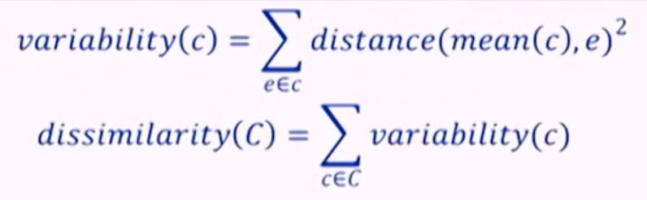
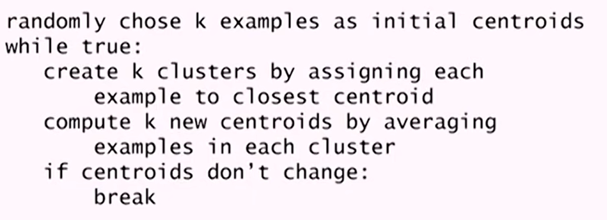

# K Means Clustering


## Introduction

### Unsupervised Learning

Unsupervised learning is a method in machine learning where algorithms are employed to identify patterns in data without the need for labels. In simpler terms, it works with unlabeled data. The main aim of such methods is to uncover similarities, differences, or the underlying structure of the data.

### Clustering

Clustering is a technique within unsupervised machine learning that focuses on grouping similar data points. The idea is to partition the data into distinct and exhaustive groups, or "clusters." 

Clustering can be posed as a Constrained Optimization problem, where we try to find a `C` such that it leads to minimum dissimilarity. This is subject to the constraint that we can have at most `K` clusters.



This is called as K-means objective function. Hierarchical clustering and K-means clustering are algorithms used to find locally optimum solutions to the clustering problem.

### Hierarchical vs K-Means Clustering

Hierarchical clustering builds a hierarchy of clusters by either starting with individual data points as clusters and iteratively merging them or starting with all data points in one cluster and iteratively splitting them. This results in a tree-like structure called a dendrogram. Hierarchical clustering doesn't require specifying the number of clusters beforehand, which can be advantageous in certain scenarios. However, it can be computationally expensive for large datasets.

On the other hand, K-means clustering is an iterative algorithm that partitions the data into a pre-defined number of clusters (K) by minimizing the sum of squared distances between data points and their respective cluster centroids. K-means is computationally efficient and works well with large datasets, but it requires specifying the number of clusters beforehand and is sensitive to the initial choice of centroids.

### Clustering vs Classification

The classification relies on labeled data for training. It learns from these labeled examples and then categorizes new instances based on what it has learned. In contrast, clustering works with unlabeled data. The clusters it generates represent partitions of the data, but these clusters don't carry semantic meaning as labels in classification do. Instead, they simply indicate similarities or patterns in the data.

## Assumptions

Similar to K-nearest neighbors (KNN), K-means clustering operates under the assumption that instances close to each other in the feature space are likely to be similar. In essence, K-means seeks to partition the data into clusters where points within each cluster are more similar to each other than to points in other clusters. This assumption is fundamental to the algorithm's effectiveness.

Additionally, K-means assumes that the variance of the distribution of each attribute (variable) is spherical. This means that the clusters formed by K-means tend to be globular or spherical, and the algorithm performs optimally when the clusters have similar sizes and densities.

David Robinson's article <a href="http://varianceexplained.org/r/kmeans-free-lunch/#:~:text=k%2Dmeans%20assume%20the%20variance,then%20k%2Dmeans%20will%20fail.">K-means clustering is not a free lunch</a> provides an intuitive explanation of why these assumptions are crucial.

## Algorithm



### Initialization

The initial selection of centroids in K-means clustering greatly influences the outcome. If we start with centroids poorly positioned, the algorithm may converge to a suboptimal solution. One strategy to mitigate this is to initialize centroids randomly and run the algorithm multiple times, selecting the best solution among them. This increases the likelihood of finding a globally optimal clustering arrangement.

### Choosing K

The parameter `K` in clustering represents how many groups we want to divide our data into. We can sometimes figure out K if we know our data well, but often we use methods like the elbow method.

The elbow method involves trying different K values and plotting how compact the clusters are. We look for where adding more clusters doesn't make much difference, forming an "elbow" shape in the plot. That's usually a good K value.

## Results

Given a dataset of student marksheets, our task is to group them based on their features, such that similar students end up in similar groups. For a total of 75 groups, we performed clustering based on age, section, gender, and marks obtained in 4 subjects.

```
Group 0: 
[16 'Gilberta' 'Male' 15 'A' 53 30 90 64]
[28 'Hanan' 'Male' 14 'A' 60 36 86 87]
[96 'Georgia' 'Female' 15 'A' 58 10 99 44]
Centroid: [ 0.7  0.8  0.  57.  25.3 91.7 65. ]

Group 9: 
[11 'Dunn' 'Male' 15 'C' 100 93 87 81]
[179 'Val' 'Male' 13 'B' 95 73 91 61]
Centroid: [ 1.   0.5  1.5 97.5 83.  89.  71. ]
```

Here we can observe that there is a decent consistency among all groups. Also by modifying the distance function, we can group students based on specific parameters. Considering only maths and science performance, we obtain the following results:

```
Group 0: 
[73 'Lorrie' 'Male' 13 'A' 72 78 40 78]
[102 'Alvin' 'Female' 13 'B' 80 28 53 67]
[120 'Alyse' 'Male' 14 'A' 80 34 85 71]
[125 'Fredric' 'Male' 14 'B' 68 20 21 81]
[145 'Alis' 'Male' 15 'A' 76 53 32 69]
[158 'Aldin' 'Female' 13 'C' 72 24 83 62]
[185 'Purcell' 'Male' 14 'B' 75 14 54 68]
Centroid: [ 0.7  0.4  0.7 74.7 35.9 52.6 70.9]

Group 9: 
[43 'Brandie' 'Male' 15 'B' 43 2 17 78]
[84 'Eugine' 'Male' 13 'C' 34 18 39 94]
[98 'Silvia' 'Male' 14 'A' 40 61 63 80]
[104 'Woodie' 'Male' 15 'A' 37 57 48 75]
[147 'Jaquenette' 'Male' 15 'C' 33 75 98 84]
[155 'Emlyn' 'Male' 14 'C' 32 3 69 96]
[171 'Fran' 'Female' 15 'B' 34 74 83 81]
Centroid: [ 0.9  0.7  1.1 36.1 41.4 59.6 84. ]
```

Group 0 consists of all students with great performance in both maths and science, while group 9 consists of students with great performance in Maths and average performance in Science.