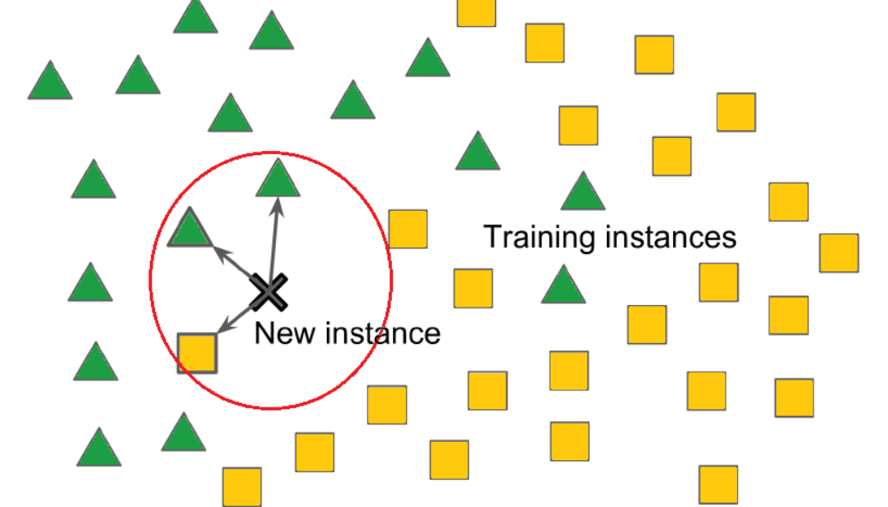
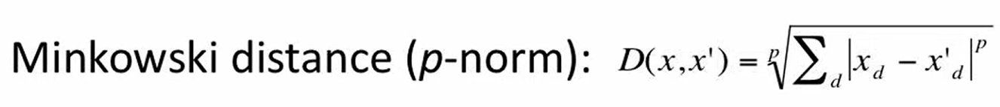

# K Nearest Neighbors (KNNs)



## Introduction

K Nearest Neighbors (KNNs) is a supervised machine learning algorithm that can be used for both classification and regression tasks. 

## Assumptions

KNN operates under the assumption that instances that are close to each other in the feature space are likely to be similar. In other words, points that are similar to each other also tend to have similar target values. Thus the target value of a new instance is likely to be the same as its nearest neighbors.

However, this assumption may not always hold, especially in datasets where the relationship between features and target values is not strictly dependent on proximity. For instance, consider a dataset concerning customer preferences, where features such as age and income are considered. Customers with similar ages and incomes may still have vastly different preferences.

## Algorithm

The KNN algorithm is only as good as its distance metric. The distance metric should be such that it captures the similarity between instances appropriately. For example, Euclidean Distance is a better metric for classifying handwritten digits based on pixel values, but it would prove to be a bad metric for calculating text similarity. Cosine Similarity would be a better metric for text similarity. Some commonly used distance metrics are: 

1. Minkowski Distance: This is a generalized distance metric that includes Manhattan (p=1), Euclidean (p=2), and Chebyshev (p=infinity) as special cases. It is defined as:



The choice of distance metric depends on the amount of penalty one wants to assign to differences in each dimension. If p is lower, say 1, then the metric is less sensitive to outliers and treats each dimension equally. If p is higher, say infinity, then it is sensitive to outliers in any single dimension.

Consider a recommendation system with features such as number of pages read, time spent, etc. Here, if a user reads 100 pages vs 200 pages, it should not be penalized as heavily as spending 1 hour vs 10 hours. Manhattan distance (p=1) would be better. On the other hand, for classifying images where each pixel is equally important, Euclidean distance (p=2) would work better. Similarly, Chebyshev distance (p=infinity) can be used when one dimension is more important than others. For example, in medical diagnosis, a single severely abnormal symptom may be more significant than several marginally abnormal symptoms.

2. Cosine Similarity: Cosine similarity measures the cosine of the angle between two vectors. It is a measure of orientation and not magnitude. Cosine similarity is commonly used as a similarity metric for text data.

Once the similarity metric is defined, for any given test point, we look at its `k` nearest neighbors and take the majority vote of the classes of these neighbors for classification and average of the target values for regression. 

The choice of the parameter `k` (the number of neighbors) is crucial, as it impacts the model's sensitivity to noise and generalization ability. A smaller ```k``` may result in a model that is sensitive to noise, while a larger ```k``` may lead to a model that is too generalized. The optimal `k` is often determined through validation methods.

## Curse of Dimensionality in KNNs


K-Nearest Neighbors (KNN) is based on the assumption that data points close together in the feature space are more likely to belong to the same category. However, as the number of features (dimensions) increases, this assumption can break down due to the curse of dimensionality. In high-dimensional spaces with few data points (sparse data), identifying the true nearest neighbors becomes challenging.

One consequence of this challenge is that the nearest neighbor found by the algorithm might not truly be a neighbor in the meaningful sense. In reality, it could be far from the test point, appearing close only due to the sparseness of the data. Consequently, the core assumption of KNN that nearby points are similar becomes meaningless in such scenarios.

In these cases, algorithms like the perceptron may be more suitable for classification tasks. The perceptron, for instance, can handle higher dimensions more gracefully and is less affected by the curse of dimensionality.

However, it's essential to note that there are instances where datasets possess large dimensions but low intrinsic dimensionality. In such cases, KNN can still be effective. For example, images often have high dimensions but low intrinsic dimensionality, meaning that important information can be captured in fewer dimensions. Techniques like Principal Component Analysis (PCA) can help in reducing the dimensions while preserving most of the important information, making KNN applicable even in high-dimensional scenarios.

## Results

## Classification

Our goal was to build a system that could classify names as belonging to boys or girls. We had two options:

* Full Name as Text: This keeps the name as it is, "John" or "Sarah".
* Encoded Name: We converted the name into a vector of 702 numbers. This vector was made up of the last letter and bigrams (like "ia" or "th").

We used various distance metrics such as Manhattan distance, Euclidean Distance, Cosine Similarity, Hamming Distance to measure the distance between vectors, but none of these methods worked well. This might be because we didn't have enough data to make sense of such a complex representation. This might be due to curse of dimensionality.

Since that didn't work, we decided comparing the names directly as text. We used minimum edit distance as the distance metric. This calculates the minimum number of changes (insertions, deletions, or replacements) needed to turn one name into another. This method of using minimum edit distance as distance metric proved to be more effective and achieved an accuracy of `82.45%` on test data. However this method has a shortcoming. Consider the names 'Prit' and 'Priti'. Clearly, the vowel on the end changes the gender. However, both of these names differ by edit distance of 1. Thus, we design a new metric for Indian names, accounting for the fact that addition of a vowel in end changes gender.

A special adjustment is made to edit distance when the edit distance is 1 and the names only differ by a vowel at the end (e.g., "Shrey" and "Shreya"). In such cases, based on domain knowledge, the labels of the training samples are swapped (using XOR on the label), which might represent handling specific domain nuances. This method provided a validation accuracy of `88.37%` and a test accuracy of `83.84%`. 

Further, by using weighted KNN we get a validation accuracy of `87.60%` and a test accuracy of `87.69%`.

## Regression

K-Nearest Neighbors (KNN) is often called "lazy learning" because it doesn't really build a model; it just remembers all the training data. When we look at the average errors over mumbai house price prediction task, we see that KNN has a score of `0.38 Cr`, but weighted KNN, where we use the inverse distances as weights, has a lower error of `0.30 Cr`.

This is quite lower error compared to linear regression. This is maybe because of features such as latitude and longitude. In places like Mumbai, where location strongly affects prices, linear regression falls short because it can't handle non-linear relationships like those between prices and coordinates. Also, by converting nominal and ordinal features such as age, type, and status to appropriate numeric values, we were able to improve accuracy. We use absolute distance as a metric for finding the nearest neighbour. This absolute distance represents median value and hence is more effective than linear regression which predicts the mean. While predicting quantities such as property prices or average salary, outliers can easily skew the mean but not the median. Hence median becomes a better estimate than mean in this case.

## Retrival

While KNN is commonly used in supervised learning for classification and regression tasks, it can also be applied in unsupervised settings such as clustering. We use the idea of Nearest Neighbors for article retrieval. Each article is represented using TF-IDF representation. 

For example, if the user is currently reading article: `The dollar slipped broadly on Friday as traders booked profits after recent gains but the U.S. currency remained well-placed for further advances, supported by strong U.S. economic data that has prompted markets to dial back expectations for interest rate cuts.`, The following recommendations are generated:

```
You might also like:

Recommendation 1: Dollar Rises on the Interest Rate Plays  NEW YORK (Reuters) - The dollar rose on Thursday as  traders, short of dollars after relentlessly selling them for  weeks, looked to the growing yield advantage of U.S. assets as  a reason to buy back the currency before the end of the year.

Recommendation 2: Dollar's Gains Cut as Fed Raises Rates  NEW YORK (Reuters) - The dollar's gains were clipped  on  Tuesday as the Federal Reserve raised interest rates for the  fifth time this year, as expected, but quashed hopes for more  aggressive rate tightening.

```

We observe that the top articles recommended are close to the topic which user is currently reading. The TF-IDF representation allow us to focus on key words which are common locally but rare globally.