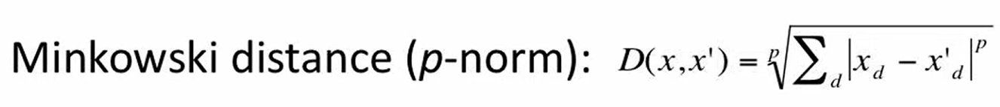

# K Nearest Neighbors (KNNs)

```
You are the average of the five people you spend the most time with.
```

## Assumptions

K Nearest Neighbors (KNNs) is a supervised machine learning algorithm which makes the following assumptions about the data:

### Similarity in proximity

KNN assumes that data points closer in the feature space are more likely to belong to the same class. This implies a smooth transition between classes with no abrupt changes. In the case of the Iris dataset, which categorizes flower species, this assumption holds true. Similar species are expected to be grouped together in the feature space based on characteristics like petal size.

However, this assumption may not be valid for all datasets. For instance, consider a dataset of customer preferences with features such as age and income. In this scenario, customers with similar ages and incomes might exhibit vastly different preferences, thereby challenging the core assumption of KNN. Thus, KNNs may not always be suitable for datasets where the relationship between features and target values is more complex, such as in the case of customer preferences.

### Fixed feature space

The algorithm assumes the features used are relevant and informative. Adding irrelevant features can negatively impact performance. Let's say we're trying to predict whether someone will like a movie based on features like genre, director, and actors. These features are likely to be relevant and informative because they give us clues about the movie's content and style, helping us predict someone's preference accurately.

On the other hand, if we include features like the person's shoe size or the color of their car when trying to predict their movie preference, these features are unlikely to be helpful. They don't tell us anything meaningful about the movies themselves or the person's likely reaction to them, so including them would just add noise to the data and reduce the effectiveness of KNN.

### Distance metric

KNN relies on a chosen distance metric (e.g., Euclidean) to measure similarity. This metric needs to be appropriate for the data and task. For example, Euclidian Distance is a better metric for classifying handwritten digits based on pixel values, but it would prove to be a bad metric for calculating text similarity. Cosine Similarity would be a better metric for text similarity.

## Algorithm

For any given test point, we look at its ```k``` nearest neighbors and take the majority vote of the classes of these neighbors. The key behind KNNs is that it is only as good as its distance metric. Consider Minkowski distance,



Here, 

### Choosing the value of K

The choice of the parameter ```k``` (the number of neighbors) is crucial. A smaller ```k``` may result in a model that is sensitive to noise, while a larger ```k``` may lead to a model that is too generalized. The optimal ```k``` depends on the specific dataset and problem.

A general method to obtain the optimal ```k``` is to use a validation set and plot the accuracy of the model as a function of ```k```. Sometimes, taking ```k``` as the sqaure root of the number of training examples is a good starting choice.

## Shortcomings

### Curse of Dimensionality

The core assumption of KNNs is that data points close to each other in the feature space are more likely to belong to the same class or share similar target values. However, as the dimensionality increases, the data points are no longer close to each other. As the number of features increases, distances become less meaningful, making it difficult to identify true nearest neighbors. Thus as the dimensionality increases, it is better to use approximate nearest neighbors algorithms, and for very high dimensional data, it is better to use some other algorithm such as perceptron.

### Sensitivity to Outliers

Outliers can significantly impact nearest neighbors and compromise accuracy. Fraud detection with KNN might misclassify normal transactions as fraudulent if an outlier representing a fraudulent transaction influences the nearest neighbors. Thus, if we find that our data has a lot of outliers, we should consider removing them before running KNNs or choose different algorithms.

### High Computational Cost

KNNs are considered to be Lazy Algorithm. This is because a lot of computations for the predictions are done during the inference time, rather than training time. Comparing all data points for each query can be computationally expensive for large datasets. Hence, KNNs do not generally scale well with large datasets. 

For a single test point, we need to compare it with all the data points in the training set. This can be running millions of comparisons, with time complexity being O(nd), where n is the number of data points and d is the number of features. This is not very useful for real life applications where the inference time is very important such as google news, where you might need to compare with all the data points to classify the news article.

### Sparse Data

In sparsely populated high-dimensional spaces, finding true neighbors becomes challenging, leading to errors. Once again, the idea of nearest neighbors become meaningless. This is because even if we find a point that is close to the test point, it might not be the true neighbor, since the space is sparse itself.