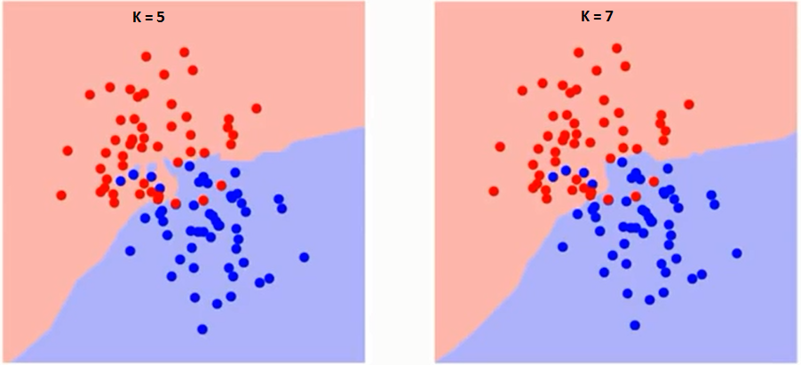

# K Nearest Neighbors (KNNs)




## Introduction

K Nearest Neighbors (KNNs) is a supervised machine learning algorithm which can be used for both classification and regression tasks. 

## Assumptions

KNN operates under the assumption that instances which are close to each other in the feature space are likely to be similar. In other words, points which are similar with each other also tend to have similar target values. Thus the target value of a new instance is likely to be the same as its nearest neighbors.

However, this assumption may not always hold true, especially in datasets where the relationship between features and target values is not strictly dependent on proximity. For instance, consider a dataset concerning customer preferences, where features such as age and income are considered. Customers with similar ages and incomes may still have vastly different preferences.

## Algorithm

KNN algorithm is only as good as its distance metric. The distance metric should be such that it captures the similarity between instances appropriately. For example, Euclidian Distance is a better metric for classifying handwritten digits based on pixel values, but it would prove to be a bad metric for calculating text similarity. Cosine Similarity would be a better metric for text similarity. Some commonly used distance metrics are: 

1. Minkowski Distance: This is a generalized distance metric that includes Manhattan (p=1), Euclidean (p=2) and Chebyshev (p=infinity) as special cases. It is defined as:


The choice of distance metric depends on the amount of penalty one wants to assign to differences in each dimension. If p is lower, say 1, then the metric is less sensitive to outliers and treats each dimension equally. If p is higher, say infinity, then it is sensitive to outliers in any single dimension.

Consider a recommendation system with features such as number of pages read, time spent etc. Here, if a user read 100 pages vs 200 pages, it should not be penalized as heavily as spending 1 hour vs 10 hours. Manhattan distance (p=1) would be better. On the other hand, for classifying images where each pixel is equally important, Euclidean distance (p=2) would work better. Similary, chebeychev distance (p=infinity) can be used when one dimension is more important than others. For example, in medical diagnosis, a single severely abnormal symptom may be more significant than several marginally abnormal symptoms.

2. Cosine Similarity: Cosine similarity measures the cosine of the angle between two vectors. It is a measure of orientation and not magnitude. Cosine similarity is commonly used as a similarity metric for text data.

Once the similarity metric is defined, for any given test point, we look at its `k` nearest neighbors and take the majority vote of the classes of these neighbors for classification and average of the target values for regression. 

The choice of the parameter `k` (the number of neighbors) is crucial, as it impacts the model's sensitivity to noise and generalization ability. A smaller ```k``` may result in a model that is sensitive to noise, while a larger ```k``` may lead to a model that is too generalized. The optimal `k` is often determined through validation methods.

## Curse of Dimensionality in KNNs

K-Nearest Neighbors (KNN) is based on the assumption that data points close together in the feature space are more likely to belong to the same category. However, as the number of features (dimensions) increases, this assumption can break down due to the curse of dimensionality. In high-dimensional spaces with few data points (sparse data), identifying the true nearest neighbors becomes challenging.

One consequence of this challenge is that the nearest neighbor found by the algorithm might not truly be a neighbor in the meaningful sense. In reality, it could be far from the test point, appearing close only due to the sparseness of the data. Consequently, the core assumption of KNN that nearby points are similar becomes meaningless in such scenarios.

In these cases, algorithms like the perceptron may be more suitable for classification tasks. The perceptron, for instance, can handle higher dimensions more gracefully and is less affected by the curse of dimensionality.

However, it's essential to note that there are instances where datasets possess large dimensions but low intrinsic dimensionality. In such cases, KNN can still be effective. For example, images often have high dimensions but low intrinsic dimensionality, meaning that the important information can be captured in fewer dimensions. Techniques like Principal Component Analysis (PCA) can help in reducing the dimensions while preserving most of the important information, making KNN applicable even in high-dimensional scenarios.

## Results

K-Nearest Neighbors (KNN) is called as lazy learning, beacuse it doesn't build a model but remembers training data instead. Due to computational constraints, we tested our Mumbai House Price Prediction with only 20 instances and achieved a mean absolute error of 0.15 Crores.

KNN performed better than linear regression, maybe because of latitude and longitude features. In places like Mumbai, where location strongly affects prices, linear regression falls short because it can't handle non-linear relationships like those between prices and coordinates. Also, by converting nominal and ordinal features such as age, type, and status to appropraite numeric values, we were able to boost accuracy. 