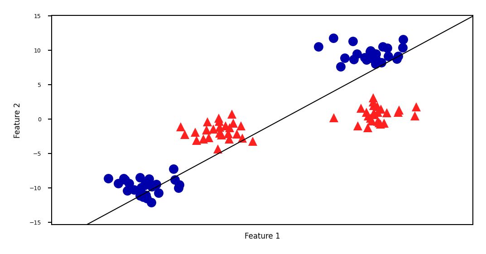
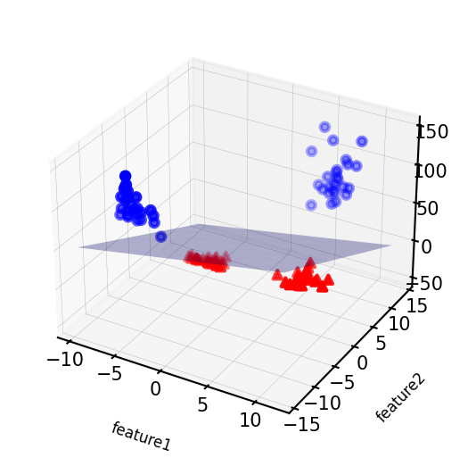
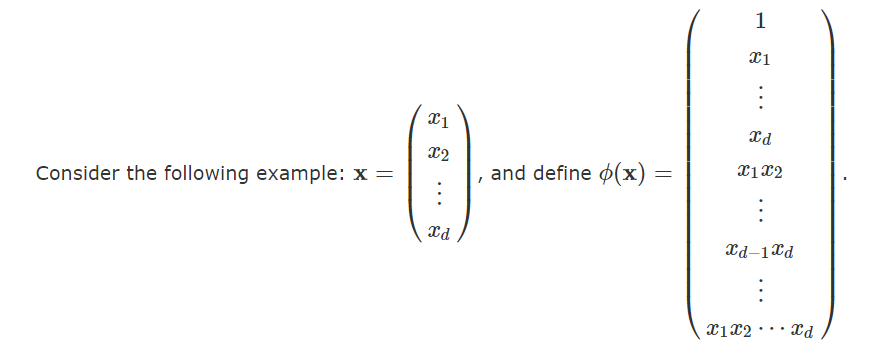
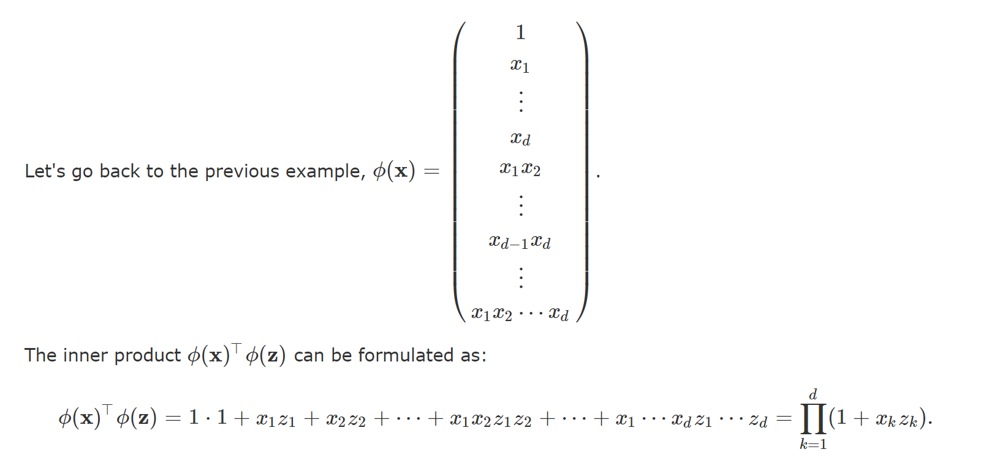
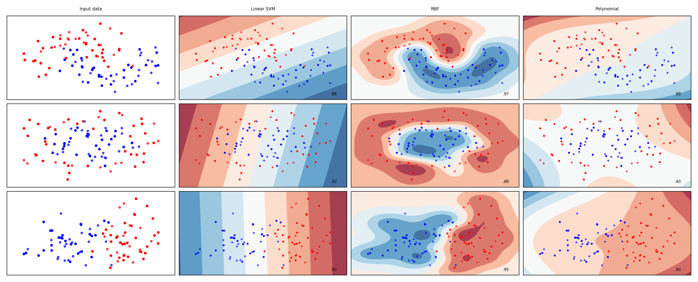

# Kernels

## Introduction

Machine Learning algorithms like SVMs are very successful at finding linear boundaries to separate data points belonging to different classes. However, real-world data frequently exhibits non-linear relationships, posing a challenge for linear classifiers.

Kernelization is a technique that allows linear classifiers to learn non-linear decision boundaries. We often use kernelization when our model suffers from a high bias problem.

## Intuition

Imagine a dataset with two features, say, weight and height, used to classify individuals based on body type (athletic vs. non-athletic). A linear classifier, like an SVM, would attempt to draw a straight line to separate the data points. But it is possible that some short people are athletic, and some tall people are not. A straight line simply wouldn't capture this complexity.

Kernels essentially transform the original data from a lower-dimensional space (e.g., 2D for weight and height) into a higher-dimensional space where the data becomes linearly separable. In our example, we might create a new feature like "body mass index (BMI)" derived from weight and height. This new, 3D space might allow a straight line to effectively separate athletic from non-athletic individuals.

The problem with simply mapping to a higher dimension is that it can get computationally very expensive. The higher dimension might consist of so many features that it is no longer feasible to store these vectors or perform computations on them.

This is where kernelization makes use of the kernel trick. It's a clever way to work with the higher-dimensional space without explicitly doing any of the calculations in that higher space. 

This function operates on the original data points and calculates a similarity measure in the higher-dimensional space, without explicitly performing the mapping itself. It essentially acts as a bridge, allowing the linear classifier to function in its familiar lower-dimensional world while considering the non-linear relationships present in the higher-dimensional space. Essentially, we map our features to a higher dimension and fit a classifier in that higher dimension, but we never perform a single calculation in this higher dimension. The calculations are still performed on the original space where calculations over the feature vector are feasible. 

## Mathematics behind Kernel Functions

Consider the following example of mapping feature vector to higher dimension.

## Part I: Linear Classifiers & Inner Products

In a linear classifier, we aim to find a decision boundary that separates different classes in the feature space. This decision boundary is represented by a hyperplane. raditionally, in linear classifiers like Support Vector Machines (SVMs) or logistic regression, we represent the decision boundary using a weights `w` and bias `b`.

The decision function for a linear classifier can be expressed as  `𝑓(𝑥) = 𝑤𝑇.𝑥 + 𝑏`. We can express the decision function solely in terms of inner products between feature vectors. The proof for the same can be found <a href="https://www.cs.cornell.edu/courses/cs4780/2018fa/lectures/lecturenote13.html">here</a>.

What this shows us that the only information we ever need in order to learn a hyper-plane classifier is inner-products between all pairs of data vectors. By this, we eliminate the need for `w` matrix, and instead require matrix of alphas.

## Part II: Kernel Trick

For some of these feature mappings, we can find the inner product between these two vectors `ϕ(x)` and `ϕ(z)` very cheaply. 

Here, instead of calculating inner product on `ϕ(x)` and `ϕ(z)` which would have involved `2^d` computations, we calculate inner products for `x` and `z` which require `d` computations.

This kernel trick allows us to use all the advantages of higher dimensions, but by keeping the computation costs of our original space.

## Algorithm

