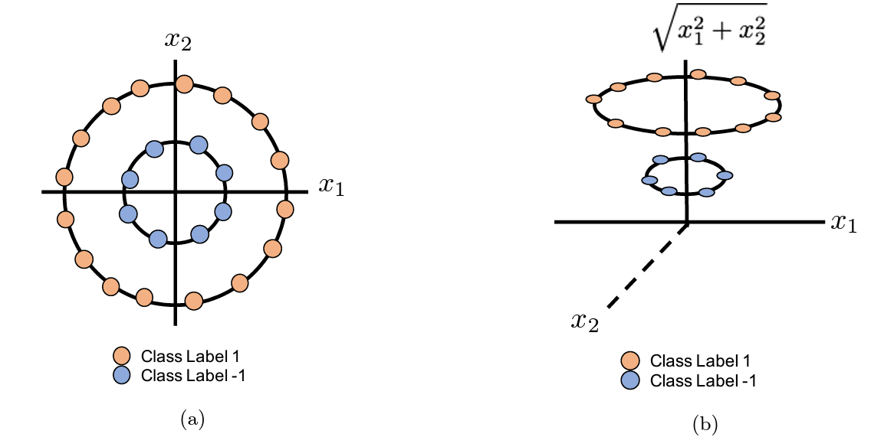
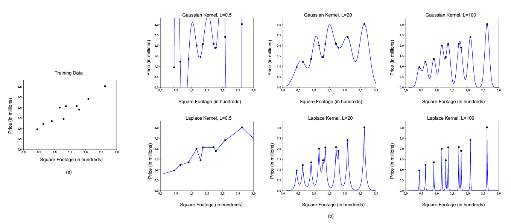

# Kernels

## Introduction

Machine Learning algorithms like SVMs are very successful at finding linear boundaries to separate data points belonging to different classes. However, real-world data frequently exhibits non-linear relationships, posing a challenge for linear classifiers.

Kernelization is a technique that allows linear classifiers to learn non-linear decision boundaries. We often use kernelization when our model suffers from a high bias problem.

## Intuition

Imagine a dataset with two features, say, weight and height, used to classify individuals based on body type (athletic vs. non-athletic). A linear classifier, like an SVM, would attempt to draw a straight line to separate the data points. But it is possible that some short people are athletic, and some tall people are not. A straight line simply wouldn't capture this complexity.

Kernels essentially transform the original data from a lower-dimensional space (e.g., 2D for weight and height) into a higher-dimensional space where the data becomes linearly separable. This higher dimensional spcae tries to capture the non linear interactions among the features. In our example, we might create a new feature like "body mass index (BMI)" derived from weight and height. This new, 3D space might allow a straight line to effectively separate athletic from non-athletic individuals.

The problem with simply mapping to a higher dimension is that it can get computationally very expensive. The higher dimension might consist of so many features that it is no longer feasible to store these vectors or perform computations on them. This is where kernelization makes use of the kernel trick. It's a clever way to work with the higher-dimensional space without explicitly doing any of the calculations in that higher space. 

This function operates on the original data points, and calculates a similarity measure in the higher-dimensional space, without explicitly performing the mapping itself. We fit a linear classifier in higher dimension, but we never perform a single calculation in this higher dimension. The calculations are only performed on the original space.

## Mathematics behind Kernel Functions

Consider the following example of mapping feature vector to higher dimension.

### Part I: Linear Classifiers & Inner Products

In a linear classifier, we aim to find a decision boundary that separates different classes in the feature space. This decision boundary is represented by a hyperplane. raditionally, in linear classifiers like Support Vector Machines (SVMs) or logistic regression, we represent the decision boundary using a weights `w` and bias `b`.

The decision function for a linear classifier is expressed as  `𝑓(𝑥) = 𝑤𝑇.𝑥 + 𝑏`. We can express the decision function solely in terms of inner products between feature vectors. The proof for the same can be found <a href="https://www.cs.cornell.edu/courses/cs4780/2018fa/lectures/lecturenote13.html">here</a>.

What this shows us that the only information we ever need in order to learn a hyper-plane classifier is inner-products between all pairs of data vectors. Thus, if we are able to precompute the inner products and store them in a matrix `K`, all we need to do during training and testing time is to refer this matrix `K`. This idea is similar to the idea of memoization in Dynamic Programming. This matrix `K` is called as Kernel Matrix `K`. By this, we eliminate the need for `w` matrix, and instead require matrix of alphas.

### Part II: Kernel Trick

For some of these feature mappings, we can find the inner product between these two vectors `ϕ(x)` and `ϕ(z)` very cheaply. 

Here, instead of calculating inner product on `ϕ(x)` and `ϕ(z)` which would have involved `2^d` computations, we calculate inner products for `x` and `z` which require `d` computations. This kernel trick allows us to use all the advantages of higher dimensions, but by keeping the computation costs of our original space. Thus even though we learn our classifier in higher dimension, we never compute even once in this space.

Some common kernel functions are as follows:

A linear kernel performs same as the linear model, but instead of storing `W`, now we store `aplha`. When there are lots of dimensions but not many training examples, using a linear kernel can be faster and more efficient. For eg. Datasets involving DNA or  genetics.

Now, the Radial Basis Function (RBF) kernel works differently. It puts Gaussian (bell-shaped) curves around each data point and finds the closest points based on these curves. Think of it like how K-Nearest Neighbors (KNN) works, but instead of using a fixed number of neighbors, the RBF kernel adjusts the number of neighbors based on these Gaussian curves. This makes it smarter than KNN because it adapts to the data better. It's interesting to see that when we try to make a linear classifier understand more complex relationships, we end up with ideas which are similar to KNN.

## Algorithm

Any linear classifier can be kernelized using two steps.

* Step I: We need to show that the the classifier can be expressed solely in terms of inner products of feature vector.

### Kernelizing Perceptron

### Kernelizing Linear Regression

### Kernelizing SVMs

## Results

One way to debug kernelized implementations is to use a linear kernel and ensure that the results match those obtained without using kernel methods. For instance, if include trigrams as feature and apply a linear kernel in kernel perceptron, we get exactly same results as those obtained without using kernels.

### Perceptron

The Kernelized Perceptron converges in 12 steps when we consider features such as last character and bigrams from a name. Unlike regular Perceptron Algorithm whih required trigrams as a feature, Kernelized Perceptron are able to converge by just using last character and bigrams. It achieves an accuracy of `90%` on the training set which is significantly higher than `86.15%` by regular Perceptron. We use the Radial Basis Function Kernel for the same.
