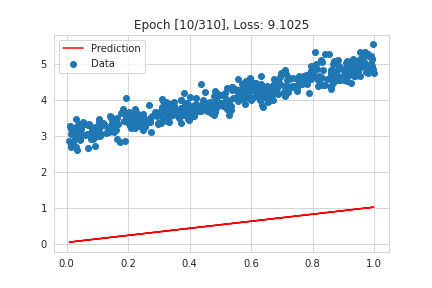
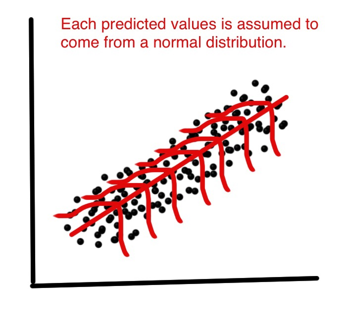
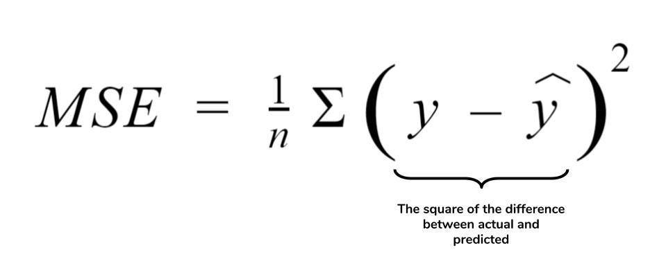

# Linear Regression

## Introduction

Linear regression allows us to predict a continuous value (like house price) based on one or more factors (like house size) by fitting a straight line through the data. Unlike classification tasks where labels fall into distinct categories, linear regression handles problems where the label is a real number.

## Assumptions

Linear regression makes two core assumptions about the data. First, it assumes a linear relationship between the features and the label. For example, house price might have a linear relationship with the area of the house. Second, it assumes the errors/noise (the difference between actual values and the fitted line) follow a Gaussian distribution. This means the data points will be scattered around the true linear regression line in a bell-shaped curve.

Thus, we can formalize these assumptions as `y = WX + b + ε` where `ε` is the Gaussian distributed error or noise, that is `ε ~ N(0, σ2)` where `σ2` is the variance of the noise.

In simpler terms, this equation also implies that `y` itself follows a normal distribution with a mean of `WX + b` and a variance of `σ^2`. We can represent this as: `y ~ N(WX + b, σ^2)`

## Algorithm

Given `y ~ N(WX + b, σ^2)`, the goal of linear regression is to estimate the parameters `W` and `b`  by maximum likelihood (MLE) or Maximum A Posteriori (MAP) estimation. 

MLE tries to maximize the probability of distribution given the data, that is it tries to maximize `P(D|θ)`. MAP on the other hand places a prior probability over parameters `P(θ)` and tries to maximize the probability of parameters given the data, that is `P(θ|D)` which is nothing but `P(D|θ)P(θ)`. This involvement of the extra term `P(θ)` helps prevent overfitting by introducing a regularization term.

<a href="https://www.cs.cornell.edu/courses/cs4780/2018fa/lectures/lecturenote08.html">Click Here</a> to view the derivation of estimation of `W` and `b`. This shows how we obtain the Ordinary Least Squares (OLS) loss function and regularization term.

Unlike logistic regression which uses a complex loss function, linear regression utilizes the Ordinary Least Squares (OLS) loss function. Because the OLS loss function is a parabola, it has a closed-form solution. This means we can theoretically find the optimal W and b in one step using methods like Newton's method. However, for problems with high dimensionality (many independent variables), calculating the Hessian matrix required by Newton's method becomes computationally expensive. Therefore, iterative optimization algorithms like gradient descent are preferred in practice.

## Results

We trained a linear regression model to predict house prices in Mumbai. On the test set, our model achieved an average absolute error of `0.68` Crores. In simpler terms, this means the predicted prices typically differed from the actual prices by around `0.68` Crores.

Compared to other algorithms like KNN where the average absolute error was around `0.31` Crores, our linear regression model performs less accurately. This could be because house prices in Mumbai can vary greatly depending on location. A similar-sized house in Juhu could cost significantly more than one in Borivali. Linear regression assumes a straight-line relationship between features and price, which might not capture the impact of location as effectively. KNN, on the other hand, can better handle these kinds of variations by considering similar houses that have already sold. Additionally, linear regression uses squared loss function, which represents mean. Median is a better quantity to predict for tasks such as house price prediction, considering the impact of outliers.