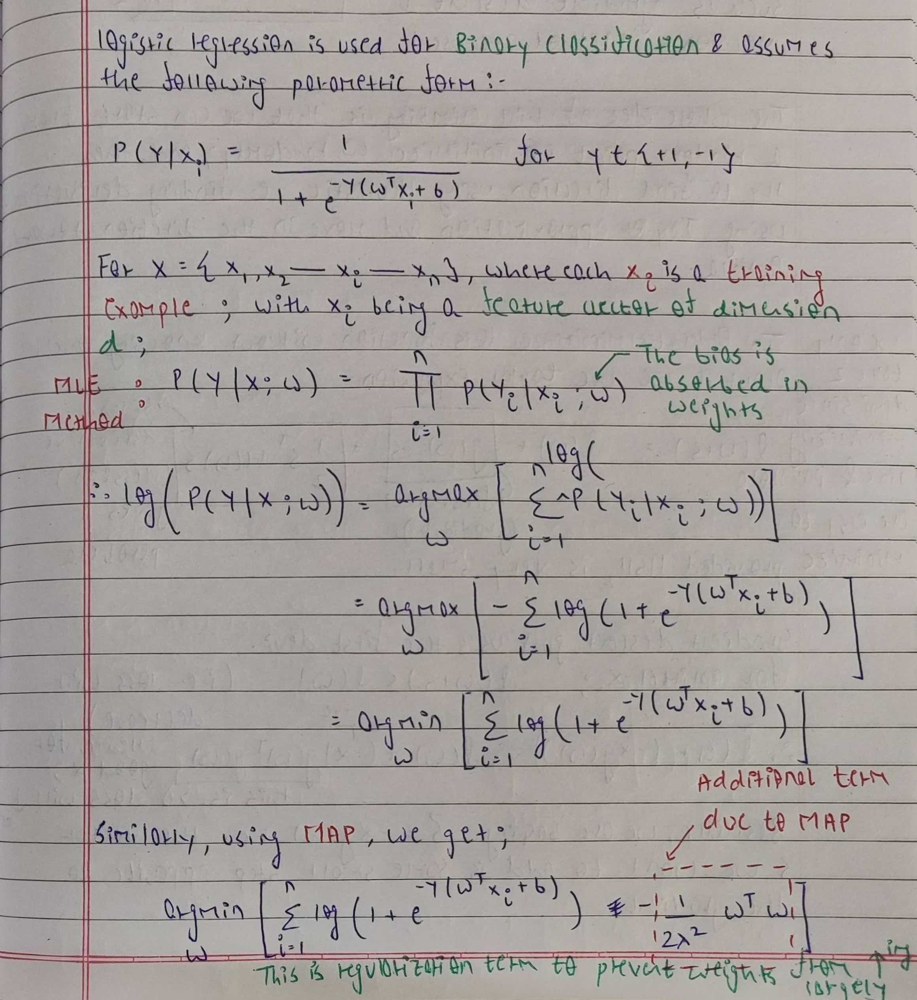

# Logistic Regression


## Introduction

Logistic regression is a linear classifier and discriminative counterpart of Naive Bayes. It tries to learn `P(Y | X)` directly. This is different from Naive Bayes which learns `P(X | Y)` and `P(Y)`. 

Consider the example of classification between cats and dogs. A generative model like naive bayes tries to understand what features makes an animal dog. Thus it tries to draw an image of what a dog might be. Discriminative model on the other hand tries to find the features which can distinguish a dog from cat. To put it simply, Generative model tries to understand what makes an animal a dog or a cat, while Discriminative model focuses on pinpointing the key features that tell them apart.

## Assumption

Logistic regression is comparatively more flexible and does not make any strict assumptions about the data. It generally works well for data drawn from exponential family distribution. The exponential family consists of several common probability distributions, including the normal (Gaussian), exponential, Poisson, binomial, and gamma distributions, among others. 

## Algorithm

Every discriminative algorithm assumes a certain parametric form over ```P(Y|X)``` and tries to learn the parameters for this directly by maximum likelihood (MLE) or Maximum A Posteriori (MAP) estimation. This parameteric form represents the sigmoid function.


MLE tries to maximize the probability of distribution given the data, that is it tries to maximize `P(D|θ)`. MAP on other hand places a prior probability over parameters `P(θ)` and tries to maximize the probability of parameters given the data, that is `P(θ|D)` which is nothing but `P(D|θ)P(θ)`. This involvement of extra term `P(θ)` helps prevent overfitting by introducting regularization term.



For both MLE and MAP, we arrive at a step which does not have a closed form solution. However, one of the nice properties of this function is that it is convex, continuous, and differentiable in nature. This implies we can use algorithms based on Hill Climb Search such as Gradient Descent or Newtons Method to find the argmin.

The whole idea of Hill Climbing is that we start randomly, that is we initialize `W` and `b` randomly such as with `0`s and then we find the direction towards the optima using some heuristics. Here, we use taylor approximations to provide us with that heuristic. Once we have found the direction, we take small steps (for taylor approximation to hold) in that direction.

<a href="https://www.cs.cornell.edu/courses/cs4780/2018fa/lectures/lecturenote07.html">Click Here</a> to learn about Logistic Regression using Gradient Descent and Newton's Method.

## Naive Bayes vs Logistic Regression

One key difference of Logistic Regression and Naive Bayes is that Logistic Regression is much for flexible. It does not makes overly bold assumptions about the conditional independence of features like Naive Bayes. We do assume a parametric form for logistic regression, but do make any assumptions about data, which allows the probability distribution to be any one of the exponential family. This allows logistic regression to be more flexible, but such flexibility also requires more data to avoid overfitting. Typically, in scenarios with little data and if the modeling assumption is appropriate, Naive Bayes tends to outperform Logistic Regression. However, as data sets become large logistic regression often outperforms Naive Bayes, which suffers from the fact that the assumptions made on `P(x|y)` are probably not exactly correct.

Imagine two features that are highly correlated, like having the same feature counted twice. Naive Bayes treats each copy of the feature as separate, which can lead to overestimating the evidence. However, logistic regression handles correlated features better. If two features are perfectly correlated, logistic regression splits the weight between them, leading to more accurate probabilities when there are many correlated features.

Given all the assumptions hold, Naive Bayes converges faster than Logistic Regression.

## Results

The logistic regression model trained on the gender dataset achieves an accuracy of approximately `86.2%` on the test set. Guessing gender from names is little tricky, even for humans, because names vary a lot and can be confusing. So the model does a decent job in predicting genders from names alone. We can also consider features such as trigrams from names to potentially improve the accuracy.