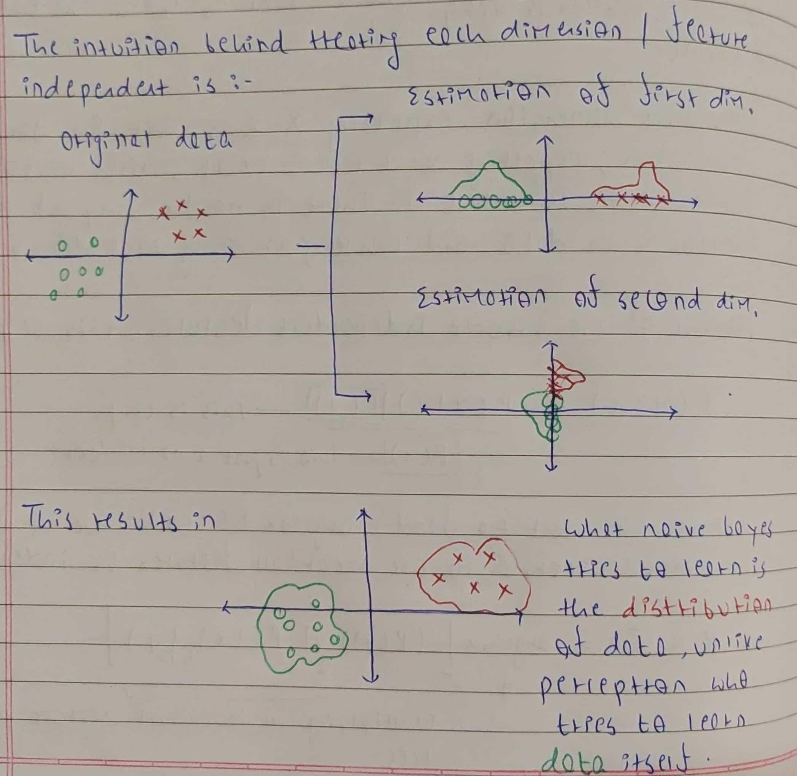
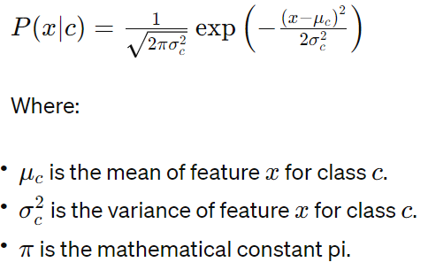
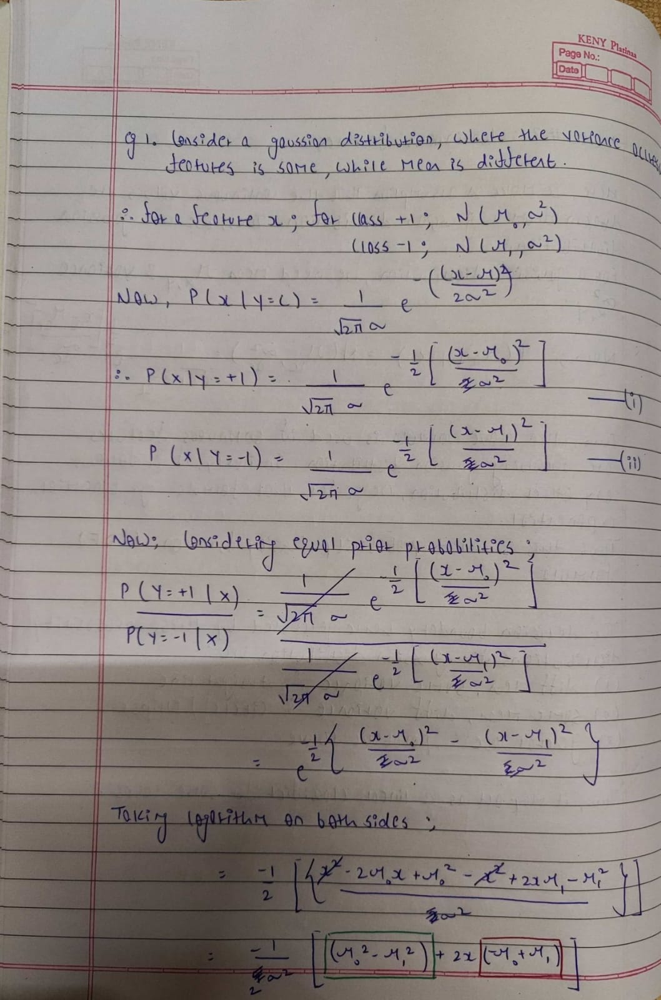
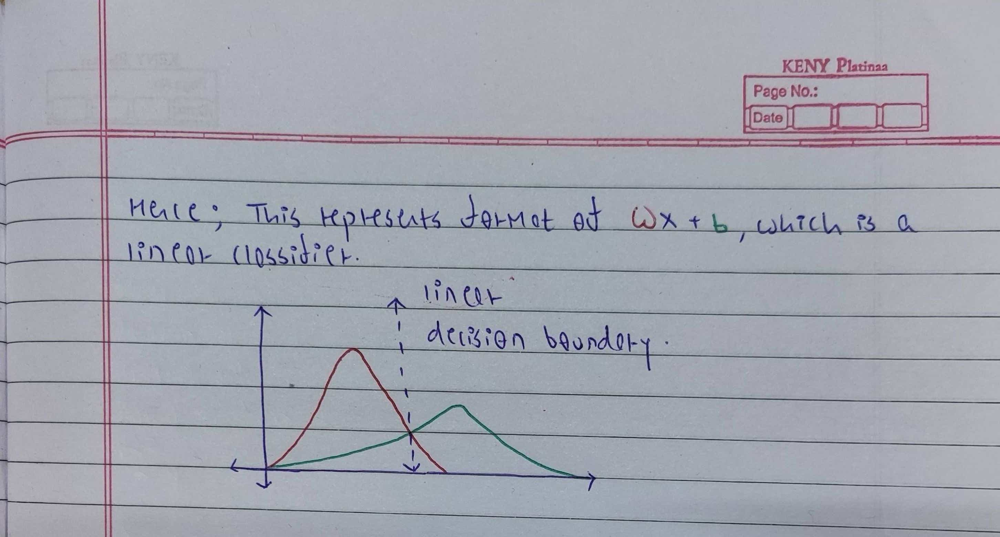

# Naive Bayes

```
Every true genius is bound to be naive.
```

## Introduction

The whole idea of learning classifiers based on Bayes Rule is that these are generative models. The goal of generative models is to learn the underlying distribution of data. This idea is different from discriminative models like perceptron which learn how to distinguish the different classes by learning a decision boundary. In simpler terms, learning classifiers based on Bayes Rule doesn't directly model the probability of a class (Y) given the data (X) which is ```(P(Y | X))```. Instead, it focuses on the probability of the data (X) given a specific class (Y) which is ```(P(X | Y))```. This essentially represents the likelihood of encountering a particular data point considering its class membership.

During prediction, when we need to determine P(Y | X), Naive Bayes employs Bayes theorem to arrive at the desired probability. This theorem provides a powerful tool for calculating conditional probabilities:

```P(Y | X) = (P(X | Y) * P(Y)) / P(X)```

Here, each term holds a specific meaning:

```P(Y)```: This represents the prior probability of class Y occurring in the dataset. It reflects the inherent bias towards a particular class if it exists.
```P(X)```: This denotes the prior probability of encountering data point X itself, independent of any class.
```P(X | Y)```: This term, known as the likelihood, is crucial. It represents the probability of observing data point X given that it truly belongs to class Y. This value is estimated using the training data.

Thus, if we look at classifiers with bayes rule, then each ```P(X = Xa | Y = c)``` is a parameter. Thus if we consider a simple feature vector ```X``` with n features, where each feature is a boolean value, and 2 classes ```{+1, -1}```; we need to estimate approximately ```2^(n+1)``` parameters. Thus even for such a simple scenario, the parameters scale exponentially with the number of features. It just becomes impractical to estimate these parameters from data.

Thus, a key challenge arises when dealing with high-dimensional data. Data point X is often a multi-dimensional vector, meaning it consists of numerous features. For instance, with 100 dimensions, X would be a vector of size 100, potentially containing specific values like "Red" and "Round". The problem lies in finding an exact match for this instance within the training data. As the number of dimensions increases, the probability of encountering an identical data point rapidly diminishes.

Imagine a single dimension with 100 possible values. Randomly picking a specific value has a probability of ```0.01```. Now, consider two such dimensions. The probability of finding a specific value in each dimension simultaneously drops to a mere ```0.0001```. This highlights the exponential decrease in probability with increasing dimensionality.

To address this challenge, Naive Bayes makes a simplifying assumption: conditional independence. This assumption, which is why the model is called "naive," posits that given a class label, the presence or absence of one feature is independent of the presence or absence of any other feature. In simpler terms, it assumes that the features provide independent clues about the class membership. This is very different from the argument that the features should be independent. Consider the following example, if a person has symptoms like chills and fever, then he may be suffering from malaria. It's like saying, once we know someone has malaria, we automatically assume they have fever. So, while fever and chills are related, in this context, chills become redundant for predicting fever if we already know the person has malaria.

This whole idea of conditional independence allows us to reduce parameters from ```2^(n+1)``` to ```2n```. This is the key to Naive Bayes.

# Intuition

Naive Bayes makes a daring assumption: it believes that each feature, like color or size, doesn't rely on the others, provided the class. Surprisingly, this bold move doesn't hurt its performance much. That's why Naive Bayes can still give pretty good guesses, even though it's quite simple.

This bold move simplifies the math to:

```
P(X|Y) = [P(x1|Y) * P(x2|Y) * ... * P(xn|Y)] * P(Y) / P(X)
```

Calculating P(Y) is easy - just count how many examples you have for each class and make sure they all add up to one. As for P(X), it's like a constant that doesn't really change our guess. The big change comes when we break down ```P(x1|Y) * P(x2|Y) * ... * P(xn|Y)``` instead of directly dealing with ```P(X|Y)```. It's like shifting from searching in many dimensions to just one, which is much easier.

In a perfect world where all features are totally unrelated, Naive Bayes would be super accurate. But in reality, if features are connected, it might make errors. That's why Naive Bayes works best when features don't depend too much on each other.



## Algorithm

When working with Naive Bayes, we typically encounter calculating probabilities for three types of scenarios:

* Categorical
* Multinomial
* Continuous

### Categorical

```P (Xa = A | Y = c) = (# number of samples with class c and feature Xa as A) / (# total number of samples in class)```

### Multinomial

```P(Xa | Y = c) = (# number of times feature X appears in instances of class c)/(# total occurrences of all features for class c)```

### Continuous

In the case of continuous features, such as numerical data, the probability density function (PDF) is often assumed to follow a specific distribution, commonly the Gaussian (normal) distribution due to its simplicity and wide applicability. The Gaussian distribution is characterized by its mean (μ) and variance (σ²).

For each class c, the Naive Bayes classifier estimates the parameters of the Gaussian distribution for each feature. Let's denote the feature as  x. Then, the probability density function (PDF) of x given class c can be expressed as:



## Naive Bayes as a linear classifier

Naive Bayes learns the underlying probability distribution rather than learning how to separate these distributions. This is different from the idea of perceptron which tries to separate two classes from each other by drawing a decision boundary. Thus, Naive Bayes is a generative model while Perceptron is a discriminative model. However, in some cases, the way naive Bayes learns the underlying probability resembles a linear classifier.




## Relationship Between Naive Bayes Classifiers and Logistic Regression


The whole idea in Naive Bayes behind learning P(Y|X) is to use the training data to estimate P(X|Y) and P(Y). Thus what we are estimating here is the data distribution. 

Logistic Regression, a discriminative model, assumes a parametric form of class distribution Y given data X, P(Y|X), then directly estimates its parameters from the training data. On the other hand, Naive Bayes classifier, a generative model uses Bayes rule for learning P(Y|X) where X=〈X1…, Xn, and does this by making a conditional independence assumption that dramatically reduces the number of parameters to be estimated when modeling likelihood P(X|Y).

Under certain assumptions, the Gaussian Naive Bayes classifier is equivalent to a linear model with the log-likelihood loss function. Both of them are learning the same boundary.

Proof for the same can be found <a href="https://appliedmachinelearning.wordpress.com/2019/09/30/equivalence-of-gaussian-naive-bayes-and-logistic-regression-an-explanation/">here</a>.