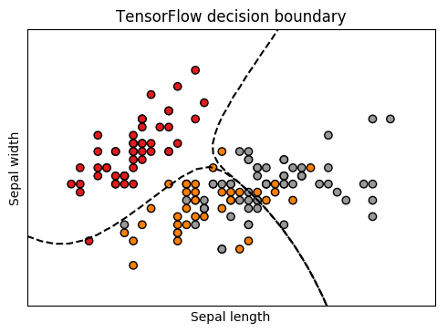
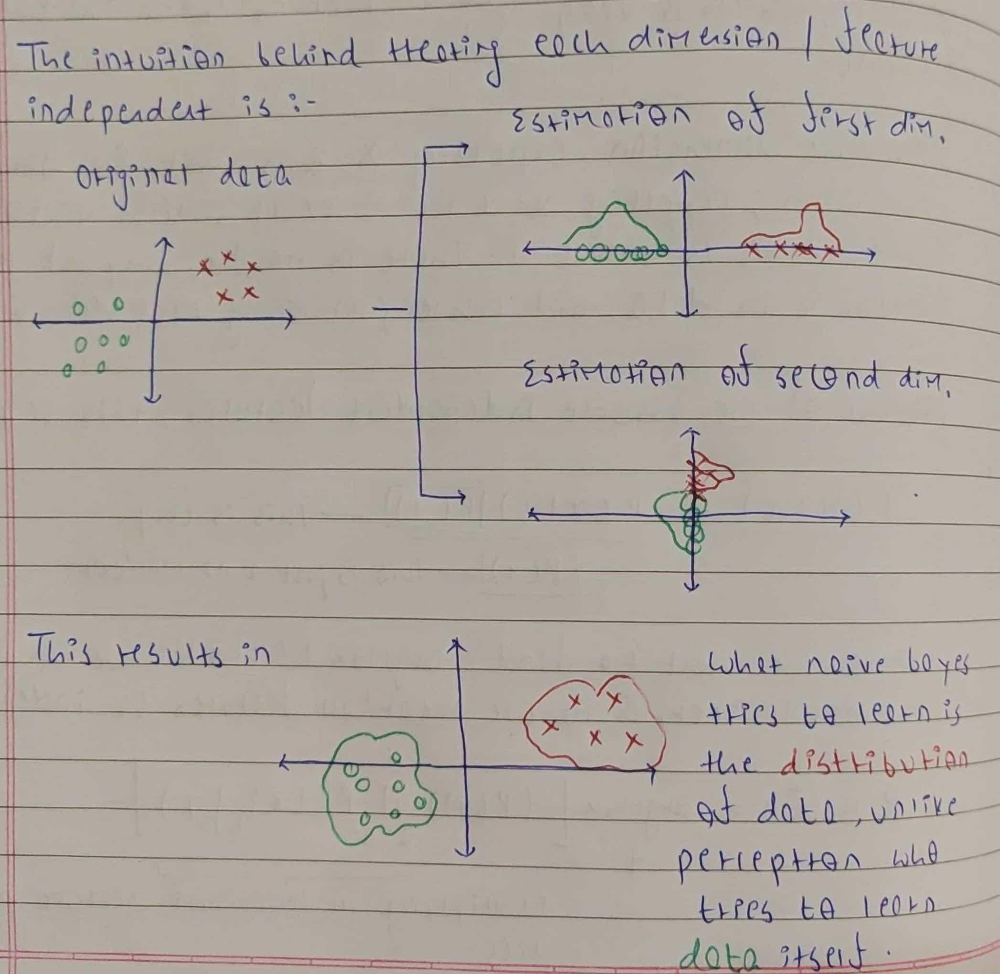
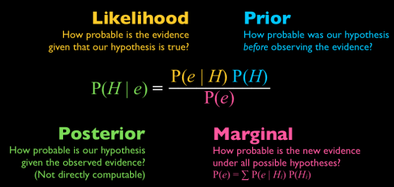
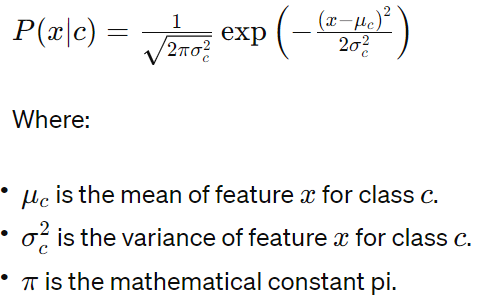
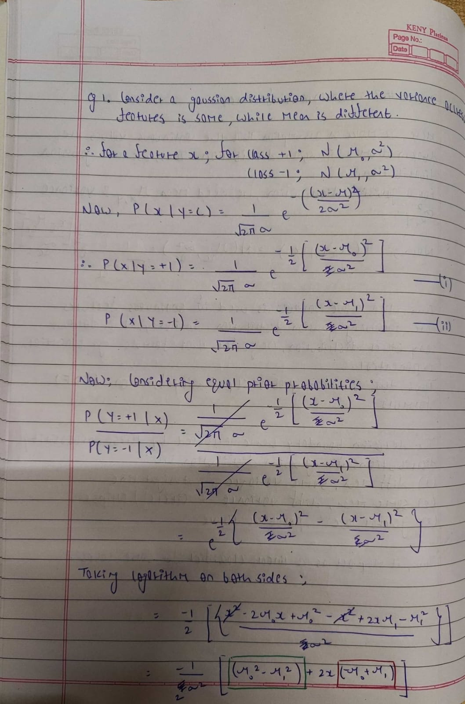
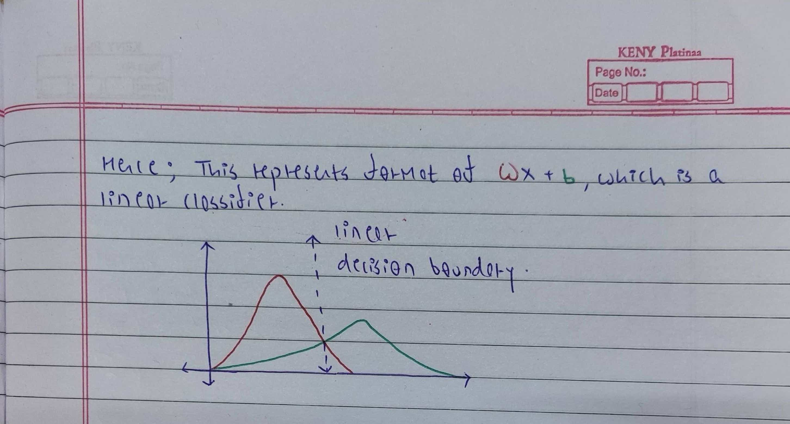

# Naive Bayes



## Introduction

Naive Bayes is a classification algorithm based on probability theory. Unlike algorithms such as perceptron or linear regression, which focus on learning decision boundaries, Naive Bayes learns classifiers based on Bayes' rule.

## Assumption

Naive Bayes makes a very bold assumption about the data, it assumes that the features are conditionally independent. This assumption, which is why the model is called "naive," says that given a class label, the presence or absence of one feature is independent of the presence or absence of any other feature. Assume a scenario where symptoms like fever and chill indicate a person has malaria. Now, given a person has malaria, we know the person has a fever. Of course fever and chills are dependent on each other in some way, but the knowledge of malaria is enough to tell us whether the person has a fever or not, chills become redundant knowledge.

### Why make such an assumption?

The whole idea of learning classifiers based on Bayes Rule is that these are generative models. The goal of generative models is to learn the underlying distribution of data. This idea is different from discriminative models like perceptron which learn how to distinguish the different classes by learning a decision boundary. In simpler terms, learning classifiers based on Bayes Rule doesn't directly model the probability of a class (Y) given the data (X) which is ```(P(Y | X))```. Instead, it focuses on the probability of the data (X) given a specific class (Y) which is ```(P(X | Y))```. This essentially represents the likelihood of encountering a particular data point considering its class membership. Thus, if we look at classifiers with the Bayes rule, then each ```P(X = Xa | Y = c)``` is a parameter. 

Consider a simple feature vector ```X``` with n features, where each feature is a boolean value, and 2 classes ```{+1, -1}```; we need to estimate approximately ```2^(n+1) + 1``` parameters. Even for such a simple scenario, the parameters scale exponentially with the number of features. It just becomes impractical to estimate these parameters from data. This whole idea of conditional independence allows us to reduce parameters from ```2^(n+1) + 1``` to ```2n + 1```. This is the key to Naive Bayes. This also simplifies the math to:

```
P(X|Y) = [P(x1|Y) * P(x2|Y) * ... * P(xn|Y)]

P(Y|X) = [P(x1|Y) * P(x2|Y) * ... * P(xn|Y)] * P(Y) / P(X)
```

Calculating P(Y) is easy - just count how many examples you have for each class and make sure they all add up to one. As for P(X), it's like a constant that doesn't really change our guess. The big change comes when we break down ```P(x1|Y) * P(x2|Y) * ... * P(xn|Y)``` instead of directly dealing with ```P(X|Y)```. It's like shifting from searching in many dimensions to just one, which is much easier.



## Algorithm

During prediction, when we need to determine `P(Y | X)`, Naive Bayes uses Bayes theorem to arrive at the desired probability.



Here, each term holds a specific meaning:

```P(H)```: This represents the prior probability of class H occurring in the dataset. It reflects the inherent bias towards a particular class if it exists.
```P(e)```: This denotes the prior probability of encountering data point X itself, independent of any class.
```P(e | H)```: This term, known as the likelihood, is crucial. It represents the probability of observing data point X given that it truly belongs to class Y. This value is estimated using the training data.

When working with Naive Bayes, we typically encounter calculating probabilities for three types of scenarios:

* Categorical
* Multinomial
* Continuous

### Categorical

```P (Xa = A | Y = c) = (# number of samples with class c and feature Xa as A) / (# total number of samples in class)```

### Multinomial

```P(Xa | Y = c) = (# number of times feature X appears in instances of class c)/(# total occurrences of all features for class c)```

### Continuous

In the case of continuous features, such as numerical data, the probability density function (PDF) is often assumed to follow a specific distribution, commonly the Gaussian (normal) distribution due to its simplicity and wide applicability. The Gaussian distribution is characterized by its mean (μ) and variance (σ²).

For each class c, the Naive Bayes classifier estimates the parameters of the Gaussian distribution for each feature. Let's denote the feature as  x. Then, the probability density function (PDF) of x given class c can be expressed as:



## Naive Bayes as a linear classifier

While Naive Bayes is a generative model, it can resemble a linear classifier in certain scenarios. By learning the underlying probability distribution, Naive Bayes indirectly learns a decision boundary between classes.




## Relationship Between Naive Bayes Classifiers and Logistic Regression

Both Naive Bayes and Logistic Regression aim to learn the relationship between features and class labels. However, they approach this task differently. Naive Bayes focuses on estimating the underlying data distribution by assuming conditional independence, while Logistic Regression directly estimates the parameters of the class distribution. Under certain conditions, such as in Gaussian Naive Bayes, the two approaches can be equivalent, learning the same decision boundary.

Proof for the same can be found <a href="https://appliedmachinelearning.wordpress.com/2019/09/30/equivalence-of-gaussian-naive-bayes-and-logistic-regression-an-explanation/">here</a>.

## Results

We extract features such as last character, bigrams and trigrams from the first name to construct probabilities. Naive Bayes achives an accuracy of `88.46%` on the test data which is slightly higher than `86.92%` by logistic regression. Naive Bayes might be better for gender prediction task because the size of dataset available is small.