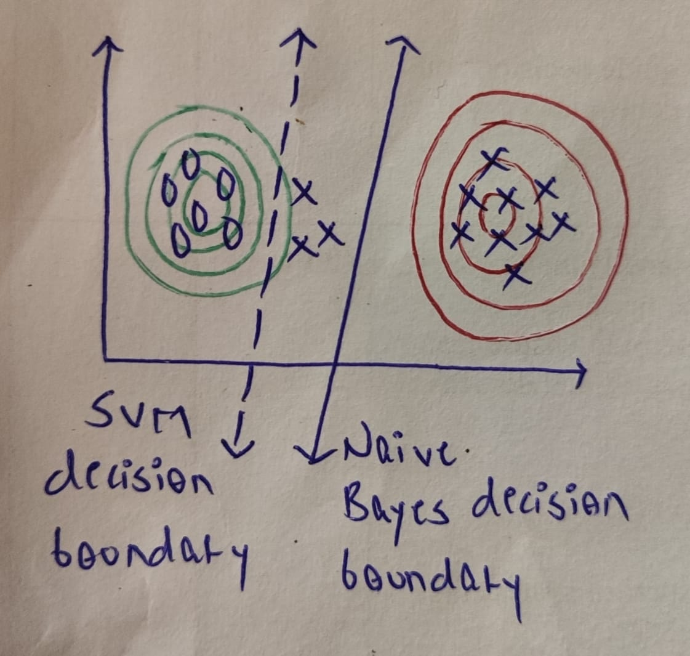
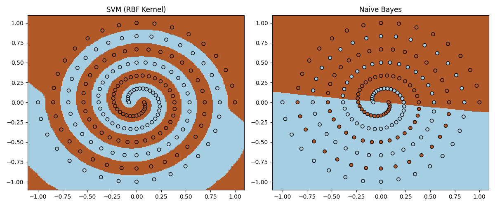
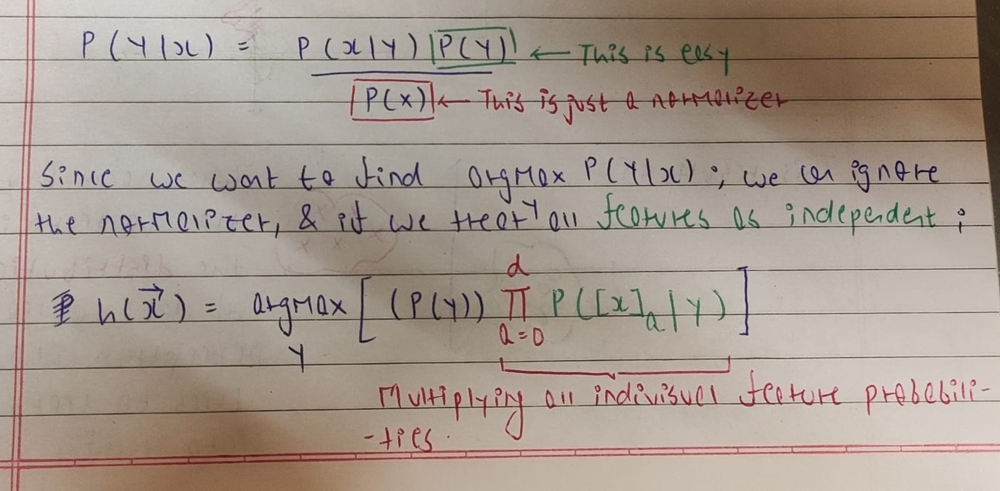
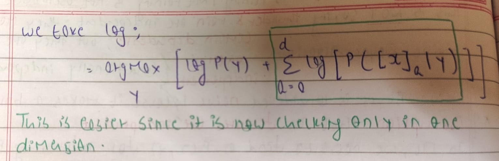

# Naive Bayes


## Introduction

Naive Bayes is a probabilistic classification algorithm based on Bayes’ Theorem. It is called "naive" because it assumes that all features are conditionally independent given the class label. Naive Bayes models the distribution of the data for each class and uses these distributions to compute the probability of a class given a data point. In other words, it tries to classify new data points based on how likely they are to belong to each class, according to the learned distributions. This approach is different from discriminative models like SVMs or logistic regression, which focus directly on finding the boundary between classes. The visualizations below illustrate how the decision boundary of Naive Bayes differs from those of other classifiers.

The first example highlights the difference between directly fitting a decision boundary between data points (discriminative approach) versus first estimating the underlying probability distributions of each class and then deriving the classifier based on those distributions (generative approach).



The second example compares the decision boundaries of SVM and Naive Bayes on a spiral-shaped dataset. Since we assume a Gaussian distribution for the features, this assumption is incorrect for the complex spiral data. This can be generated by running `compare_svm_naive_bayes_spiral.py`.



## Assumption

Naive Bayes makes a very bold assumption about the data, it assumes that the features are conditionally independent. This assumption says that given a class label, every feature is independent of evry other feature. 

For example, consider diagnosing malaria based on symptoms like fever and chills. Both fever and chills often occur together and are dependent on each other. However, given that a person has malaria (the class label), knowing whether they have fever tells you little additional information about whether they have chills, because the class label “malaria” already explains the presence of both symptoms. Thus, Naive Bayes ignores the dependency between features within each class.

### Why make such an assumption?

The goal of generative models is to learn the underlying distribution of data. In simpler terms, naive bayes doesn't directly model the probability of a class given the data which is ```P(Y | X)```. Instead, it focuses on the probability that the data belongs to the distribution of a class which is ```P(X | Y)```. Thus, each ```P(X = Xa | Y = c)``` becomes a parameter for full bayes. This approach introduces a major challenge becuase the number of parameters becomes unmanageable.

Consider a simple feature vector X with 
n boolean features and two classes: 
{+1,−1}. To fully model P(X∣Y) without any assumptions, we need to estimate ```2^(n+1) −2``` parameters. The -2 accounts for the fact that the final probabilities must sum to 1, so the last parameter for each class is simply ```1 - sum of all previous parameters```. Even in this basic binary setup, the parameter space grows exponentially with the number of features, making it impractical to estimate from real-world data. The whole idea of conditional independence allows us to reduce parameters from ```2^(n+1) - 2``` to ```2n - 2```. 

```
P(X|Y) = [P(x1|Y) * P(x2|Y) * ... * P(xn|Y)]
```

Using Naive Bayes assumption, we can simplify the formula as

```
P(Y|X) = (P(X|Y) * P(Y)) / P(X)

P(Y|X) = [P(x1|Y) * P(x2|Y) * ... * P(xn|Y)] * P(Y) / P(X)
```

Calculating P(Y) is easy - just count how many examples you have for each class and make sure they all add up to one. As for P(X), it's like a constant that doesn't really change our guess. The big change comes when we break down ```P(x1|Y) * P(x2|Y) * ... * P(xn|Y)``` instead of directly dealing with ```P(X|Y)```. It's like shifting from searching in many dimensions to just one, which is much easier.


## Algorithm





When working with Naive Bayes, we typically encounter calculating probabilities for three types of scenarios:

1) Categorical
2) Multinomial
3) Continuous

### Categorical

```P (Xa = A | Y = c) = (# number of samples with class c and feature Xa) / (# total number of samples in class)```

### Multinomial

```P(Xa | Y = c) = (# number of times feature X appears in instances of class c)/(# total occurrences of all features for class c)```

### Continuous

In the case of continuous features, such as numerical data, the probability density function (PDF) is often assumed to follow a specific distribution, commonly the Gaussian (normal) distribution due to its simplicity and wide applicability. The Gaussian distribution is characterized by its mean (μ) and variance (σ²).

For each class c, the Naive Bayes classifier estimates the parameters of the Gaussian distribution for each feature. Let's denote the feature as  x. Then, the probability density function (PDF) of x given class c can be expressed as:


## Naive Bayes as a linear classifier

While Naive Bayes is a generative model, it can resemble a linear classifier in certain scenarios. By learning the underlying probability distribution, Naive Bayes indirectly learns a decision boundary between classes.


## Relationship Between Naive Bayes Classifiers and Logistic Regression

Both Naive Bayes and Logistic Regression aim to learn the relationship between features and class labels. However, they approach this task differently. Naive Bayes focuses on estimating the underlying data distribution by assuming conditional independence, while Logistic Regression directly estimates the parameters of the class distribution. Under certain conditions, such as in Gaussian Naive Bayes, the two approaches can be equivalent, learning the same decision boundary.

Proof for the same can be found <a href="https://appliedmachinelearning.wordpress.com/2019/09/30/equivalence-of-gaussian-naive-bayes-and-logistic-regression-an-explanation/">here</a>.

## Results

We extract the last character and all bigrams from the first name to construct frequency distributions. Using Laplacian Smoothing with `K=1`, Naive Bayes achives an accuracy of `88.46%` on the test data. This accuracy is slightly higher than `86.92%` by logistic regression. Naive Bayes might be better for gender prediction task because the size of dataset available is small. Additionally, the confusion matrix that we obtain is `[[77, 11], [4, 38]]`.