# Neural Networks / Deep Learning / Multilayer Perceptrons

## Introduction

Neural Networks are a type of supervised machine learning model, which aim to capture non-linear relationships. This is in contrast to perceptrons, which function as linear classifiers.

## Intuition

The perceptron aims to learn a linear classifier represented by the equation `Wx + b`. In kernelization, the goal is to transform `x` into a higher-dimensional space `ϕ(x)`, making the data linearly separable. Thus, in kernelized perceptron, the equation becomes `W⋅ϕ(x) + b`. However, it is important to note that for `ϕ(x)`, we need to craft a well defined inner product. Thus we need to define a transformation and the algorithm learns the classifier.

Neural networks, unlike kernels, learn a transformation and classifier simultaneously. It first perform an affine transformation on the input vector `x` and then apply a classifier. The equation for a two layer neural networks would be `W⋅ϕ(x) + b`, where `ϕ(x)` is the result of applying a non-linear activation function `σ(z)` to the affine transformation `Ax+c`. Here, `A` and `c` perform the mapping, and and all parameters `A`, `c`, `W`, and `b` are learned during training. These parameters can be learned using backpropogation and gradient descent.

Consider a neural network with one hidden layer and ReLU activation function. Let's say we want to learn the function `y = 0.9((x-0.5)^2) + 2.5`.

Each neuron in the hidden layer learns to combine features, apply weights, add bias, and activate through ReLU. For instance:

Neuron 1 might learn `y = max(3x - 5, 0)`
Neuron 2 might learn `y = max(-2x + 1, 0)`
Neuron 3 might learn `y = max(x + 2, 0)`

    
    
    

The output layer combines the outputs of these neurons by weighting and adding them up. Thus, the final neural network output can be represented as:

`y = 0.95 * max(-2x + 1, 0) + 1.25 * max(0.8x - 5, 0) + 0.95 * max(x + 2, 0), 0)`

The blue line here represents the function learned by our network, while the black line represents the true function. By combining these piecewise functions, the network starts to resemble the true function more closely. Adding more neurons to the hidden layer, i.e., incorporating more piecewise functions, allows us to better replicate the true function.

Increasing the number of hidden layers permits more intricate transformations. Each subsequent layer combines the outputs of preceding layers, allowing the network to acquire increasingly sophisticated mappings. While theoretically, a single layer with large neurons could suffice, it would require a substantial number of neurons in the hidden layer. Therefore, increasing depth yields comparable outcomes with fewer neurons.

Essentially, this is what deep learning does. It learns low-level representations and subsequently employs these representations to learns progressively complex ones.

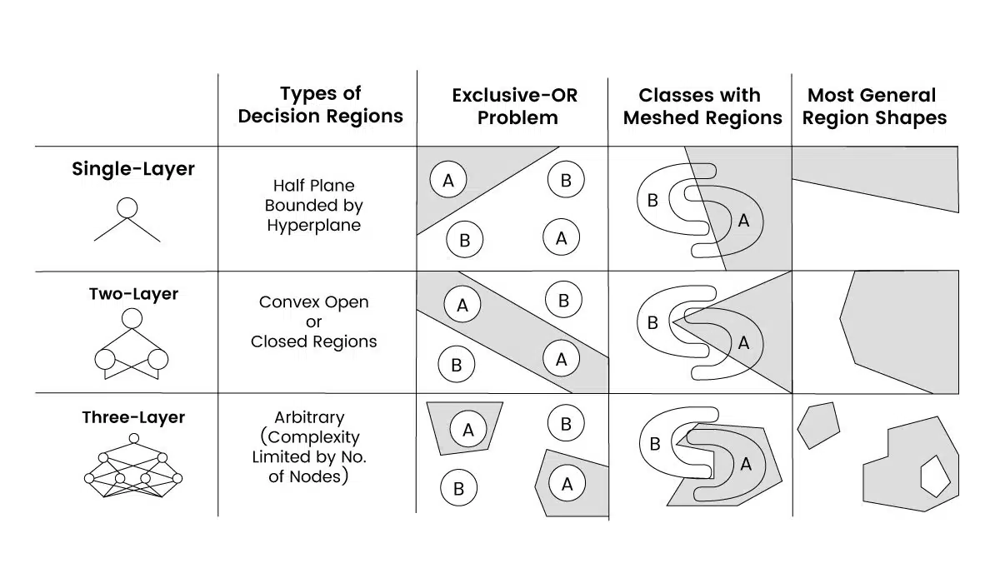

To visualize how ReLU functions combine to yield a close prediction, these graphs can be plotted on Desmos. <a href="https://www.desmos.com/calculator">Click here</a> to access Desmos.

For a visualization of how deep learning operates, you can watch the amazing playlist by 3Blue1Brown on <a href="https://www.youtube.com/playlist?list=PLZHQObOWTQDNU6R1_67000Dx_ZCJB-3pi">Neural Networks</a>.

## Activation Functions

The main reason neural networks are able to capture non-linear relationships is due to activation functions. It is crucial that the activation function is non-linear, as this enables the network to model complex patterns.

Consider the example above with identity function as the activation function instead of ReLU.

    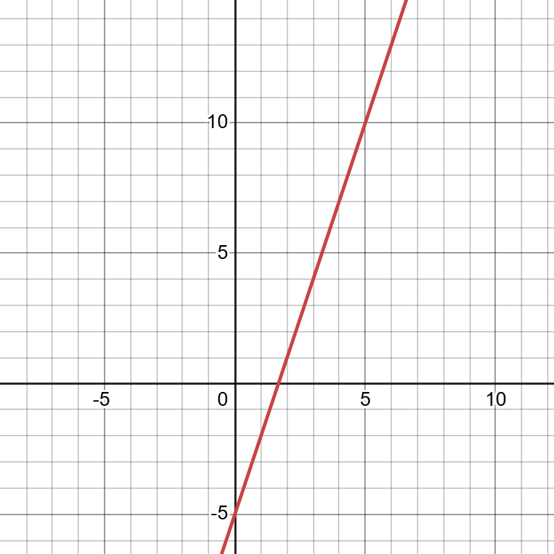
    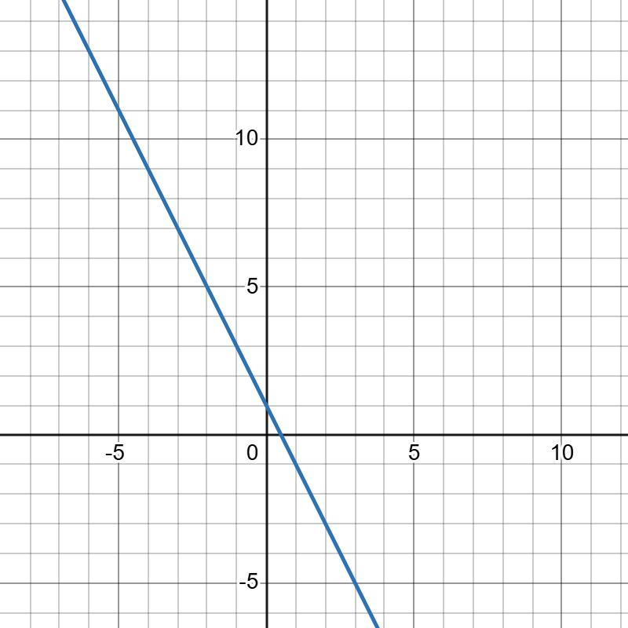
    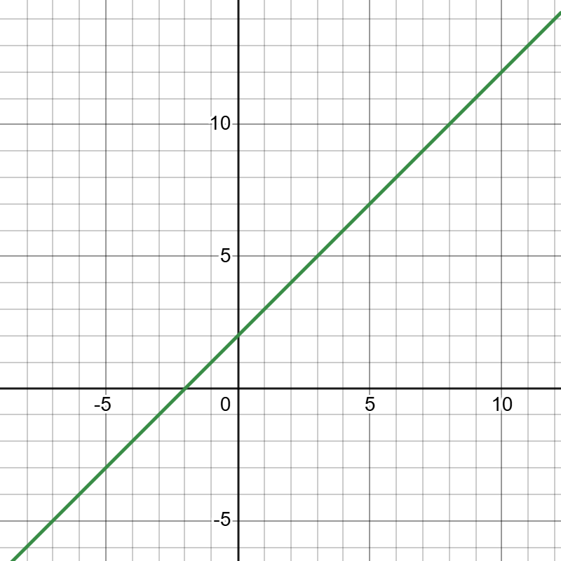

By weighting and adding these outputs, we get, 

`y = 0.95 * (-2x + 1) + 1.25 * (0.8x - 5) + 0.95 * (x + 2)`

Simplifying this expression results in: `y = 0.05x - 3.40`, which is essentially a straight line.

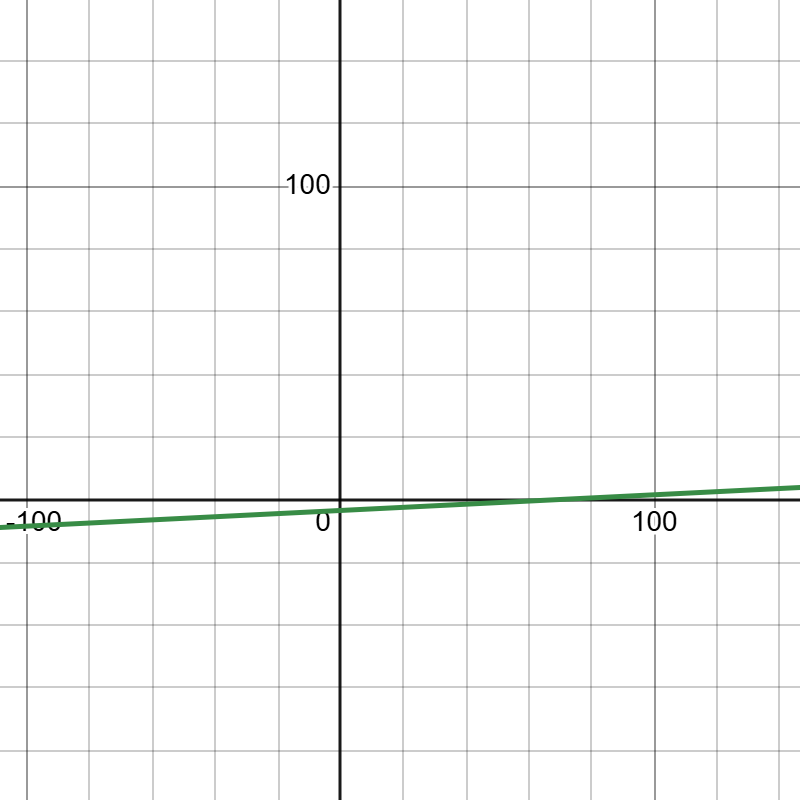

Without a non-linear activation function, the network is limited to learning only linear relationships, essentially just fitting a hyperplane or a linear classifier.

However, by introducing a non-linear activation function like ReLU, we enable the network to learn more complex, curved relationships.

## Algorithm

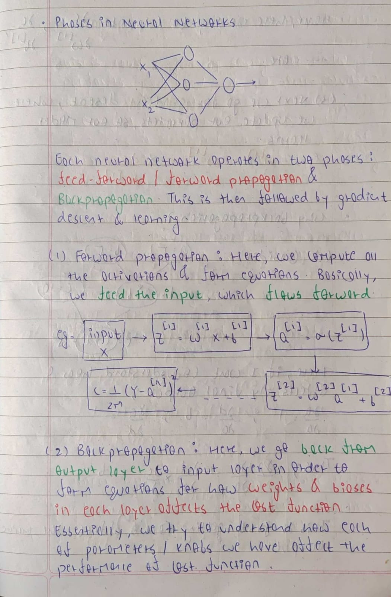

### Backpropogation

One of the best explanation for Backpropogation can be found in <a href="http://neuralnetworksanddeeplearning.com/chap2.html">Neural Networks and Deep Learning (Chapter 2)</a>  by Michael Nielsen. 

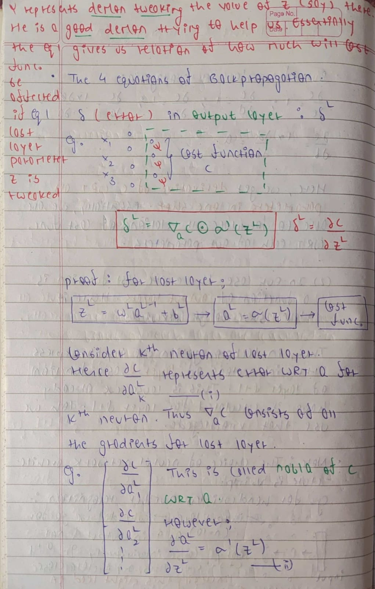
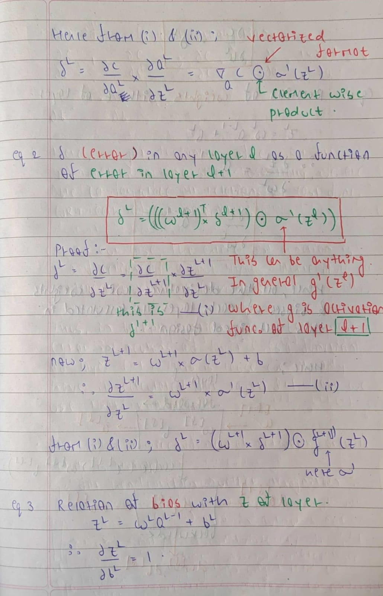
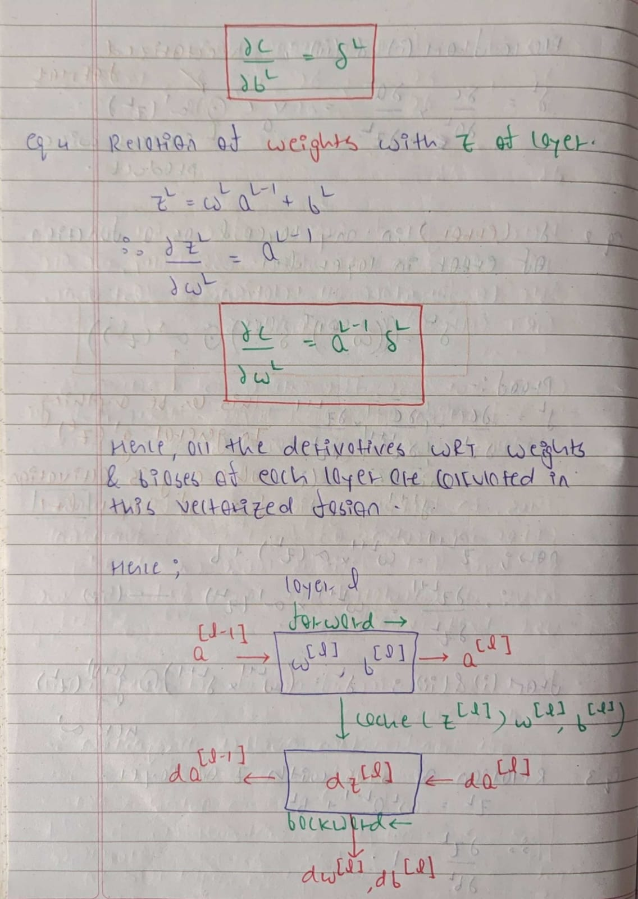
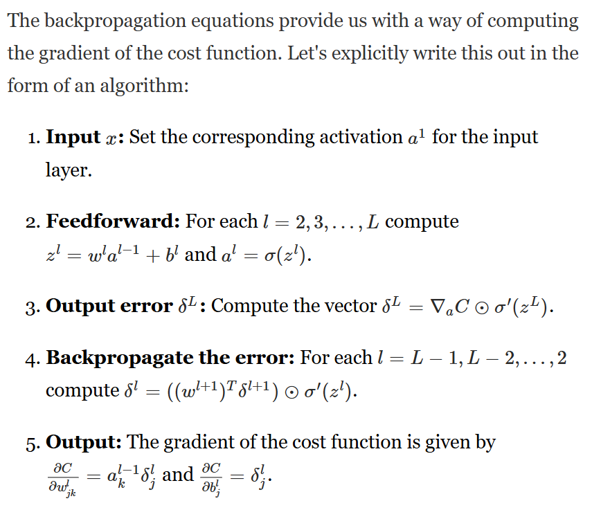

### Stochastic Gradient Descent

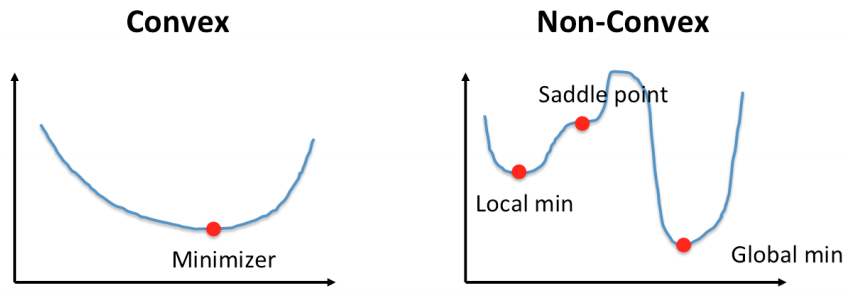

The cost function in deep learning is a Non-Convex function. While methods such such as Gradient Descent or Newton's Method work well for regression, where the cost function is convex, they do not work well for non-convex functions. Thus, we require methods like Stochastic Gradient Descent (SGD). SGD is so noisy that it does not converge to local minima. It is this nature of SGD that makes it not suitable for convex optimization, but very suitable for non convex optimization.

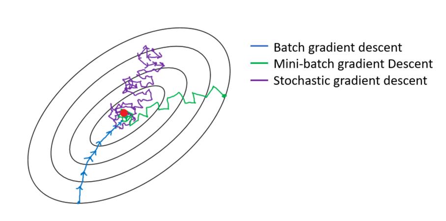

Due to this non-convex nature, even initialization of the parameters in nerual network matter a lot. This did not matter for linear regression because we were suce that we can reach the minimum from any given point. Additionally, initialization using a constant in neural networks will lead to all neurons learning the same thing and not break the symmetry.

An explanation for different initialization techniques can be found in <a href="https://www.deeplearning.ai/ai-notes/initialization/index.html#:~:text=Initializing%20all%20the%20weights%20with,scheme%20will%20perform%20very%20poorly.">AI Notes</a> by DeepLearning.AI

## Results

### Classification

For the task of gender prediction, we use a neural network with a single hidden layer consisting of `100` nodes. The architecture of the network is `[702, 200, 1]`, where:

1) `702` represents the input layer size (the length of the input vector),
2) `200` represents the number of nodes in the hidden layer,
3) `1` represents the output layer size (binary classification: girl 0 or boy 1).

We use the sigmoid activation function in the output layer since this is a binary classification problem. The model achieves a validation accuracy of `87.60%` and a test accuracy of `86.15%`. 

It is worth noting that the performance of the neural network is highly dependent on the weight initializations. As a result, you may observe variations in accuracy each time you run the code. Roughly the accuracy lies between `80%` to `90%`. During multiple runs, the highest test accuracy recorded was `89.40%`.

One clear observation from the Stochastic Gradient Descent (SGD) graph is its noisy nature. This behavior is expected due to the inherent randomness in SGD, as it updates weights based on individual data points rather than the entire dataset at once.

### Regression