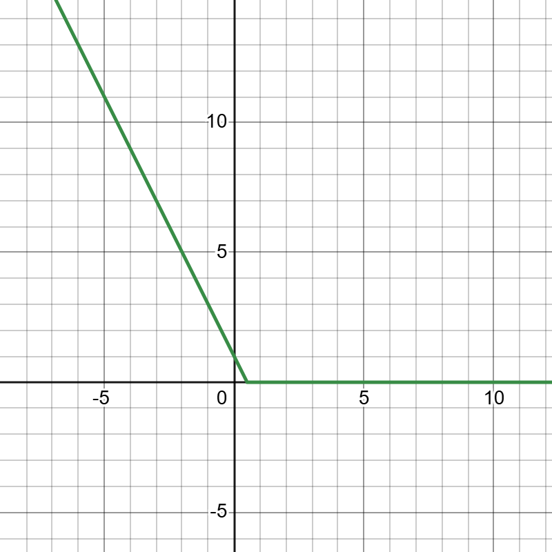

# Neural Networks & Deep Learning

## Introduction

Neural Networks, also known as Multilayer Perceptrons (MLP), represent a type of supervised machine learning model. Neural Networks aim to capture non-linear relationships, in contrast to perceptrons, which function as linear classifiers.

## Algorithm

The perceptron aims to learn a linear classifier represented by the equation `Wx + b`. In kernelization, the goal is to transform `x` into a higher-dimensional space `ϕ(x)`, making the data linearly separable. Thus, in kernelized perceptron, the equation becomes `W⋅ϕ(x) + b`. However, it is important to note that for `ϕ(x)`, we need to craft a well defined inner product. Thus we need to define a transformation and the algorithm learns the classifier.

Neural networks, unlike kernels, learn a transformation and classifier simultaneously. It first perform an affine transformation on the input vector `x` and then apply a classifier. The equation for a two layer neural networks would be `W⋅ϕ(x) + b`, where `ϕ(x)` is the result of applying a non-linear activation function `σ(z)` to the affine transformation `Ax+c`. Here, `A` and `c` perform the mapping, and and all parameters `A`, `c`, `W`, and `b` are learned during training. These parameters can be learned using backpropogation and gradient descent.

Details about the algorithm can be found <a href="https://developer.nvidia.com/blog/a-data-scientists-guide-to-gradient-descent-and-backpropagation-algorithms/">here</a>

## Intuition

Consider a neural network with one hidden layer and ReLU activation function. Let's say we want to learn the function `y = 0.9(x^2) + 2`.

Each neuron in the hidden layer learns to combine features, apply weights, add bias, and activate through ReLU. For instance:

Neuron 1 might learn `y = max(3x - 5, 0)`
Neuron 2 might learn `y = max(-2x + 1, 0)`
Neuron 3 might learn `y = max(x + 2, 0)`

    
    
    

The output layer combines the outputs of these neurons by weighting and adding them up. Thus, the final neural network output can be represented as:

`y = max(0.8 * max(-2x + 1, 0) + 0.9 * max(0.8x - 5, 0) + 1.6 * max(x + 2, 0), 0)`

The green line here represents the function learned by our network, while the black line represents the true function. By combining these piecewise functions, the network starts to resemble the true function more closely. Adding more neurons to the hidden layer, i.e., incorporating more piecewise functions, allows us to better replicate the true function.

Increasing the number of hidden layers permits more intricate transformations. Each subsequent layer combines the outputs of preceding layers, allowing the network to acquire increasingly sophisticated mappings. While theoretically, a single layer with large neurons could suffice, it would require a substantial number of neurons in the hidden layer. Therefore, increasing depth yields comparable outcomes with fewer neurons.

Essentially, this is what deep learning does. It constructs low-level representations and subsequently employs these representations to construct progressively complex ones. 

To visualize how ReLU functions combine to yield a close prediction, these graphs can be plotted on Desmos. <a href="https://www.desmos.com/calculator">Click here</a> to access Desmos.

For a visualization of how deep learning operates, you can watch the amazing playlist by 3Blue1Brown on <a href="https://www.youtube.com/playlist?list=PLZHQObOWTQDNU6R1_67000Dx_ZCJB-3pi">Neural Networks</a>.

### Stochastic Gradient Descent