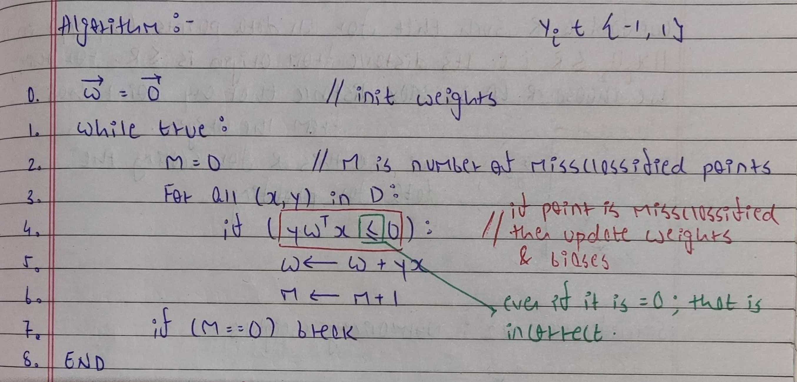

# Perceptron

## Assumptions

Perceptrons are used for binary classification. They assume that there's at least one straight line (or plane, in higher dimensions) that can perfectly separate the two classes. While this isn't always true in low dimensions, it tends to hold in higher dimensions because points are more spread out, making separation easier. So, for low dimensions, other algorithms like KNN are preferred, while for higher dimensions, perceptrons are useful.

## Algorithm

In a perceptron, we define a hyperplane using a weight vector `w` (normal to the hyperplane) and a bias `b`. We can combine these into one vector `W` = `[w, b]` by extending our feature space into one higher dimension. Essentially, we're absorbing the bias term as one dimension and lifting our points into a higher dimension.

A hyperplane is like a flat sheet, one dimension lower than the feature space. For instance, in 2D, it's a line. Instead of characterizing it with both `w` and `b`, we extend it to 3D and draw a plane passing through the origin, removing the need for an extra bias term.

During inference, we look at the direction of the point relative to the hyperplane using `W.T @ x` and classify based on the sign of the result. If `W.T @ x > 0`, it's in the positive class, and vice versa.

However, if the data isn't linearly separable, the algorithm will keep trying indefinitely. To avoid this, we can set a limit on the number of iterations.

## Proof that Perceptron will always converge

If the points are linearly separable (can be perfectly separated by a line or hyperplane), the Perceptron will converge to a solution (though not necessarily the best one). But if they're not separable, it will loop forever.

<a href="https://www.youtube.com/watch?v=fHDouTKwfXw">Click Here</a> for proof that the Perceptron will always converge if the data fits our assumption.

## Results

We applied the perceptron algorithm for Gender Classification using First Names and achieved an accuracy of 86% on the test data. During training, we noticed an interesting trend: as we increased the dimensionality of the feature space by considering more features, the algorithm tended to converge in fewer steps.

For instance, when considering only the last letter of each name, the perceptron never converged. However, when considering bigrams (pairs of consecutive letters), it converged after a certain number of steps. Furthermore, with trigrams (triplets of consecutive letters), it converged even faster. This observation highlights the effectiveness of the perceptron in higher dimensions, where it can better separate classes.