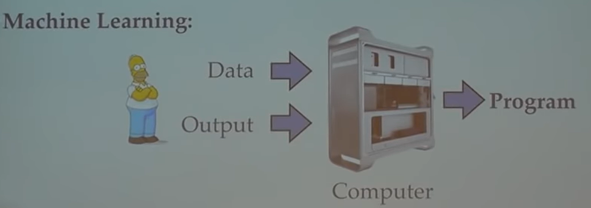
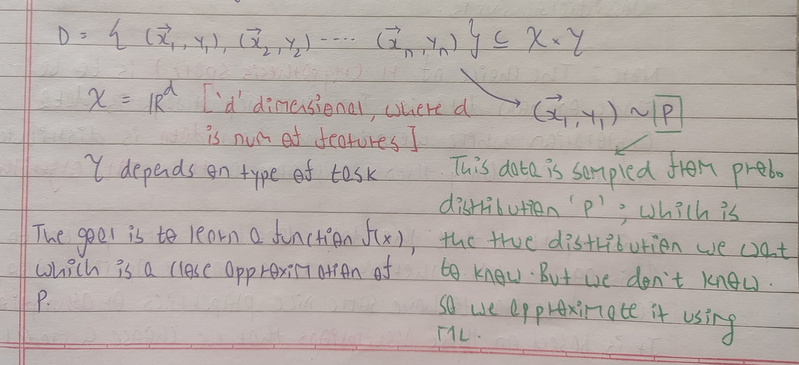
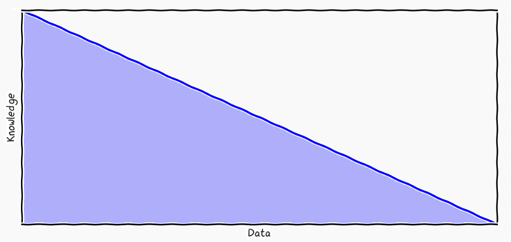
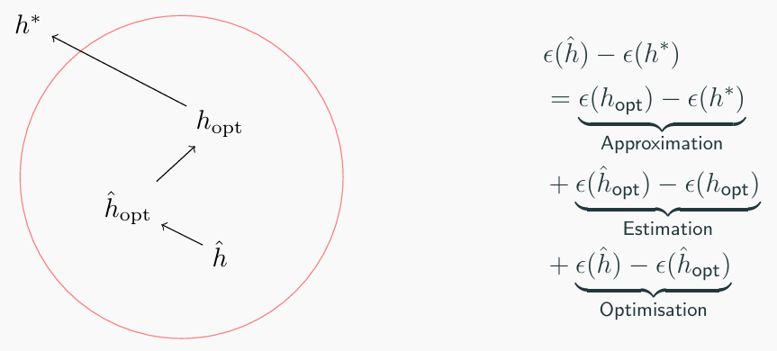

# ML-Toolbox

<p align="center">
  
  <br>
  
  <br>
  <small><i>Image source: https://www.cs.cornell.edu/courses/cs4780/2018fa/lectures/lecturenote01_MLsetup.html</i></small>
</p>

## Table of Contents

- [Project](#ml-toolbox)
  - [Table of Contents](#table-of-contents)
  - [About](#about)
  - [File Structure](#file-structure)
  - [ML Philosophy](#ml-philosophy)
  - [References](#references)

## About

Each machine learning algorithm is a tool. ML-Toolbox is a collection of a few machine learning tools. The goal of this project is to understand machine learning algorithms by learning the theory behind them. This theory will help to choose the right tool for the task at hand.

## File Structure

```
ML-Toolbox/
 ┣ 📂assets/
 ┃ ┣ 📂data/                                 # datasets
 ┃ ┣ 📂img/                                  
 ┃ ┣ 📂scripts/                              # preprocessing scripts
 ┣ 📂Concept Learning/  
 ┃ ┣ 📄titanic_survival_prediction.ipynb  
 ┣ 📂Perceptron/
 ┃ ┣ 📄gender_prediction.ipynb  
 ┣ 📂Apriori Algorithm/
 ┃ ┣ 📄correlated_courses.ipynb 
 ┣ 📄README.md 

// WIP

 ┣ 📂SVMs/
 ┃ ┣ 📄gender_prediction.ipynb  

// TO DO

 ┣ 📂KNNs/
 ┣ 📂Naive Bayes/
 ┣ 📂Logistic Regression/
 ┣ 📂Linear Regression/
 ┣ 📂Gaussian Processes
 ┣ 📂Support Vector Machine/
 ┣ 📂Kernels/                                
 ┃ ┣ 📂Perceptron/
 ┃ ┣ 📂Linear Regression/
 ┃ ┣ 📂Support Vector Machine/
 ┣ 📂Decision Trees/
 ┣ 📂Random Forests/
 ┣ 📂Bagging/
 ┣ 📂Boosting/
 ┣ 📂preprocessing/Bias Variance Decomposition/
 ┣ 📂Neural Networks/
 ┣ 📂CNNs/
 ┣ 📂RNNs/
 ┣ 📂K Means Clustering/  
 ┣ 📂GMMs/  
 ┣ 📂Kernel Density Estimation/   
 ┣ 📂PCA/   
 ┣ 📂Autoencoders/
 ┣ 📂VAEs/
                                                  
```

## ML Philosophy

### Definition

Formally, the primary goal of machine learning is to discover the underlying (but unknown) joint distribution `P(x, y)`, which captures the relationship between inputs (`x`) and outputs (`y`) in the real world. If we can have access to this distribution, we can stick in any input `x` and get the `y` that has the maximum probability for that input.

<p align="center">
  
</p>

### ML as a combination of Knowledge and Data

One way to think about machine learning is as a way to combine knowledge and data to solve problems. ML problems can be visualized within the central region of this Pareto chart.

<p align="center">
  
  <br>
  <small><i>Image source: https://gpss.cc/gpss24/slides/Ek2024.pdf</i></small>
</p>

If we had complete knowledge, we can express a problem as a formula or algorithm, like the relationship `speed = distance / time`. If we had access to complete data, the solution is simply be a lookup, like finding a place on a map. However, machine learning comes into play when we have limited knowledge and limited data. The position of the problem on this chart helps us select the appropriate tools. For example, for problems where we have a lot of data, but very little knowledge, we tend to use neural networks. 

### How to combine Knowledge and Data?

<p align="center">
  
  <br>
  <small><i>Image source: https://gpss.cc/gpss24/slides/Ek2024.pdf</i></small>
</p>

Given a problem, our goal is to find the optimal solution *h\**. In practice, we cannot search over all possible solutions, so we restrict ourselves to a specific class of solutions. This is the first point where we inject knowledge into the problem. For image-related tasks, for example, we might choose CNN-based architectures such as ResNet or U-Net, based on our prior experience that they work well for images. Once this solution class is fixed, we introduce an approximation error. This is the gap between *h\** and the best possible solution from our choosen class *h<sub>opt</sub>*. This error arises from the limitations of the chosen hypothesis space. In our case, maybe using InceptionNet would have given the best results, but we limited ourselves to ResNet like architectures.

After choosing the hypothesis class, we preprocess the data, which is the second point where knowledge is injected. *h<sub>opt</sub>* is the solution we would obtain with ideal data, but with limited or biased data, we obtain *ĥ<sub>opt</sub>*. For example, if all training images have bright backgrounds, the model may perform poorly on images with darker backgrounds. The difference between *h<sub>opt</sub>* and *ĥ<sub>opt</sub>* is the estimation error, caused by limited data. This error can be reduced by using domain knowledge, such as applying data augmentation to improve robustness to lighting variations.

Finally, we choose hyperparameters such as the learning rate, batch size, and optimizer. *ĥ<sub>opt</sub>* corresponds to the best solution achievable with ideal hyperparameter choices, but in practice, we obtain *ĥ* because we cannot search the entire hyperparameter space. The gap between *ĥ<sub>opt</sub>* and *ĥ* is the optimization error, which can be reduced by injecting knowledge, for example, by selecting an appropriate optimizer.

Overall, a model can suffer from three types of error, and each of these errors can be reduced by injecting knowledge.

## References

* Cornell CS4780 <a href="https://www.youtube.com/playlist?list=PLl8OlHZGYOQ7bkVbuRthEsaLr7bONzbXS">Machine Learning for Intelligent Systems</a> by Prof. Kilian Weinberger.
* CS7.403 <a href="https://github.com/kryptc/smai-lecture-notes">Statistical Methods in Artificial Intelligence</a> course by IIIT Hyderabad.
* MIT 6.036 <a href="https://www.youtube.com/playlist?list=PLxC_ffO4q_rW0bqQB80_vcQB09HOA3ClV">Machine Learning</a> by Prof. Tamara Broderick.
* <a href="https://www.youtube.com/playlist?list=PLZ_xn3EIbxZEoWLlm9y6OizFkontrhA6G">Gaussian Process Summer School 2024</a>.
* Bias Variance Tradeoff by <a href="https://ocw.mit.edu/courses/15-097-prediction-machine-learning-and-statistics-spring-2012/dec694eb34799f6bea2e91b1c06551a0_MIT15_097S12_lec04.pdf" target="_blank">MIT OpenCourseware</a> and <a href="https://nlp.stanford.edu/IR-book/html/htmledition/the-bias-variance-tradeoff-1.html" target="_blank">The Stanford NLP Group</a>.
* <a href="https://see.stanford.edu/materials/aimlcs229/cs229-notes3.pdf">Notes</a> on SVM by Andrew NG, <a href="https://cvml.ista.ac.at/papers/lampert-fnt2009.pdf">Tutorial</a> on Kernel Methods in Computer Vision by Prof. Christoph Lampert, <a href="https://www-cs.stanford.edu/people/davidknowles/lagrangian_duality.pdf">Notes</a> on lagrangian multiplier and KKT.
* <a href="http://neuralnetworksanddeeplearning.com/index.html">Neural Networks and Deep Learning</a> Online Book by Michael Nielsen.
* Talk on <a href="https://www.youtube.com/watch?v=eOOhn9CX2qU">Association Rule Mining</a> by Prof. Ami Gates.