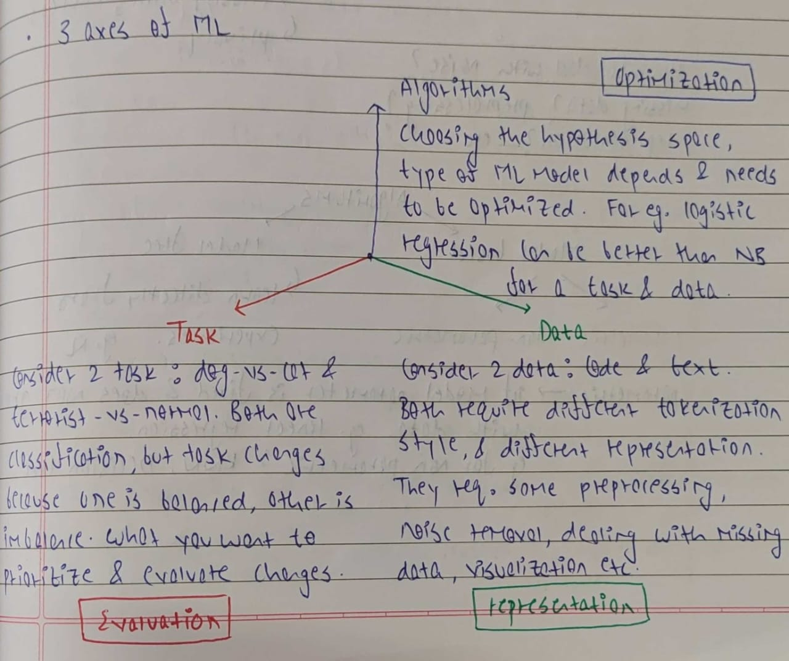

# ML-Toolbox

<p align="center">
  
  <br>
  
  <br>
  <small><i>Image source: https://www.cs.cornell.edu/courses/cs4780/2018fa/lectures/lecturenote01_MLsetup.html</i></small>
</p>

## Table of Contents

- [Project](#ml-toolbox)
  - [Table of Contents](#table-of-contents)
  - [About](#about)
  - [Introduction to Machine Learning](#introduction-to-machine-learning)
  - [File Structure](#file-structure)
  - [Getting Started](#getting-started)
  - [References](#references)
  - [License](#license)

## About

Each machine learning algorithm is a tool. Each tool has its particular usecases, advantages and disadvantages. It is this knowledge of how to choose the right tools and use them in right manner that can solve problems. My aim in this repository is to understand each ML algorithm as a tool better and learn about the assumptions and theory behind the algorithm which makes it good in certain settings. 

The ML-Toolbox is like a toolkit of various machine learning methods, each offering its own approach to modeling a function `f(x)`. The key is choosing the right tool for the task at hand, depending on the problem we're trying to solve. While neural networks are widely used, they’re just one tool in the box which produce outputs in the form of weights and biases.

## Introduction to Machine Learning

One way to think about machine learning is as a way to combine knowledge and data to solve problems. If we have complete knowledge, we can often express a problem as a formula, like the relationship between speed, distance, and time. When we have complete data, the solution might simply be a lookup, like finding a place on a map. However, machine learning comes into play when we have limited knowledge and data.

<p align="center">
  
  <br>
  <small><i>Image source: https://gpss.cc/gpss24/slides/Ek2024.pdf</i></small>
</p>

ML problems can be visualized within the central region of this Pareto chart. The position of the problem on this chart helps us select the appropriate tools. For example, predicting house prices might not allow us to obtain the data of every house in the country, but we can use a few samples and combine this data with the knowledge that house prices generally follow a linear trend and that similar houses share similar prices to make predictions.

Knowledge can take various forms. For example, we may know that changing the background intensity does not affect the face in an image, which can be used for data augmentation. Another piece of knowledge might be that, while many neural networks can fit the data, simpler models tend to generalize better. This knowledge helps us refine the space of possible solutions, or the parameter space, guiding our search for the best model.

Consider <i>h*</i> as the optimal solution for a problem. In practice, we can't search through all possible solutions, so we limit ourselves to a specific space of solutions. For instance, if we choose linear regression, <i>h<sub>opt</sub></i> is the best solution within this space assuming we had perfect data. In real-world scenarios, however, the available data is never perfect. The best hypothesis we can find given our data is <i>h<sup>^</sup><sub>opt</sub></i>, and the model we actually have is <i>h<sup>^</sup></i>. This framework allows us to break down the error between <i>h*</i> and <i>h<sup>^</sup></i> into three distinct parts.

<p align="center">
  
  <br>
  <small><i>Image source: https://gpss.cc/gpss24/slides/Ek2024.pdf</i></small>
</p>

The first is the error between <i>h*</i> and <i>h<sub>opt</sub></i>. This error is the approximation error and it occurs because of the limitations of our chosen hypothesis space. For example, when we do linear regression, we fit a line to the data points. If the data points do not follow a linear trend, the error we obtain is the approximation error. The second error, between <i>h<sub>opt</sub></i> and <i>h<sup>^</sup><sub>opt</sub></i>, is the estimation error caused by having limited data. In face detection, for example, we know that faces remain consistent despite changes in the environment, so we can use this knowledge to improve our data through augmentation. This is an attempt to reduce the estimation error. The third error, between <i>h<sup>^</sup><sub>opt</sub></i> and <i>h<sup>^</sup></i>, is the optimization error. This is related to things like how many nearest neighbors to consider in k-NN or the number of epochs in a neural network.

The important takeaway is that any machine learning problem can be seen as a combination of these three types of error. Our job is to use our knowledge to minimize these errors as much as possible.

Yet another way to look at machine learning is to think about it in terms of three axes: data, model, and task. The data axes determines the data and the format in which we represent the problem. For example, a "bag of words" representation works well for identifying topics in text, but it might not be the best choice for sentiment analysis. For example, collecting data from 500 students will provide good representation of all students. The task defines the evaluation metric. Accuracy may be the right measure for face recognition, but precision and recall might be more important for medical diagnoses or spam detection. The evaluation metric is highly dependent on task and the costs associated with true positives, false positives etc. Finally, the model represents the method we use to solve the problem. For example, if the data is temporal, we might prefer Markov chains or RNNs.

<p align="center">
  
</p>

Formally, the primary goal of machine learning is to discover the underlying (but unknown) process that generates the observed data. This process is typically modeled as a probability distribution `P(x, y)`, which captures the relationship between inputs (`x`) and outputs (`y`) in the real world.

<p align="center">
  
</p>

## File Structure

Phase II:

```
ML-Toolbox
 ┣ 📂assets                               # Supporting resources
 ┃ ┣ 📂data                               # Datasets used in experiments and examples
 ┃ ┃ ┣ 📄customer_dataset.csv 
 ┃ ┣ 📂img                                
 ┣ 📂KNNs
 ┣ 📂Linear Regression
 ┣ 📂K Means Clustering
 ┣ 📂GMMs
 ┣ 📄README.md                              
```

Phase I:

```
ML-Toolbox/
 ┣ 📂assets/                                 # Supporting resources
 ┃ ┣ 📂data/                                 # Datasets used in experiments and examples
 ┃ ┃ ┣ 📄articles.csv
 ┃ ┃ ┣ 📄gender.csv
 ┃ ┃ ┣ 📄modified_mumbai_house_price.csv
 ┃ ┃ ┣ 📄mumbai_house_price.csv
 ┃ ┃ ┣ 📄student_marksheet.csv
 ┃ ┃ ┣ 📄titanic.csv
 ┃ ┃ ┣ 📄un_voting.csv 
 ┃ ┣ 📂img/                                  # Images used in documentation or notebooks
 ┃ ┣ 📂scripts/                              # Utility or preprocessing scripts
 ┃ ┣ 📂notes/                                # Theoretical notes and derivations, 
 ┣ 📂Concept Learning/                       # Implementations and theory behind concept learning
 ┣ 📂K Nearest Neighbors/
 ┣ 📂Perceptron/
 ┣ 📂Naive Bayes/
 ┣ 📂Logistic Regression/
 ┣ 📂Linear Regression/
 ┣ 📂Support Vector Machine/
 ┣ 📂Kernels/                                # Kernelized versions of various algorithms
 ┃ ┣ 📂Perceptron/
 ┃ ┣ 📂Linear Regression/
 ┃ ┣ 📂Support Vector Machine/
 ┣ 📂Decision Trees/
 ┣ 📂Neural Networks/
 ┣ 📂K Means Clustering/
 ┣ 📄README.md                               # Project overview
```

## Getting Started

### Installation

Clone the project by typing the following command in your Terminal/CommandPrompt

`git clone https://github.com/PritK99/ML-Toolbox`

Navigate to the ML ToolBox folder

`cd ML-Toolbox`

### Python Environment

To create and activate a python environment, run the following commands

`python -m venv venv`

`venv/Scripts/activate`

Now, you can install all the required libraries 

`pip install -r .\requirements.txt `

You can now choose this virtual environment and run the `.ipynb` files.

## References

* A big thanks to Prof. Kilian Weinberger for the Cornell CS4780 course, <a href="https://www.youtube.com/playlist?list=PLl8OlHZGYOQ7bkVbuRthEsaLr7bONzbXS">Machine Learning for Intelligent Systems</a>. Majority of the content in this repository is inspired by the lectures.
* MIT 6.036 <a href="https://www.youtube.com/playlist?list=PLxC_ffO4q_rW0bqQB80_vcQB09HOA3ClV">Machine Learning</a> by Prof. Tamara Broderick.
* <a href="https://www.youtube.com/playlist?list=PLZ_xn3EIbxZEoWLlm9y6OizFkontrhA6G">Gaussian Process Summer School 2024</a>
* Bias Variance Tradeoff by <a href="https://ocw.mit.edu/courses/15-097-prediction-machine-learning-and-statistics-spring-2012/dec694eb34799f6bea2e91b1c06551a0_MIT15_097S12_lec04.pdf" target="_blank">MIT OpenCourseware</a> and <a href="https://nlp.stanford.edu/IR-book/html/htmledition/the-bias-variance-tradeoff-1.html" target="_blank">The Stanford NLP Group</a>.
* Additional resources to understand <a href="https://ml-course.github.io/master/notebooks/03%20-%20Kernelization.html">kernelization</a>.
* <a href="http://neuralnetworksanddeeplearning.com/index.html">Neural Networks and Deep Learning</a> Online Book by Michael Nielsen.
* <a href="https://www.visiondummy.com/2014/04/curse-dimensionality-affect-classification/">Blog</a> on the Curse of Dimensionality.

## License
[MIT License](https://opensource.org/licenses/MIT)