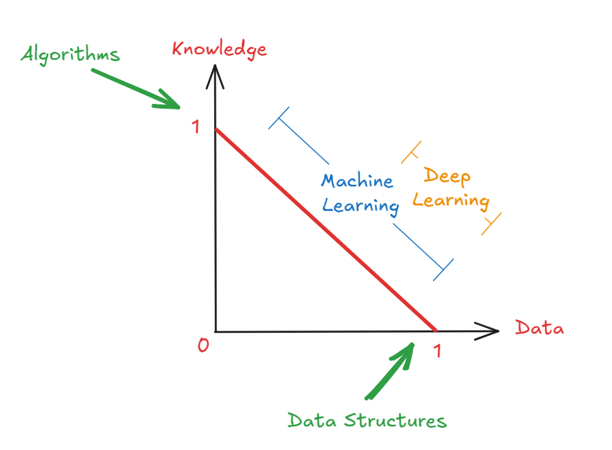

# ML-Toolbox

<p align="center">
  
  <br>
  
  <br>
  <small><i>Image source: https://www.cs.cornell.edu/courses/cs4780/2018fa/lectures/lecturenote01_MLsetup.html</i></small>
</p>

## Table of Contents

- [ML Toolbox](#ml-toolbox)
  - [About](#about)
  - [Philosophy](#philosophy)
  - [How do we combine knowledge with data?](#how-do-we-combine-knowledge-with-data)
  - [List of Algorithms](#list-of-algorithms)
  - [Getting Started](#getting-started)
    - [Installation](#installation)
    - [Datasets](#datasets)
    - [Usage](#usage)
  - [References](#references)


## About

Classical machine learning and optimization methods are deeply fascinating fields of study. The motivation behind this project is to explore these techniques in depth.

This repository is currently under development, and given the vast scope of machine learning algorithms and optimization methods, it will likely remain a work in progress for a long time.

## Philosophy

<p align="center">
  
</p>

Most engineering problems can be thought of as lying somewhere on the graph above. One extreme represents situations where we have complete knowledge of how to solve the problem. This category includes algorithmic problems such as finding the shortest path in a graph or converting an RGB image to grayscale. The other extreme represents situations where we have complete data about the problem. In such cases, the solution effectively becomes a lookup table, like finding the logarithm of a number using a log table.

For problems that lie between these two extremes, we need approaches that make use of both the limited knowledge and the limited data available about the problem. Thus, machine learning problems can be represented by the following equation:

<p align="center">
  
</p>

Now, depending on the value of λ, we may choose different machine learning algorithms. For problems where we have more knowledge than data, we might prefer models such as linear regression, SVMs, or decision trees. On the other hand, when we have a large amount of data, we generally prefer deep learning approaches.

## How do we combine knowledge with data?

Knowledge is the set of priors we have about a problem. For example, if I ask you to find two numbers whose product is 30, there are several possible answers. However, if we know that the numbers are as close as possible to each other, we can infer that the answer must be (5,6). In machine learning, there are three main ways in which we combine priors with data.

#### 1. Model & Design Choices

Given a problem, our goal is to find the optimal solution. Since we cannot search over all possible solutions, we restrict ourselves to a particular class of solutions through design choices. These choices include how we model the problem, what assumptions we make, how we formulate the loss function, and so on. Such choices reflect what we already believe about the problem or what properties we want from the solution.

For example, consider a classification problem. If we only care about prediction accuracy, a Support Vector Machine (SVM) may be a good choice. However, if we want probability estimates instead of just class labels, models such as Naive Bayes or Logistic Regression are more suitable. Another example is regularization. L2 regularization is useful when we want smoother and simpler models, whereas L1 regularization is preferred when we want sparse solutions.

#### 2. Data

Data is the second place where we can inject prior knowledge. This includes techniques such as data augmentation, synthetic data generation, and feature engineering.

For example, when working with datasets such as ImageNet, we often use augmentation techniques like horizontal flipping because we know that the identity of most objects does not change when the image is flipped. By augmenting the data in this way, we improve generalization.

#### 3. Optimization

The third place where we can inject prior knowledge is in the optimization process itself. For some problems, such as total variation denoising, algorithms like ADMM may perform better than standard gradient descent. In other cases, Newton’s method may converge in only a few steps, whereas gradient descent may require many more iterations.

Another aspect of optimization is the choice of hyperparameters, such as the learning rate, batch size, and regularization constants.

However, with great power comes great responsibility. In all three components, if our priors are incorrect or misleading, they can increase the error instead of reducing it. 

## List of Algorithms

```
ML-Toolbox/
│
├── 📂 supervised-learning/
│   ├── 📂 linear-models/
│   │   ├── perceptron
│   │   ├── linear-regression*
│   │   ├── logistic-regression*
│   │   └── svm*
│   │
│   ├── 📂 probabilistic-models/
│   │   ├── naive-bayes*
│   │   ├── gaussian-processes*
│   │   └── hidden-markov-models*
│   │
│   ├── 📂 instance-based-learning/
│   │   ├── knn*
│   │   ├── kd-trees*
│   │   └── ball-trees*
│   │
│   ├── 📂 tree-based-methods/
│   │   ├── decision-trees*
│   │   ├── random-forests*
│   │   ├── bagging*
│   │   └── boosting*
│   │
│   ├── 📂 kernel-methods/
│   │   ├── kernel-perceptron*
│   │   ├── kernel-regression*
│   │   └── kernel-svm*
│   │
│   └── 📂 neural-networks/
│       ├── mlp*
│       ├── cnn*
│       ├── rnn*
│
├── 📂 unsupervised-learning/     # Unsupervised Learning
│   ├── 📂 anomaly-detection*
│   │
│   ├── 📂 association-rule-mining*
│   │   └── apriori-algorithm*
│   │
│   ├── 📂 clustering*
│   │   ├── k-means*
│   │   └── gaussian-mixture-models*
│   │
│   ├── 📂 density-estimation*
│   │   └── kernel-density-estimation*
│   │
│   ├── 📂 dimensionality-reduction*
│   │   └── pca*
│   │
│   ├── 📂 generative-models*
│   │   └── generative-adversarial-networks*
│   │
│   └── 📂 representation-learning*
│       ├── autoencoders*
│       └── variational-autoencoders*
│
├── 📂 optimization-methods/      # Optimization Techniques
│   ├── 📂 unconstrained/
│   │   ├── gradient-descent*
│   │   ├── newtons-method*
│   │   ├── quasi-newton-method*
│   │   ├── coordinate-descent*
│   │   └── conjugate-gradient*
│   │
│   └── 📂 constrained/
│
├── 📂 data/                      # Datasets
│
├── 📂 assets/
│   ├── img/                      # Images & visual assets
│   └── scripts/                  # Preprocessing scripts
│
└── 📄 README.md

Note: * indicates work in progress.
```

## Getting Started

### Installation

Clone the project by typing the following command in your Terminal/CommandPrompt

```
git clone https://github.com/PritK99/ML-Toolbox.git
```

Navigate to the ML-Toolbox folder

```
cd ML-Toolbox
```

We also require OpenCV (C++). To install OpenCV on Ubuntu, run the following command

```
sudo apt install libopencv-dev
```

You can verify the installation by running

```
pkg-config --modversion opencv4
```

### Datasets

The datasets used are either publicly available datasets from standard libraries (such as Fashion-MNIST) or datasets downloaded from Kaggle. Details about each dataset can be found in assets/data/README.md. The datasets can either be downloaded from their original sources or from the following <a target="_blank" href="https://iiithydresearch-my.sharepoint.com/:f:/g/personal/prit_kanadiya_research_iiit_ac_in/IgCAsvxlQCVzQIFTEjRVEk71AbHk8xwgYtHWHMbOREhGvnk?e=mU1mg3">Onedrive Link</a>. Once downloaded, the datasets should be placed in the `/data` folder.

### Usage


```
g++ k-means.cpp ../../utils/image.cpp  `pkg-config --cflags --libs opencv4`
```

## References

* Cornell CS4780 <a href="https://www.youtube.com/playlist?list=PLl8OlHZGYOQ7bkVbuRthEsaLr7bONzbXS">Machine Learning for Intelligent Systems</a> by Prof. Kilian Weinberger.
* <a href="https://www.youtube.com/playlist?list=PLZ_xn3EIbxZEoWLlm9y6OizFkontrhA6G">Gaussian Process Summer School 2024</a>.
* MIT 6.036 <a href="https://www.youtube.com/playlist?list=PLxC_ffO4q_rW0bqQB80_vcQB09HOA3ClV">Machine Learning</a> by Prof. Tamara Broderick.
* Bias Variance Tradeoff by <a href="https://ocw.mit.edu/courses/15-097-prediction-machine-learning-and-statistics-spring-2012/dec694eb34799f6bea2e91b1c06551a0_MIT15_097S12_lec04.pdf" target="_blank">MIT OpenCourseware</a> and <a href="https://nlp.stanford.edu/IR-book/html/htmledition/the-bias-variance-tradeoff-1.html" target="_blank">The Stanford NLP Group</a>.
* <a href="https://cvml.ista.ac.at/papers/lampert-fnt2009.pdf">Kernel Methods in Computer Vision</a> by Prof. Christoph Lampert, and <a href="https://www-cs.stanford.edu/people/davidknowles/lagrangian_duality.pdf">Notes</a> on Lagrangian multiplier and KKT.
* <a href="http://neuralnetworksanddeeplearning.com/index.html">Neural Networks and Deep Learning</a> Online Book by Michael Nielsen.
* Talk on <a href="https://www.youtube.com/watch?v=eOOhn9CX2qU">Association Rule Mining</a> by Prof. Ami Gates.