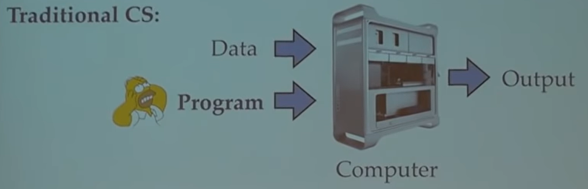

# ML-Toolbox

<p align="center">
  
  <br>
  
  <br>
  <small><i>Image source: https://www.cs.cornell.edu/courses/cs4780/2018fa/lectures/lecturenote01_MLsetup.html</i></small>
</p>

## About

Classical machine learning and optimization methods are truly fascinating. The motivation behind this project is to explore these foundational techniques in depth. The repository is currently under development, and given the vast breadth of machine learning algorithms and optimization techniques, it is likely to remain a work in progress for a long time.

## File Structure

```
ML-Toolbox/
│
├── 📂 supervised-learning/       # Supervised Learning
│   ├── 📂 perceptron*
│   ├── 📂 knn*
│   ├── 📂 naive-bayes*
│   ├── 📂 logistic-regression*
│   ├── 📂 linear-regression*
│   ├── 📂 decision-trees*
│   ├── 📂 kd-ball-trees*
│   ├── 📂 svm*
│   ├── 📂 gaussian-processes*
│
├── 📂 ensemble-learning/         # Ensemble Methods
│   ├── 📂 bagging*
│   ├── 📂 boosting*
│   └── 📂 random-forests*
│
├── 📂 kernels                    # Kernel Methods
│       ├── 📂 perceptron*
│       ├── 📂 linear-regression*
│       └── 📂 svm*
│
├── 📂 unsupervised-learning/     # Unsupervised Learning
│   ├── 📂 k-means*
│   ├── 📂 gaussian-mixture-models*
│   ├── 📂 kernel-density-estimation*
│   ├── 📂 pca*
│   └── 📂 apriori-algorithm*
│
├── 📂 deep-learning/             # Deep Learning
│   ├── 📂 neural-networks*
│   ├── 📂 cnn*
│   ├── 📂 rnn*
│   ├── 📂 autoencoders*
│   └── 📂 variational-autoencoders*
│
├── 📂 optimization/              # Optimization Techniques
│   ├── 📂 unconstrained/
│   │   ├── gradient-descent*
│   │   ├── newtons-method*
│   │   ├── quasi-newton-method*
│   │   ├── coordinate-descent*
│   │   └── conjugate-gradient*
│   │
│   ├── 📂 constrained/
│
├── 📂 assets/
│   ├── 📂 data/                  # Datasets
│   ├── 📂 img/                   # Images & visual assets
│   └── 📂 scripts/               # Preprocessing scripts
│
└── 📄 README.md

Note: * indicates work in progress.                                              
```

## ML Philosophy

If we had complete knowledge about a problem, we could directly write down a formula or an algorithm to solve it. For example, finding the shortest path between two points in a graph. On the other hand, if we had complete data, solving the problem would be as simple as looking up the answer. For instance, finding a place on a map is just a lookup task. Here, the main challenge is choosing the right way to organize data. In such settings, problems are solved using data structures and algorithms (<a href="https://github.com/PritK99/DSA-Toolbox">DSA-Toolbox</a>).

Machine learning can be thought of as a hybrid approach that combines knowledge and data to solve problems. In this regime, we don’t have complete knowledge or complete data. Consider the task of prediction. If we know that the problem follows a linear trend, we can model it using a straight line `y = mx + c`. We can then use data to find the unknown parameters `m` and `c` that make the line fit the data best. This would become linear regression. 

Knowledge can be combined with data in many ways. Mainly, there are three different places where we can inject knowledge. 

<p align="center">
  
  <br>
  <small><i>Image source: https://gpss.cc/gpss24/slides/Ek2024.pdf</i></small>
</p>

1. *Model & Design Choices*

Given a problem, our goal is to find the optimal solution *h\**. Since we cannot search over all possible solutions, we restrict ourselves to a class of models through design choices. These choices include how we model the problem, what assumptions we make, how we formulate our loss function, etc. These choices reflect what we already believe about the problem or what we want from the solution.

For example, consider classification. If we only care about accuracy, a Support Vector Machine (SVM) can be a good choice. But if we want probability outputs instead of just labels, models like Naive Bayes or Logistic Regression are better. Between these two, if we have very little data, Naive Bayes is often preferred. It makes explicit assumptions about data distribution (e.g., Gaussian Naive Bayes), and if those assumptions are close to reality, it works well even with limited data. Logistic Regression makes fewer assumptions and is more flexible. However, because of this, it usually needs more data to perform well.

Another example is regularization. L2 regularization is useful when we want smoother and simpler models.
L1 regularization is helpful when we want the solution to be sparse.

All these choices define the gap between *h\** and *h<sub>opt</sub>*, where *h<sub>opt</sub>* is the best model that can be produced based on our design choices. 

2. *Data*

Data is the second place where we can inject knowledge. *h<sub>opt</sub>* is the best solution we would get if we had perfect or unlimited data. But with limited or biased data, we end up with *ĥ<sub>opt</sub>* instead. One way to improve this is to collect more data. Another way is to use knowledge about the problem itself.

For example, if all training images have bright backgrounds, the model may not work well on images with darker backgrounds. In this case, we can use data augmentation to include different lighting conditions during training. This can help reduce the gap between *h<sub>opt</sub>* and *ĥ<sub>opt</sub>*. 

3. *Optimization*

The third place where we can inject knowledge is the way we optimize the model. For some problems, like total variation denoising, the ADMM algorithm may perform better than gradient descent. In other cases, the Newton method may reach the solution in a few steps, while gradient descent may take much longer. Another example of optimization is the choice of hyperparameters. This includes the learning rate, batch size, constants, etc. *ĥ<sub>opt</sub>* represents the best solution achievable with ideal optimization, and *ĥ* represents the solution we actually obtain.

However, with great power comes great responsibility. In all three components, if our assumptions do not match reality, they will increase the error instead of reducing it.

## Getting Started

The datasets are either public datasets from libraries (such as Fashion-MNIST) or datasets downloaded from Kaggle. Details about each dataset used can be found in `assets/data/README.md`. The datasets can be downloaded from their original sources or from <a href="https://iiithydresearch-my.sharepoint.com/:f:/g/personal/prit_kanadiya_research_iiit_ac_in/IgCAsvxlQCVzQIFTEjRVEk71AbHk8xwgYtHWHMbOREhGvnk?e=mU1mg3">this link</a>. Once downloaded, the datasets must be placed in the `/assets/data` folder.

## Major References

* Cornell CS4780 <a href="https://www.youtube.com/playlist?list=PLl8OlHZGYOQ7bkVbuRthEsaLr7bONzbXS">Machine Learning for Intelligent Systems</a> by Prof. Kilian Weinberger.
* CS7.403 <a href="https://github.com/kryptc/smai-lecture-notes">Statistical Methods in Artificial Intelligence</a> course by IIIT Hyderabad.
* <a href="https://www.youtube.com/playlist?list=PLZ_xn3EIbxZEoWLlm9y6OizFkontrhA6G">Gaussian Process Summer School 2024</a>.

## Other References 

* MIT 6.036 <a href="https://www.youtube.com/playlist?list=PLxC_ffO4q_rW0bqQB80_vcQB09HOA3ClV">Machine Learning</a> by Prof. Tamara Broderick.
* Bias Variance Tradeoff by <a href="https://ocw.mit.edu/courses/15-097-prediction-machine-learning-and-statistics-spring-2012/dec694eb34799f6bea2e91b1c06551a0_MIT15_097S12_lec04.pdf" target="_blank">MIT OpenCourseware</a> and <a href="https://nlp.stanford.edu/IR-book/html/htmledition/the-bias-variance-tradeoff-1.html" target="_blank">The Stanford NLP Group</a>.
* <a href="https://cvml.ista.ac.at/papers/lampert-fnt2009.pdf">Kernel Methods in Computer Vision</a> by Prof. Christoph Lampert, and <a href="https://www-cs.stanford.edu/people/davidknowles/lagrangian_duality.pdf">Notes</a> on Lagrangian multiplier and KKT.
* <a href="http://neuralnetworksanddeeplearning.com/index.html">Neural Networks and Deep Learning</a> Online Book by Michael Nielsen.
* Talk on <a href="https://www.youtube.com/watch?v=eOOhn9CX2qU">Association Rule Mining</a> by Prof. Ami Gates.