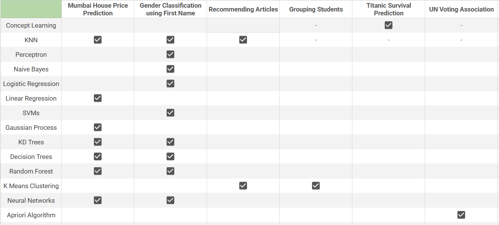

# ML-Toolbox

<p align="center">
    
</p>

## Table of Contents

- [Project](#ml-toolbox)
  - [Table of Contents](#table-of-contents)
  - [About](#about)
  - [Introduction to Machine Learning](#introduction-to-machine-learning)
    - [Traditional Programming vs Machine Learning](#traditional-programming-vs-machine-learning)
    - [Core Idea Behind Machine Learning](#core-idea-behind-machine-learning)
  - [Introduction to ML-Toolbox](#introduction-to-ml-toolbox)
  - [File Structure](#file-structure)
  - [Results](#results)
  - [Pending Section](#pending-section)
  - [References](#references)
  - [License](#license)

## About

Machine learning is closely related to statistics and optimization. Each ML algorithm makes certain assumptions about the data, has a theory behind it, and comes with its own set of advantages and disadvantages. In this repository, I aim to understand the intuition, implement algorithms from scratch, and derive the proofs and theories behind them. By understanding the theory behind an algorithm and the characteristics of the data, we can optimize performance and achieve better results.

## Introduction to Machine Learning

### Traditional Programming vs Machine Learning

Traditional programming is based on the idea of writing a program, providing it with an input, and receiving an output. This works well for all tasks where the rules can be clearly defined. Consider the problem of classifying a number as odd or even. This can be done by a simple if-else program.


For problems where the rules cannot be clearly defined, we use Machine Learning to generate these rules for us. Consider the problem of classifying an image as cat or dog. Writing a program for this would be very difficult. Machine Learning is the idea where we provide the computer with data and corresponding outputs and get the program. This phase is called training. Now we use these program, along with new data like traditional programming to get an output. This phase is called inference.


### Core Idea behind Machine Learning

Machine Learning is a subset of Artificial Intelligence (AI). While AI aims to imitate human thinking, Machine Learning focuses on using statistics to uncover patterns in data. For instance, in games like chess, AI uses strategies like minimax, similar to how humans strategize, while Machine Learning methods such as Linear Regression aim to draw the best-fitting line through data points, relying on statistics and pattern recognition rather than directly mimicking human thought processes.


The main goal of ML is to use observations or data to find the true function `f(x)` or probability distribution `P(x,y)` that closely approximates the relationship between inputs and outputs in the real world. Unlike traditional programming, where functions are manually defined, machine learning algorithms learn from data to automatically derive the most suitable function or model for a given task.

## Introduction to ML-Toolbox

The ML-Toolbox is like a toolkit full of different machine learning methods, each offering its own form of `f(x)`. The trick is picking the right one for the job, which is kind of like choosing a setting on a tool – it depends on what we are trying to do. Neural networks are popular, but they're just one tool in the box, giving us outputs in the form of weights and biases.

The core concept behind the ML-Toolbox is to grasp the diverse range of algorithms capable of generating forms of `f(x)`. Some widely used algorithms include Decision Trees, Neural Networks, Support Vector Machines, Random Forests, and K-Nearest Neighbors. The goal isn't to determine which method is the best; instead, it's about knowing when each method works well and when it might struggle. It's analogous to knowing when to use a screwdriver instead of a hammer.

## File Structure
```
👨‍💻ML-Toolbox
 ┣ 📂assets                                   
 ┃ ┣ 📂data                                 // datasets 
 ┃ ┃ ┣ 📄articles.csv
 ┃ ┃ ┣ 📄gender.csv
 ┃ ┃ ┣ 📄modified_mumbai_house_price.csv
 ┃ ┃ ┣ 📄mumbai_house_price.csv
 ┃ ┃ ┣ 📄student_marksheet.csv
 ┃ ┃ ┣ 📄titanic.csv
 ┃ ┃ ┣ 📄un_voting.csv 
 ┃ ┣ 📂img 
 ┃ ┣ 📂scripts    
 ┃ ┣ 📂notes              
 ┣ 📂Concept Learning                  
 ┣ 📂K Nearest Neighbors                    
 ┣ 📂Perceptron                             
 ┣ 📂Naive Bayes
 ┣ 📂Logistic Regression
 ┣ 📂Linear Regression     
 ┣ 📂Support Vector Machine
 ┣ 📂Kernels
 ┃ ┣ 📂Perceptron
 ┃ ┣ 📂Linear Regression
 ┃ ┣ 📂Support Vector Machine
 ┣ 📂Decision Trees     
 ┣ 📂Neural Networks     
 ┣ 📂K Means Clustering      
 ┣ 📄README.md
``` 



## Results

## Pending Section

The following sections are still in progress:

* Kernels
* Neural Networks
* Association Rule Mining
* KD Trees
* Gaussian Processes
* Bagging
* Boosting

## References

* A big thanks to Prof. Kilian Weinberger for the Cornell CS4780 course, <a href="https://www.youtube.com/playlist?list=PLl8OlHZGYOQ7bkVbuRthEsaLr7bONzbXS">Machine Learning for Intelligent Systems</a>. Majority of the content in this repository is inspired by the lectures.
* MIT 6.036 <a href="https://www.youtube.com/playlist?list=PLxC_ffO4q_rW0bqQB80_vcQB09HOA3ClV">Machine Learning</a> by Prof. Tamara Broderick.
* Bias Variance Tradeoff by <a href="https://ocw.mit.edu/courses/15-097-prediction-machine-learning-and-statistics-spring-2012/dec694eb34799f6bea2e91b1c06551a0_MIT15_097S12_lec04.pdf" target="_blank">MIT OpenCourseware</a> and <a href="https://nlp.stanford.edu/IR-book/html/htmledition/the-bias-variance-tradeoff-1.html" target="_blank">The Stanford NLP Group</a>.
* Additional resources to understand <a href="https://ml-course.github.io/master/notebooks/03%20-%20Kernelization.html">kernelizations</a>.
* <a href="http://neuralnetworksanddeeplearning.com/index.html">Neural Networks and Deep Learning</a> Online Book by Michael Nielsen.
* <a href="https://www.visiondummy.com/2014/04/curse-dimensionality-affect-classification/">Blog</a> on the Curse of Dimensionality.
* <a href="https://www.kaggle.com/">Kaggle</a> for providing several datasets used in this repository.

## License
[MIT License](https://opensource.org/licenses/MIT)