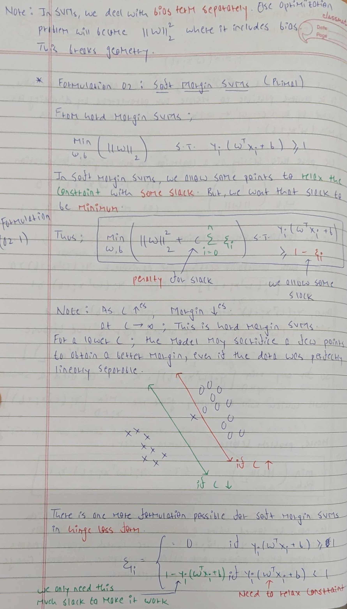
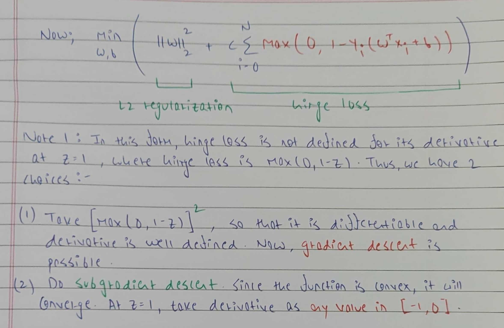

# Support Vector Machines

  
   
  <small><i>Image source: https://medium.com/@dhivyasamin/support-vector-machine-in-machine-learning-algorithms-3fd8f399e0c2</i></small>

## Introduction

We want our ML models to be correct and confident. For a linear classifier, correctness can be simply measured by accuracy. For measuring confidence, we can use its geometric margin. Consider the following example,

  

While all 3 hyperplanes are correctly classifying the data, the green classifier is most robust. The other classifiers will misclassify the points if there are minor perturbations. Thus, the dotted classifiers are not confident about their prediction. 

Algorithms like perceptron do find the correct solution (given the assumptions hold), but they provide no guarantees on the confidence. This means that out of many possible hyperplanes, perceptron will choose any one hyperplane that separates points correctly. SVMs improve on this and find the optimal hyperplane with the biggest margin.

## Assumptions

Similar to perceptrons, SVMs assume that the data is linearly separable. However, SVMs do not require this assumption to be followed strictly. Soft Margin SVMs can find a classifier even if the data is not perfectly separable. Also, kernelized SVMs can handle non-linear data.

## SVMs with Hard Margin

The distance of a point `X` from a hyperplane is given by 

Our goal now is to find optimal hyperplane parameters `W` and `b` that maximize margin, constrained to the fact that the hyperplane classifies all the points properly. 

This new formulation is a Quadratic Optimization Problem (QP). Here, the objective is the quadratic form `||w||^2` while the constraints are linear. Because the quadratic represents a parabola, the above formulation will always give a unique optimal solution, provided a hyperplane exists. All the training points that lie on the margin are called Support Vectors. Only these points are needed to determine the optimal hyperplane. Moving support vectors in any direction will change the hyperplane..

## SVMs with Soft Margin

The above formulation works well when the data is linearly separable. However, in real-world scenarios, data might not be perfectly separable due to noise or outliers. To handle this, we relax our constraint slightly. Now, for each data point, rather than forcing `W(xi) + b >= 1`, we allow `W(xi) + b >= 1 - ξi`. However, we want this relaxation to be minimum. Hence, we minimize this slack in addition to our objective. We use parameter `C` to control the impact caused by slack. For large values of C, the model will behave as hard margin SVMs. For small values of C, the model might sacrifice some points (even if they were separable) to find a better hyperplane. In other words, `C` provides us a tradeoff between correctness and confidence of the model.

In all the above formulations, we assume the data to be linearly separable. While soft margin allows us to manage some violations, even it would fail to provide a good classifier for non linear data such as spiral data. For non-linear data, we can use Kernelized SVMs (discussed in `/Kernel Method`).

## Results