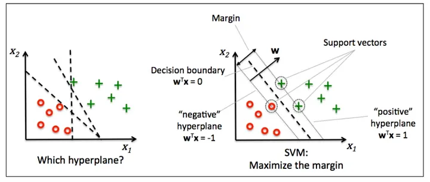
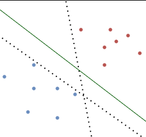
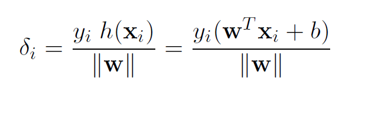
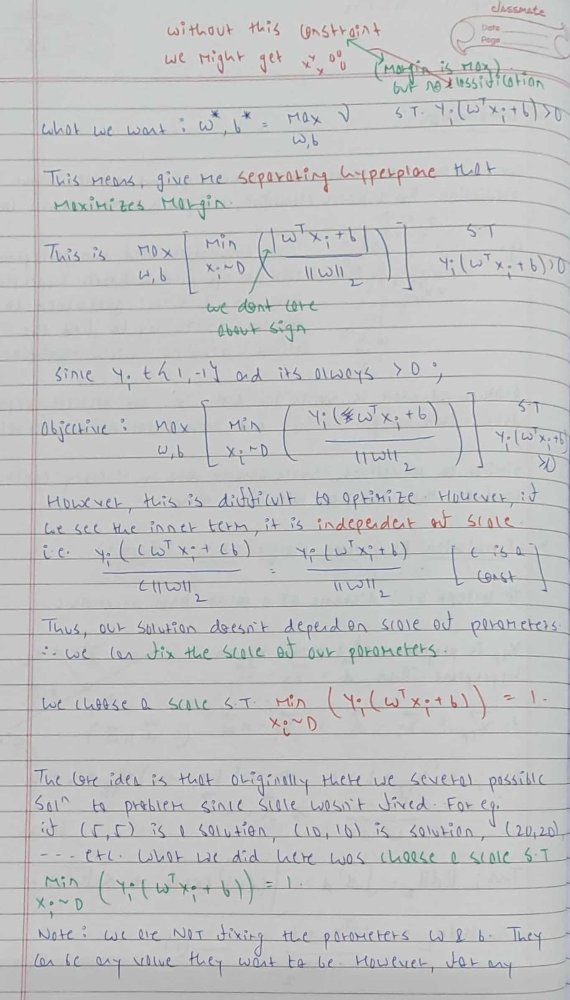
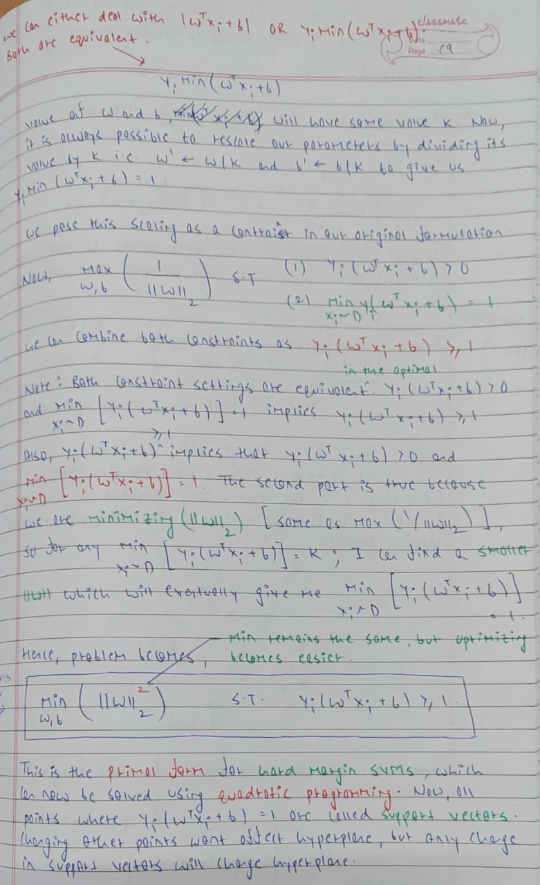

# Support Vector Machines

  
   
  <small><i>Image source: https://medium.com/@dhivyasamin/support-vector-machine-in-machine-learning-algorithms-3fd8f399e0c2</i></small>

## Introduction

We want our ML models to be correct and confident. For a linear classifier, correctness can be simply measured by accuracy. For measuring confidence, we can use its geometric margin. Consider the following example,

  

While all 3 hyperplanes are correctly classifying the data, the green classifier is most robust. The other classifiers will misclassify the points if there are minor perturbations. Thus, the dotted classifiers are not confident about their prediction. 

Algorithms like perceptron do find the correct solution given the assumptions hold, but they have no guarantee on confidence. This means that out of many possible hyperplanes, perceptron will choose any one hyperplane that separates points correctly. SVMs improve on this and find the optimal hyperplane with the biggest margin.

## Assumptions

Similar to perceptrons, SVMs assume that the data is linearly separable. However, SVMs do not require this assumption to be followed strictly. Soft Margin SVMs can find a classifier even if the data is not perfectly separable. Also, kernelized SVMs can handle non-linear data.

## SVMs with Hard Margin (Primal Formulation)

The distance of a point `X` from a hyperplane is given by 

Our goal now is to find optimal parameters `W` and `b` that maximize margin constrained to the fact that they classify all the points properly. 

This new formulation is a Quadratic Optimization Problem (QP) which can be solved to obtain the optimal hyperplane. Here, Objective is the quadratic form `||w||^2` while Constraints are linear. Because the quadratic represents a parabola, the above formulation will always give a unique optimal solution, provided a hyperplane exists.

All the training points which are on the margin, are called Support Vectors. Only these points are needed to determine the optimal hyperplane. All other points can be practically ignored. Moving these support vectors in any direction will change the hyperplane but moving any other points will have no effect. This is the key property behind SVMs.

## SVMs with Soft Margin (Primal Formulation)

The above formulation works well when data is linearly separable. However, in real-world scenarios, data is rarely perfectly separated by a straight line. Noise or outliers can make it messy. To handle this, we introduce the concept of "slack variables" `ξi`. These slack variables allow some data points to deviate from the ideal separation line, either by being on the wrong side of the margin or by being within the margin. We do this by penalizing these deviations proportionally, and this penalty is controlled by a parameter called C.

## SVMs with Hard Margin (Dual Formulation)

## Results

SVMs for Gender Prediction using first names provide an accuracy of `88.46%` on the test set. This is higher than the `85.38%` obtained using Perceptron. The reason behind this can be the fact that SVM chooses the optimal hyperplane. Unlike Perceptron where we need to consider the last character, bigrams, and trigrams to converge, we just required the last character and bigrams for SVMs. 

Additionally, we can observe how accuracy increases over the training set as we increase our value of C from `0.01` to `1`. A larger value of C means that we are increasingly penalizing the incorrect classifications. This would increase the accuracy at the cost of margin. A small value of C would not penalize so heavily and would hence allow more error on the training set, but it will provide a bigger margin. Hence we tried to choose an optimum value of C using a validation set and found it to be around `0.1`.