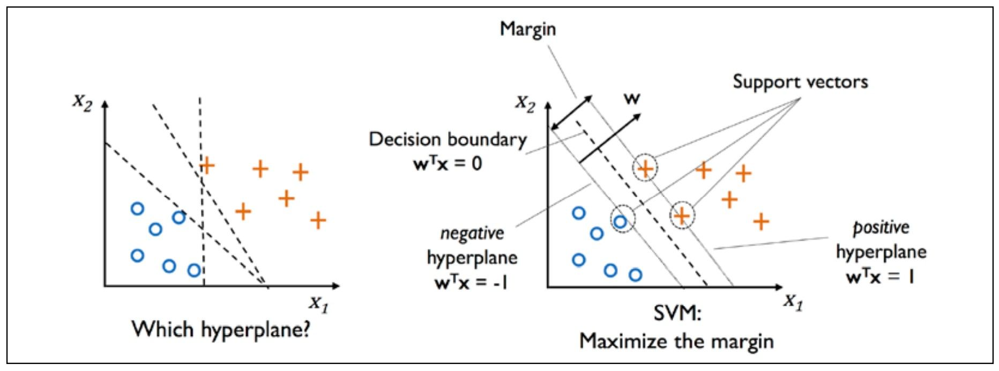
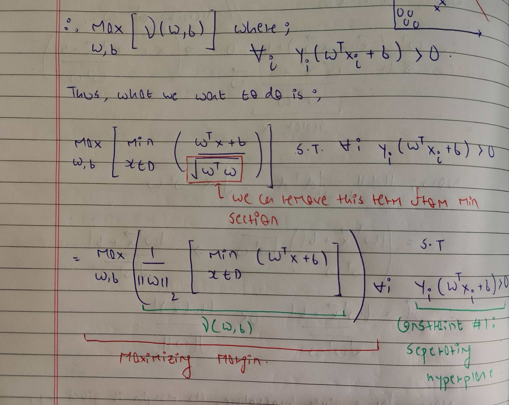
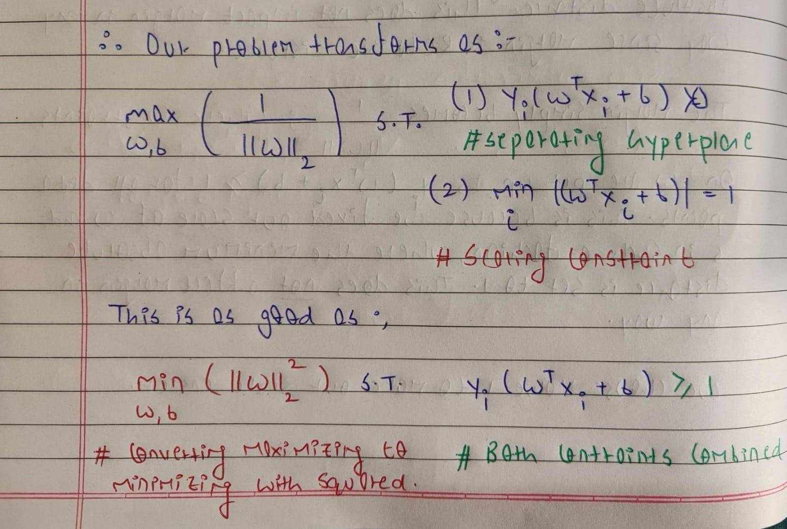
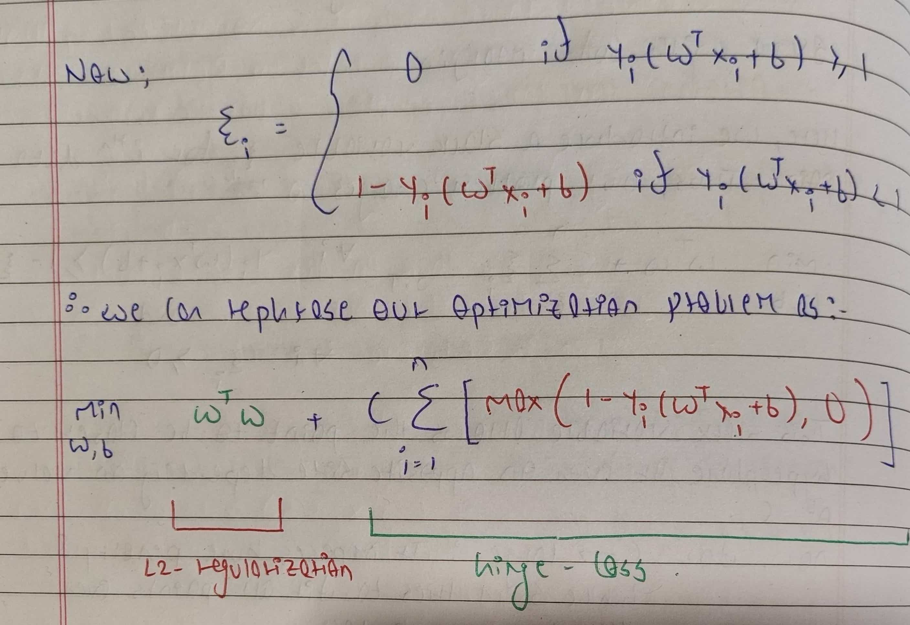

# Support Vector Machines

## Introduction

SVM is a classification algorithm based on maximum margin linear discriminants, that is, the goal is to find the optimal hyperplane that maximizes the gap or margin between the classes.

The goal of the perceptron was to find a hyperplane, but it has no guarantee of optimality. SVM finds the optimal hyperplane by using the geometric intuition that maximizing the margin between classes would lead to better generalization.

## Assumptions

SVMs assume that the data is linearly separable. However, unlike perceptron which requires this assumption to be followed strictly, SVMs can handle some noise or error in classification by introducing slack variables. This is called Soft Margin Classification. 

## Algorithm

The distance of a point `X` from a hyperplane is given by 

It is important to note that the numerator represents the absolute distance while the denominator performs normalization to provide relative distance.

Our goal is to find `W` and `b` that maximize margin, where the margin is the distance of the closest points to the hyperplane. This can be represented as a constrained optimization problem. Without the constraint, the optimization problem will just aim to maximize the margin, without ensuring that the points are classified correctly. The constraint enforces that the margin should be maximum, but such that all points are classified properly.

Now, we know that the numerator `| W^T.X + b |` represents the absolute distance of point X from the hyperplane. This becomes relative distance when it is normalized by the norm of `W`.

When we talk about margin, we refer to the relative distance, that is, how well the hyperplane separates two classes.

In the following proof, we can use this idea to set the `min | W^T.X + b |` to `1`. What we are trying to do is to fix a scale for the absolute distance. This does not impact the margin in any way since the margin is defined relatively.

The margin simply becomes `1/||W||`, where the new constraint on the hyperplane is that all points at least have an absolute distance of `1` from the hyperplane. This constraint has to be introduced because of scaling. We chose the value 1 since it makes our problem easier.

Consider the analogy of a pepper-eating contest between two people, A and B. A can eat things that are twice as spicy as what B can eat. Thus, for a given spice level, if B can eat 5 peppers, A can eat 10 peppers. Tomorrow, if the competition introduces spicier peppers, let's say B can now only eat 2.5 peppers. At the same time, A's limit also scales down proportionately to 5 peppers. The absolute difference between A and B has changed, but the margin remains the same: A can eat twice as spicy as B. What we have done in SVMs is fix the spice level at 1 and introduce it as a constraint. This does not change the relative difference or margin between classes.

This new formulation is a Quadratic Optimization Problem (QP) which can be solved to obtain the optimal hyperplane. Here, Objective is the quadratic form `||w||^2` while Constraints are linear. Because the quadratic represents a parabola, the above formulation will always give a unique optimal solution, provided a hyperplane exists.

All the training points which are on the margin, are called Support Vectors. Only these points are needed to determine the optimal hyperplane. All other points can be practically ignored. Moving these support vectors in any direction will change the hyperplane but moving any other points will have no effect. This is the key property behind SVMs.

## SVM with Soft Constraints

The above formulation works well when data is linearly separable. However, in real-world scenarios, data is rarely perfectly separated by a straight line. Noise or outliers can make it messy. To handle this, we introduce the concept of "slack variables" `ξi`. These slack variables allow some data points to deviate from the ideal separation line, either by being on the wrong side of the margin or by being within the margin. We do this by penalizing these deviations proportionally, and this penalty is controlled by a parameter called C.

When C is large, the penalty for deviations is high. So, the model tries hard to find a separation line that includes almost all points, even if this means a very narrow margin. Conversely, when C is small, the penalty for deviations is low. This results in a wider margin, allowing more points to be on the wrong side or very close to the separation line.

The formulation can be rephrased as:

This is very similar to logistic regression, except we use hinge loss instead of logistic loss. A lot of machine learning algorithms end up with this idea of minimizing a function which is a combination of loss function and regularization term. The regularization term keeps the model simple by penalizing the complexity of the model, like the norm of weights. The loss function measures errors in data, like hinge loss here The goal is to minimize this objective function to find the optimal hyperplane Regularization term is a function of parameters, and is independent of data points, while the loss term is a function of both parameters and data. This allows us to keep the model simple as well as fit the data well.

## Results

SVMs for Gender Prediction using first names provide an accuracy of `88.46%` on the test set. This is higher than the `85.38%` obtained using Perceptron. The reason behind this can be the fact that SVM chooses the optimal hyperplane. Unlike Perceptron where we need to consider the last character, bigrams, and trigrams to converge, we just required the last character and bigrams for SVMs. 

Additionally, we can observe how accuracy increases over the training set as we increase our value of C from `0.01` to `1`. A larger value of C means that we are increasingly penalizing the incorrect classifications. This would increase the accuracy at the cost of margin. A small value of C would not penalize so heavily and would hence allow more error on the training set, but it will provide a bigger margin. Hence we tried to choose an optimum value of C using a validation set and found it to be around `0.1`.