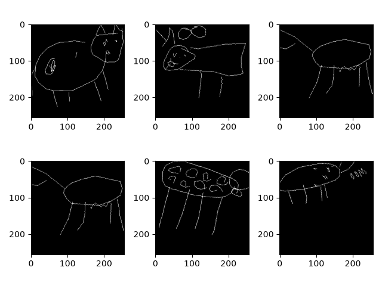

# List of Raw Kaggle Datasets used in the project

1) <a href="https://www.kaggle.com/datasets/pritsheta/indian-male-and-female-name-dataset">Indian Male and Female Name Dataset</a>

2) <a href="https://www.kaggle.com/competitions/learning-agency-lab-automated-essay-scoring-2/data">Learning Agency Lab - Automated Essay Scoring 2.0</a>

3) <a href="https://github.com/googlecreativelab/quickdraw-dataset">QuickDraw Dataset</a>

**Note:** The datasets available on Kaggle are raw and are not used directly in this project. They are either manually preprocessed or processed using the scripts provided in `\assets\scripts`. It is recommended to download the preprocessed datasets from the <a target="_blank" href="https://iiithydresearch-my.sharepoint.com/:f:/g/personal/prit_kanadiya_research_iiit_ac_in/IgCAsvxlQCVzQIFTEjRVEk71AbHk8xwgYtHWHMbOREhGvnk?e=mU1mg3">Onedrive Link</a>.

# Data Visualization

1) Indian names from `gender.csv`

```csv
Name,Target
Meet,1
Hetal,0
Akshay,1
Radhika,0
Riya,0
```

3) Cow images from `full_simplified_cow.ndjson`

