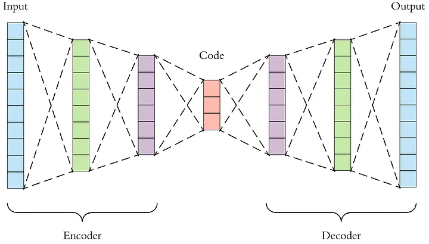
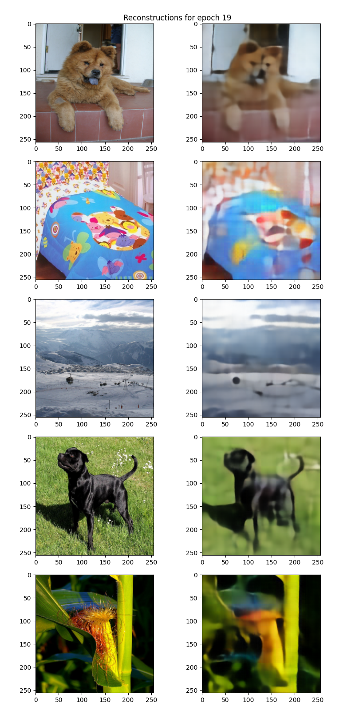
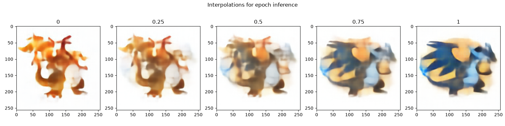

# Autoencoder

<p align="center">
  
  <br>
  <small><i>Image source: https://medium.com/data-science/applied-deep-learning-part-3-autoencoders-1c083af4d798</i></small>
</p>

## Introduction

The main goal of autoencoders is to learn compact representations of data. This is done by compressing the original input into a lower-dimensional latent space that captures the most important features needed to describe the input.

A loose analogy is describing a human face. While a complete image contains every detail of a face, we can often describe the key characteristics using a small set of attributes: a round face, curly hair, wrinkles, a sharp nose, and so on. An artist can create a resonable approximation if they know these important features.

The latent space learned by an autoencoder serves a similar purpose. Instead of storing every pixel of an image, it learns a compact representation that captures the underlying structure and important variations in the data. Once the data is mapped into this latent space, we can perform tasks such as measuring similarity between samples, visualizing clusters, or using this compact representations for other tasks (as used in `diffusion`).


## Architecture

An autoencoder follows an encoder-decoder architecture. The encoder compresses the input into a lower-dimensional latent representation, while the decoder reconstructs the original input from this representation. Autoencoders are self-supervised models because we don't train the model by providing target latent representations. Instead, the input itself acts as the training target. The model learns to reproduce the input from its compressed representation.

The encoder learns a mapping:

$$
z = f_{\theta}(x)
$$

where `x` is the input image and `z` is the latent representation. The decoder acts as an approximate inverse of the encoder by learning a reconstruction function:

$$
\hat{x} = g_{\phi}(z)
$$

To train the autoencoder, we minimize the reconstruction error between the original input and the reconstructed output:

$$
\mathcal{L} = \|x - \hat{x}\|^2
$$

## Usage

After downloading and the ImageNet dataset, we need to first prepare validation folder using `prepare_val_data.py`. To train the autoencoder, run `train.py`. To generate latent space interpolations, first organize the input image pairs in the interpolation_dir directory using the following structure:


```
interpolation_dir/
├── pair1/
│   ├── 1.png
│   └── 2.png
├── pair2/
│   ├── 1.png
│   └── 2.png
└── ...
```

Each subdirectory should contain exactly two images. Once the directory is prepared, generate interpolations by running `python inference.py`

## Results

Our autoencoder has `6.7M` parameters and takes approximately `11` minutes per epoch to train on RTX 2080 GPU and we train for 20 epochs. The following are reconstructions for best epoch. 

<p align="center">
  
  <br>
  <small><i>Reconstruction plot</i></small>
</p>

Once the model is trained, we can also explore its latent space by interpolating between the latent representations of two images. 

<p align="center">
  
  <br>
  <small><i>Interpolation from Charizard to Mega Charizard X. This looks like Charizard evolving into its Mega X form.</i></small>
</p>