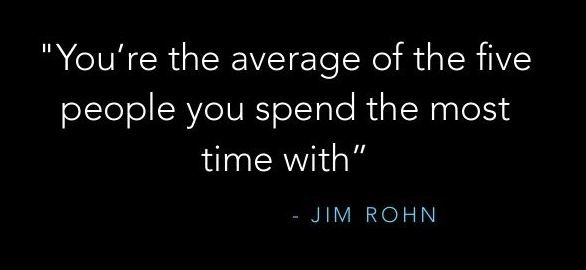
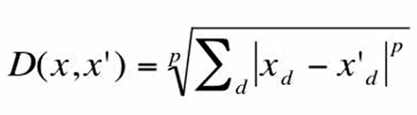
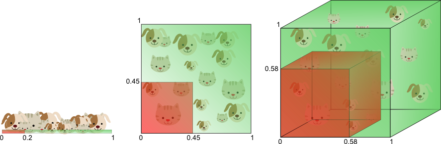

# K Nearest Neighbors (KNNs)

<p align="center">
  
  <br>
  <small><i>Image source: https://www.linkedin.com/pulse/youre-average-five-people-you-spend-most-time-richard-goold (KNN where K = 5)</i></small>
</p>

## Table of Contents

- [KNN](#knn)
  - [Assumptions](#assumptions)
  - [Algorithm](#algorithm)
  - [Curse of Dimensionality](#curse-of-dimensionality)
  - [Usage](#usage)
  - [Results & Demo](#results--demo)

## Assumptions

KNN assumes that data points that are close to each other in the feature space are likely to have similar labels. So when we get a new point, we assign it a label similar to its nearest neighbors.

But this assumption does not always work. In some datasets, the relationship between features and target values is not based on how close the points are. For example, in geopolitics, neighboring countries often do not share the same interests. They might even be opposed to each other. In this case, the KNN idea that countries in the same region have similar policies might not hold.

## Algorithm

The KNN Algorithm simply looks for the K nearest neighbors, picks their label, and assigns it to the target point. For classification, we can use the majority. For regression, output can be average of all neighbor values. The KNN algorithm is only as good as its distance metric. The distance metric should be such that it captures the similarity between instances appropriately. 

Some commonly used metrics are as follows:-

1. Minkowski Distance: This is a generalized distance metric that includes Manhattan (p=1), Euclidean (p=2), and Chebyshev (p=infinity) as special cases. It is defined as:

<p align="center">
  
</p>

The choice of distance metric depends on the amount of penalty one wants to assign to differences in each dimension. If p is lower, say 1, then the metric is less sensitive to outliers and treats each dimension equally. If p is higher, say infinity, then it is sensitive to outliers in any single dimension.

Consider analyzing user behavior on an e-learning platform, with features like number of quizzes taken, videos watched, time spent reading, and forum activity. These actions are independent and contribute additively to overall engagement. Manhattan distance is better here as it effectively captures similarity in such multi-faceted user behavior without letting one large difference dominate. Similarly, Chebyshev distance (p=infinity) can be used when one dimension is more important than others. For example, in medical diagnosis, a single severely abnormal symptom may be more significant than several marginally abnormal symptoms.

2. Cosine Similarity: Cosine similarity measures the cosine of the angle between two vectors. It is a measure of orientation and not magnitude. Cosine similarity is commonly used as a similarity metric for text data.

Once the similarity metric is defined, for any given test point, we look at its `k` nearest neighbors and take the majority vote of the classes of these neighbors for classification and average of the target values for regression. 

The choice of the parameter `k` (the number of neighbors) is crucial. A smaller ```k``` may result in a model that is sensitive to noise, while a larger ```k``` may lead to a model that is too generalized. The optimal `k` is often determined through validation methods.

## Curse of Dimensionality in KNNs



KNNs are based on the assumption that data points close together in the feature space are more likely to belong to the same category. However, as the number of features increases, this assumption can break down due to the curse of dimensionality. In high-dimensional spaces with few data points (sparse data), identifying the true nearest neighbors becomes challenging.

One consequence of this challenge is that the nearest neighbor found by the algorithm might not truly be a neighbor in the meaningful sense. In reality, it could be far from the test point, appearing close only due to the sparseness of the data. Consequently, the core assumption of KNN that nearby points are similar becomes meaningless in such scenarios.

In these cases, algorithms like the perceptron may be more suitable for classification tasks. The perceptron, for instance, can handle higher dimensions more gracefully and is less affected by the curse of dimensionality.

However, it's essential to note that there are instances where datasets possess large dimensions but low intrinsic dimensionality. In such cases, KNN can still be effective. For example, images often have high dimensions but low intrinsic dimensionality, meaning that important information can be captured in fewer dimensions. 

## Usage

To compile the code, run the following command:

```
g++ knn.cpp ../../../utils/csv.cpp ../../../utils/distances.cpp ../../../utils/metrics.cpp
```

## Results & Demo

We split the data in 80:10:10 ratio, and obtain the following results on the test set.

```
MAE: 0.541427
RMSE: 0.708649
R2: 0.530219
```

Since essay scores range from 1 to 6, the MAE of `0.54` indicates that, on average, our model's predictions differ from the actual essay scores by approximately 0.54 points on the 1–6 scoring scale. The R² score of `0.53` is an okay score, which is surprisingly high since we never accounted for punctuations, flow, content etc.

We also run the model on our essay, which achieves a score of `4.73`: 

`This is a test essay. Lets see where it goes! This is a poem from the family guy. Oh, squiggly line in my eye fluid, I see you lurking there on the periphery of my vision. But when I try to look at you, you scurry away. Are you shy, squiggly line? Why only when I ignore you, do you return to the center of my eye? Oh, squiggly line, it's alright, you are forgiven.`

