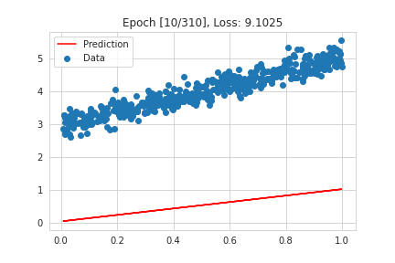
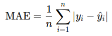
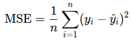
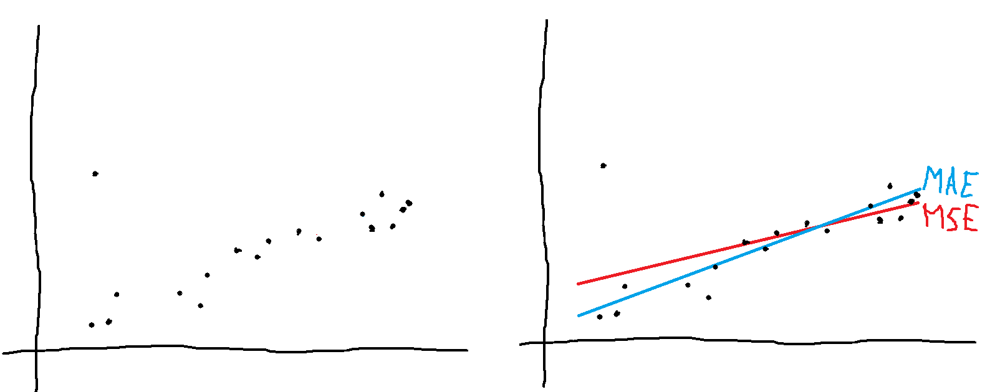
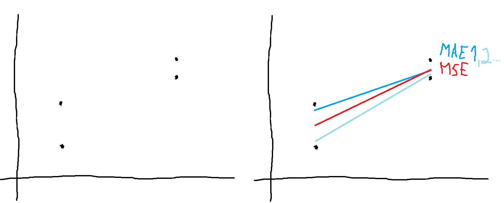
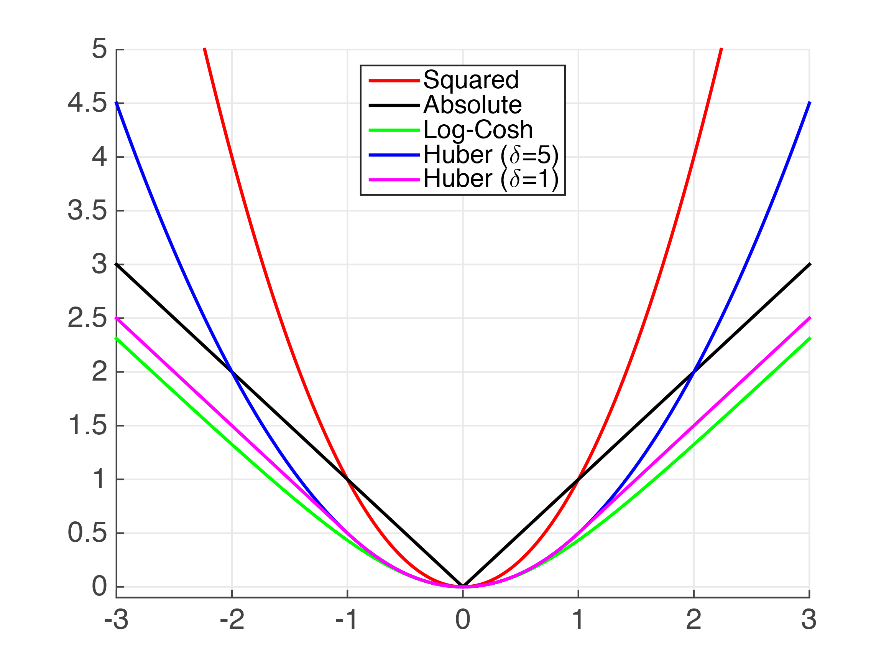

# Linear Regression

  
   
  <small><i>Image source: https://medium.com/swlh/visualising-linear-regression-dfac98624d27</i></small>

## Table of Contents

- [Linear Regression](#linear-regression)
  - [Introduction](#introduction)
  - [Algorithm](#algorithm)
    - [Nature of solution](#nature-of-solution)
    - [Optimization methods](#optimization-methods)
  - [Usage](#usage)
  - [Demo](#demo)

## Introduction

Linear regression assumes that the target variable can be approximated as a linear combination of the input variables. This means that the predicted output can be computed as  $y = w^T x + b$. The goal is to learn $w$ and $b$ such that the hyperplane provides the best fit to the data. The fact that the data can be modelled using a linear hyperplane is the knowledge, while the parameters of the hyperplane are learned from the data.

## Algorithm

The end goal is to find a line that best fits the data. Mathematically, this means finding the line that minimizes the average error between our predictions and the true values. There are two common ways to model this error. One is by taking the absolute difference between $\hat{y}$ and $y$, and the other is by taking the square of the difference. Thus, we can define two possible objective functions: Mean Absolute Error (MAE) and Mean Squared Error (MSE).

  
  

Once we define the objective function, the problem becomes an optimization problem. The choice of objective function affects both the nature of the solution and the optimization method we use. Depending on our usecase, we choose an appropriate objective function. 

### Nature of solution

In terms of the solution, MSE gives the mean and MAE gives the median. Consider the numbers `[10, 10, 10, 10, 100]`. The mean is `28`, while the median is `10`. Here, `100` appears to be an outlier. It pulls the mean toward itself because squared error penalizes large errors more heavily. To reduce this penalty, the mean shifts away from the normal values. The median does not change much because it only depends on the middle value, not how large the outlier is. Even if the outlier becomes `10000`, the median stays the same. This makes the median more robust to outliers.

With respect to linear regression, the solutions differ as follows:

  
   
  <small><i>Image source: https://www.lesswrong.com/posts/xpj8uRihG6A9tBxGS/why-square-errors</i></small>

If we ignore the outlier (the point on the top left), we can see that the MAE line fits the remaining points better.

For use cases where large errors are much more harmful than small ones, such as medical dosage prediction, we can use MSE. MSE penalizes large errors more strongly, which helps reduce risky mistakes.For use cases where the data contains extreme outliers, we can use MAE. One example is placement statistics. When a college reports the average package, it can be heavily influenced by a few exceptional students. However, the median package gives a more realistic picture and is a better metric for understanding placements and return on investment.

Another property to consider is the uniqueness of the solution. MSE gives a single unique solution, while MAE can have multiple optimal solutions. Consider `[1, 2, 3, 4]`. The mean value `2.5` is the unique minimizer of MSE. But for MAE, any value between 2 and 3 is a minimizer. This means there can be many optimal solutions for MAE.

With respect to linear regression, the uniqueness of the solution differs as follows:

  
   
  <small><i>Image source: https://www.lesswrong.com/posts/xpj8uRihG6A9tBxGS/why-square-errors</i></small>

### Optimization methods

  
   
  <small><i>Image source: https://fritz.ai/best-regression-loss-functions/</i></small>

From an optimization perspective, MSE can be solved using two methods. Since MSE is a quadratic function, it has a parabolic shape, and we can directly find its minimizer using a closed-form solution. $$\mathbf{w} = (X^T X)^{-1} X^T \mathbf{y}$$ 

We can also use gradient descent because MSE is smooth and differentiable everywhere. No matter where we initialize, gradient descent will converge to the minimum. 

For MAE, optimization requires a bit more effort. Since the function is not differentiable at 0, we use subgradient descent. Another way is to use Linear Programming However, convergence is slower compared to MSE.

Overall, the choice of objective function depends on the problem requirements. Depending on the situation, we can model the “best fit” using MAE, MSE, or other variants. We can even combine both, which leads to Huber loss. In cases where we are unsure, a practical approach is to try different loss functions and compare their performance on a validation set.

## Usage

## Demo
