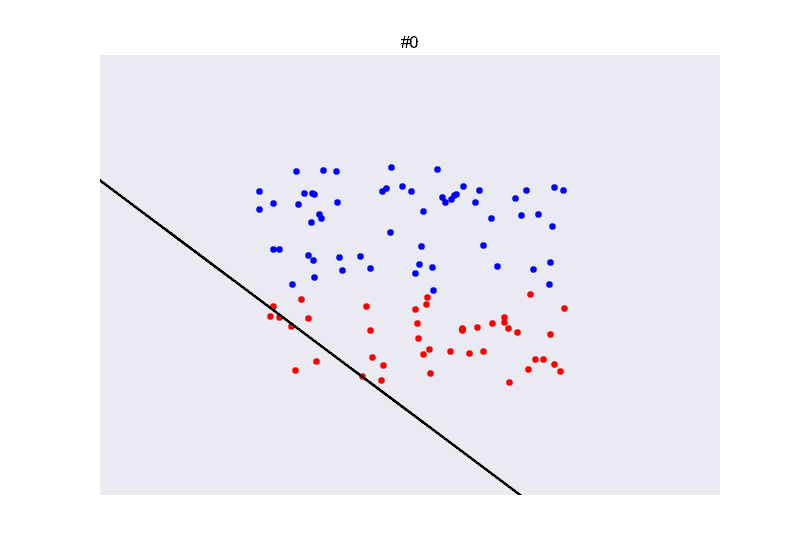
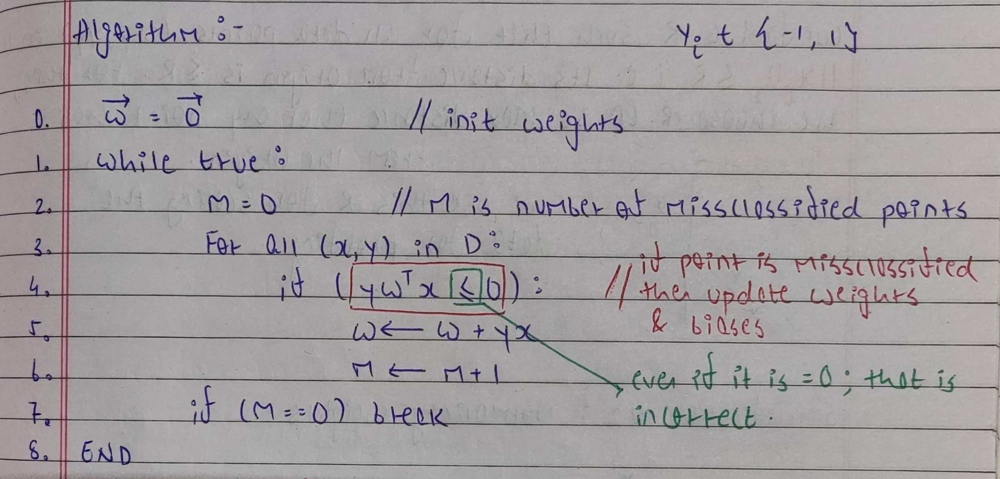
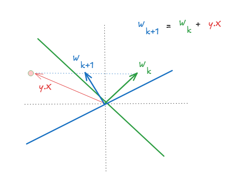
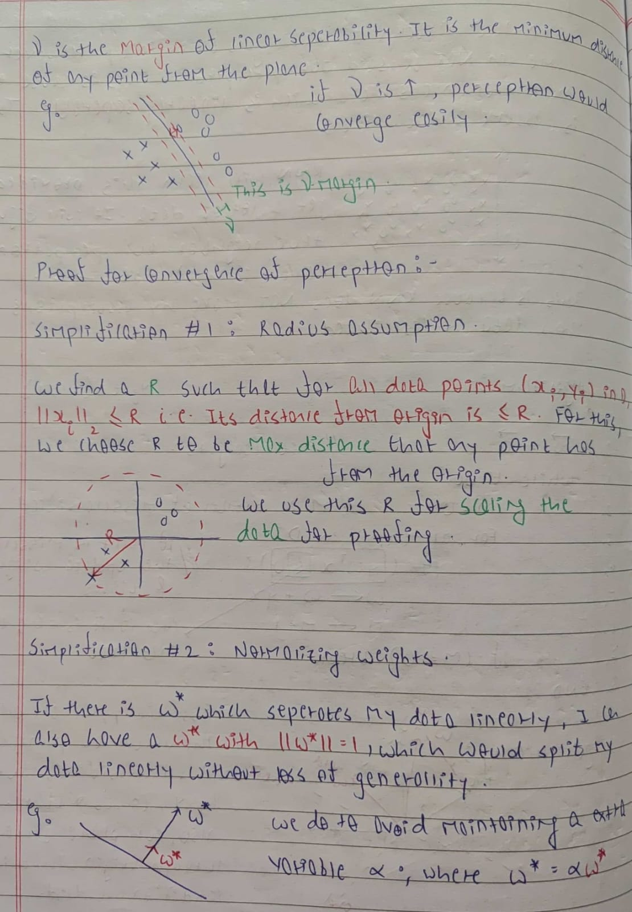
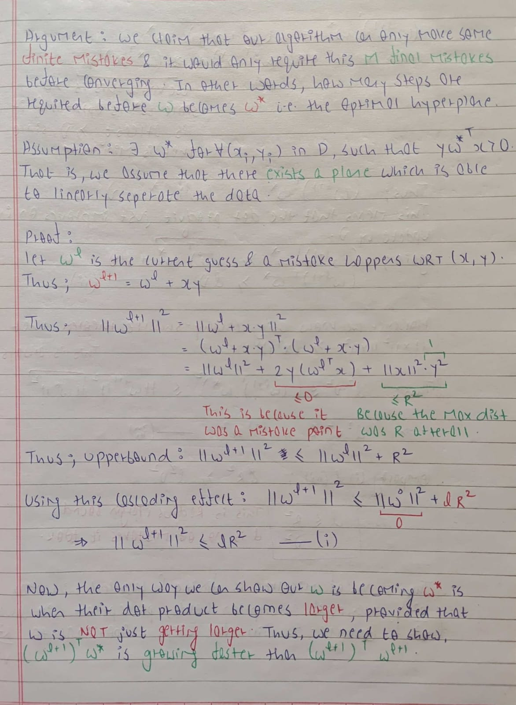
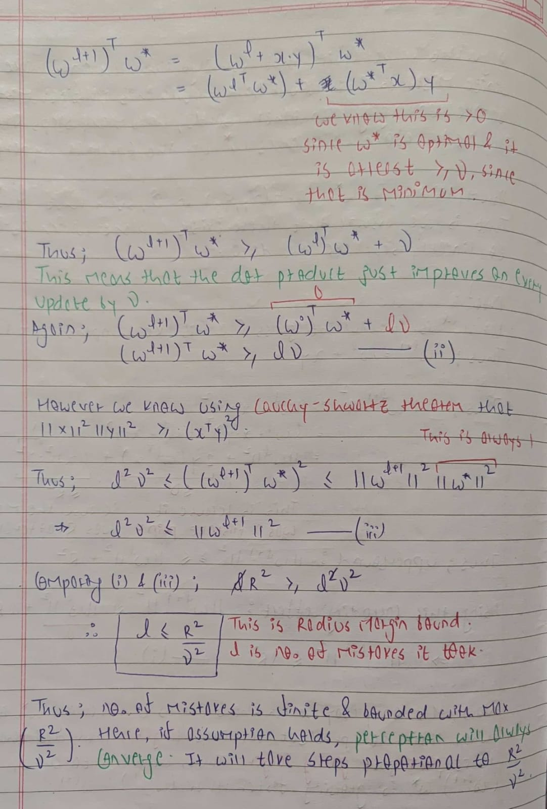

# Perceptron

<p align="center">
  
  <br>
  <small><i>Image source: https://commons.wikimedia.org/wiki/File:PerceptronSample.gif</i></small>
</p>

## Introduction

The perceptron is one of the earliest linear classification algorithms. Linear classifiers assume that there exists a hyperplane that can separate the data into different classes. The goal of the perceptron is therefore to learn a hyperplane $w^T x + b = 0$ such that all the data points are correctly classified. The fact that the data can be separated using a linear hyperplane is the knowledge, while the parameters of the hyperplane are learned from the data.

## Algorithm

A hyperplane is a subspace whose dimension is one less than that of the feature space. For example, in a 2D feature space, a hyperplane is simply a straight line, while in 3D it is a plane. A hyperplane can be defined using:

1) A weight vector w, which is normal (perpendicular) to the hyperplane, and
2) A bias term b, which controls the offset from the origin.

Hence, it can be written as $w^T x + b = 0$. But, this is as good as $W^T X = 0$ where `W` = `[w, b]` and `X` = `[x, 1]`. Because the bias term is absorbed into `W` now, we don't have to do additional bookkeeping for the bias term.

Now, we can use the following algorithm to learn the parameters for the hyperplane.

<p align="center">
  
</p>

During inference, we just need to check the sign of $W^T X$ to classify it.

### Why does the update rule work?

A single perceptron update is not guaranteed to classify the point correctly immediately after the update. But it moves the decision boundary in a direction that makes the current example more likely to be classified correctly.

<p align="center">
  
</p>

While adjusting the hyperplane for one point, it is possible that some previously correct points may become misclassified. However, we can show that if we keep following the update rule, the perceptron will find a separating hyperplane.

### Proof that the Perceptron will converge

The goal of this proof is to show that if the points are linearly separable, the Perceptron will find a separable hyperplane.

<p align="center">
  
  <br>
  
  <br>
  
</p>

## Demo

We now build a perceptron for the task of gender prediction using first names. Given a name, the goal is to predict whether it is a boy's or a girl's name. To do this, we first construct features from the name using:

1) `26` unigrams
2) `26*26` bigrams
3) `26*26*26` trigrams
4) `1` feature indicating whether the name ends with a vowel.
5) `1` bias term

For Indian names, especially North Indian names, many girl names end with a vowel, while for boy names, they do not. Hence, this feature can be useful for classification.

To run the perceptron, we require `csv.cpp` from `/utils`.

```
g++ perceptron.cpp ../../../utils/csv.cpp
./a.out
```

The perceptron converged after 80 iterations with 87.6% accuracy on the validation set. If we don't use trigram features, the algorithm does not converge on the training set. The results on the test set are:

```
Confusion Matrix: 56 8 10 55
Accuracy: 0.860465
Precision: 0.875
Recall: 0.848485
F1: 0.861538
```

We can now try running the algorithm on a few sample names:

```
I am sure Prit is a boy.
I am sure Asin is a boy.    // This is wrong
I am sure Raavan is a boy.
I am sure Mandodari is a girl.
I am sure Zooni is a girl.
I am sure Chandanbala is a girl.
```