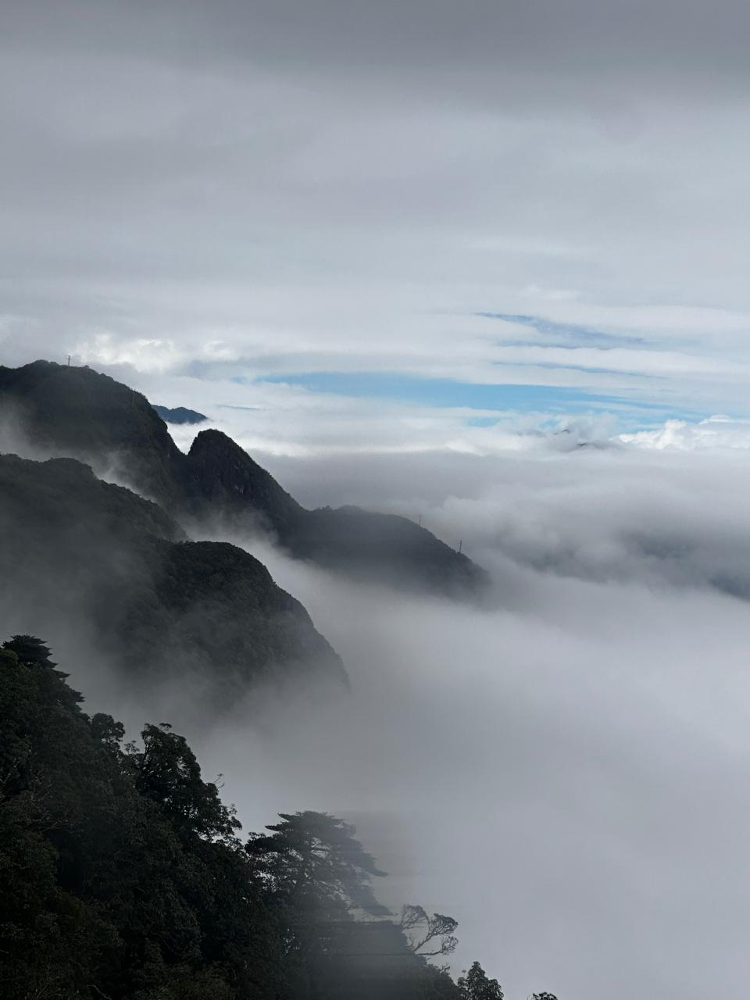

## Clustering

The idea of clustering is to group similar objects together. The end goal is to obtain a set of groups such that, for any member, it is more similar to members of its own group than to members of other groups.

## List of Algorithms

1) K-Means  
2) Gaussian Mixture Models (GMMs)  
3) Hierarchical Clustering  
4) DBSCAN  

Each clustering algorithm makes different assumptions about what a cluster looks like. However, all assume that similar points lie close to each other in feature space. Because clustering depends on distance for similarity, it also suffers from the curse of dimensionality.

All algorithms have their own set of assumptions, but the common assumption each one makes is that similar objects lie close to each other in feature space. Due to this, clustering also suffers from curse of dimensionality like KNNs. The choice of algorithm depends on what type of clusters do we want. For example,

* Hard assignments (K-means) or soft assignments (Gaussian Mixture Models)
* Hierarchical (agglomerative / divisive) or single-level (K-means)
* Density-based (DBSCAN) or partition-based (K-means)

## Setup

For each clustering algorithm, we will use the two images shown below and observe the clustering results produced by each method on these images.

<p align="center">
  
  <br>
  <small><i>The iconic "Rocking Horse" painting from the movie "Welcome"</i></small>
</p>

<p align="center">
  
  <br>
  <small><i>A photograph of cloudy mountains taken by me</i></small>
</p>

## Algorithm 1: K-Means

### Usage


```
g++ k-means.cpp ../../utils/image.cpp  `pkg-config --cflags --libs opencv4`
```