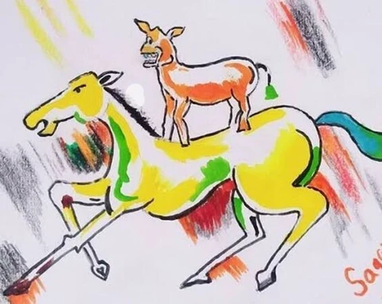

## Clustering

The idea of clustering is to group similar objects together. The goal is to obtain a set of groups such that, for any member, it is more similar to members of its own group than to members of other groups.

## List of Algorithms

1) K-Means  
2) Gaussian Mixture Models (GMMs)  
3) Hierarchical Clustering  
4) DBSCAN  

## Setup

For each clustering algorithm, we will use the two images shown below and observe the clustering results produced by each method on these images.

  
   
  <small><i>The iconic "Rocking Horse" painting from the movie "Welcome"</i></small>

  
   
  <small><i>A photograph of cloudy mountains taken by me</i></small>

